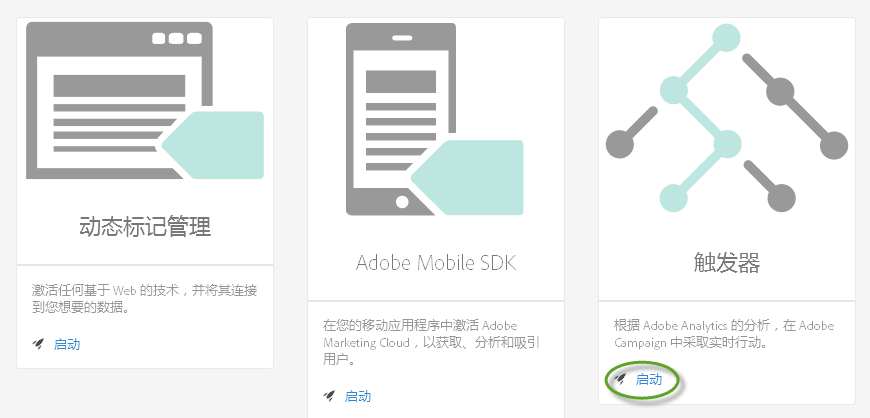
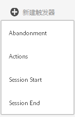
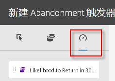
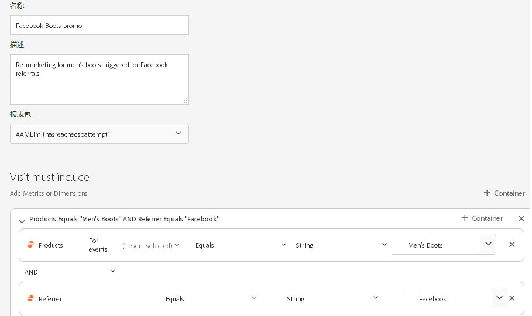

# 触发器

## 触发器概述 {#topic_4F21FCE9A64E46E8B6D51F494FA652A7}

*触发器* 使您能够识别、定义和监控关键消费者行为，然后生成跨解决方案通信以重新吸引访客。 您可以在实时决策和个性化中使用触发器。

* 为放弃购物车或放弃购物车而删除产品配置快速再营销
* 表单和应用程序不完整
* 网站上的任何操作或操作序列

### 触发器类型

通常，触发器可能要用 15-90 分钟时间才能启动市场营销活动。此时间根据数据收集的实施、管道的加载、定义触发器的自定义配置以及 Adobe Campaign 中的工作流而有所不同。

* **放弃：**&#x200B;您可以创建一个触发器，该触发器将在访客查看了产品却未将任何产品添加到购物车时启动。配置[倾向得分](../activation/triggers.md#concept_A506150674AD45DB98D3CC07E560D334)，以了解客户在放弃购物车后不返回的倾向。
* **操作：** 例如，您可以创建触发器，以便在新闻稿注册、电子邮件订阅或信用卡申请（确认）后触发。 如果您是零售商，则可以为注册忠诚度项目的访客创建触发器。 在媒体和娱乐业中，为观看某个节目的访客创建触发器，并且您可能希望用调查来回应。
* **会话开始和会话结束：** 为会话开始和会话结束事件创建触发器。

## 创建 Experience Cloud 触发器 {#task_821F37183AC045E5AC8EED20317598FE}

创建放弃触发器并配置触发器和倾向评分的条件。 例如，您可以在访问期间为触发器规则指定标准，如“购物车放弃”等指标或产品名称等维度。 当满足这些规则时，触发器会运行。

>[!NOTE]
>
>当前的技术限制为 100 个触发器。

1. 在 Experience Cloud 中，单击 ，然后单击&#x200B;**[!UICONTROL 激活]**。
1. 找到[!UICONTROL 触发器]信息卡，然后单击&#x200B;**[!UICONTROL 启动]**。

   

1. 单击&#x200B;**[!UICONTROL 新建触发器]**，然后指定触发器类型：

   

1. 通过填写以下字段，并将量度和维度项拖动到规则容器中以配置该触发器：

   | 元素 | 描述 |
   |--- |--- |
   | 名称 | 此触发器的易记名称。 |
   | 描述 | 此触发器的描述，您将如何使用它，等等。 |
   | 报表包 | 用于此 [触发器的](https://docs.adobe.com/content/help/en/analytics/implementation/analytics-basics/ref-reports-report-suites.html) Analytics报告套件。 此设置标识要使用的报告数据。 |
   | Visit must include Visit must not include Trigger after no action Include meta data | 您可以定义希望发生的标准或访客行为，以及不希望发生的行为。例如，一个简单的购物车放弃触发器规则可能是：<ul><li>必须包括的访问：购物车加货（量度）和存在。（您可以进一步完善规则，以包含特定产品视图或浏览器类型等维度。）</li><li>必须排除的访问：结帐。</li><li>没有行动后启动触发器：10 分钟。</li><li>包括元数据：允许您添加特定的营销活动维度或与访客行为相关的变量。此字段对 Adobe Campaign 生成正确的再营销电子邮件十分有用。</li></ul> 您可以在容器内或容器之间指定 Any、And 或 Or 逻辑，具体取决于您确定的标准是否对规则很重要。 |
   | 容器 | 容器是您设置和存储定义触发器的规则、条件或过滤器的位置。 如果希望事件同时发生，请将其置于同一容器。 这意味着，每个容器在命中级别中独立处理。例如，如果您有两个由 And 运算符连接的容器，那么当两个命中符合要求时，可以预计这些规则符合条件。 |
   | 开始之后的新会话 | 为会话开始和会话结束事件创建触发器。 |

1. (Optional) In [!UICONTROL Abandonment triggers], you can apply [Propensity Scoring](../activation/triggers.md#concept_A506150674AD45DB98D3CC07E560D334).

   

1. 单击&#x200B;**[!UICONTROL 保存]**。
1. Use triggers for [real-time remarketing](https://docs.campaign.adobe.com/doc/standard/en/EMA_Transactional_messaging_Marketing_Cloud_Triggers.html) in [!DNL Adobe Campaign].

### 触发器示例

Experience Cloud触发器示例：

#### 购物车放弃触发器

例如，下页根据在访问期间查看的产品显示了您可能用于“购物车放弃”触发器的规则。

#### 推荐人触发器

当Men&#39;s Boots和Facebook的推荐人产品附带点击时，以下触发器会触发。 For the two criteria (*products* and *referrer*) to be evaluated in the same hit, they should be added to the same container.

## 倾向评分 {#concept_A506150674AD45DB98D3CC07E560D334}

了解客户在放弃购物车后返回的倾向。倾向评分内置于 Experience Cloud 触发器中，并可用于“放弃”触发器。

例如，一些客户放弃购物车以利用电子邮件奖励返回购物车。 为了减少收入损失，倾向评分算法可帮助识别在没有奖励的情况下可能无法返回的相关放弃购买者。

您可以：

* 避免让客户过度暴露于再营销。
* 识别正确的购物车放弃客户并将其活动映射到正确的消息。
* 通过了解哪些客户将会和不会返回来增加收入。

### 倾向评分的价值 {#section_CA99874A25434CC0BF01D0DA61608889}

您可以执行数据发现，以识别数据中存在的隐藏行为或模式。 具体而言，倾向评分可帮助您使用更加专注和客观的方式而不是简单的细分或筛选来识别相似客户的聚类。 此外，倾向评分允许您设置预测功能，以识别公司高价值客户的行为。

确定高价值受众后，您就可以与其互动，以获得最大效果。 例如，如果您是企业对企业的公司，您可能会有销售电话销售线索，这样您便可以对销售线索进行评分并确定他们离线转化的可能性。 由于每个销售线索都会增加成本，因此创建奖励来识别最有可能转化销售的潜在客户是最有效、最不昂贵的资源集中方式。

倾向评分能够识别最能预测特定得分的因素或增加发生事件的可能性，但也可以应用它来回答特定问题：

* 客户是否会转化？
* 客户是否会回复电子邮件？
* 客户会回购吗？

倾向评分允许您回答这些问题并识别具有相应操作倾向的访客，然后设置并评分。
