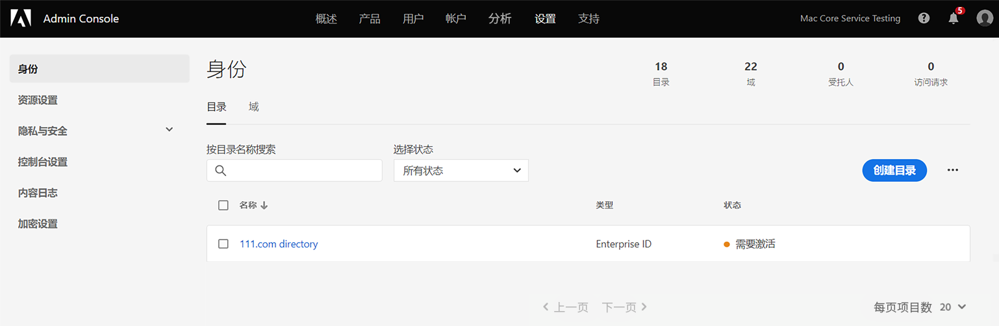
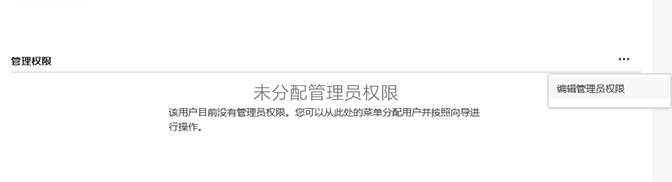
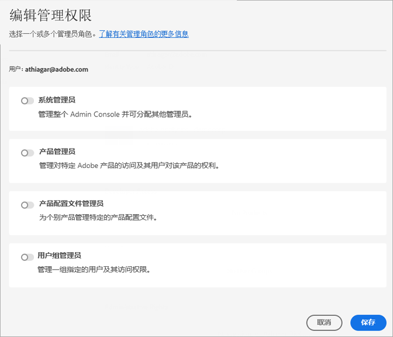

# 管理 Experience Cloud 用户和产品

了解如何登录到Admin Console、管理Experience Cloud用户权限和产品配置文件，以及浏览器支持。

>[!IMPORTANT]
>
>以下信息专门针对 Experience Cloud 应用程序。此信息补充了 Adobe 所有云产品的[企业管理用户指南](https://helpx.adobe.com/cn/enterprise/admin-guide.html)中更广泛的管理信息。

您可以在“管理工具”中查看所有 Experience Cloud 用户的可排序、可过滤列表及其详细信息。请参阅[在管理工具中查看 Experience Cloud 用户](admin-tool-experience-cloud.md)。

## Experience Cloud用户身份验证（计划迁移）{#migration}

从2022年2月开始，Adobe将更新其配置文件管理系统，以使组织能够更好地管理个人配置文件的业务权利。 因此，具有个人资料(对应于单个Adobe ID（类型1）)的所有用户都将迁移到新的业务资料。 此用户档案对应于 _业务ID_ （类型2e）。

请参阅 [Adobe Admin Console上的身份类型](https://helpx.adobe.com/cn/enterprise/using/identity.html) ，以了解有关身份类型的信息。

### 迁移过程

当您需要迁移时，组织管理员将在迁移前30天收到通知电子邮件。

* 迁移时间安排在晚上10点之间。上午6:00，根据组织的主要时区或周末。
* 在迁移期间，Experience Cloud应用程序可能无法访问大约15分钟，Admin Console可能无法访问长达30分钟。 否则，此迁移将是无缝的。

### 迁移后的更改

Admin Console

* 具有多个帐户的管理员在登录时可能会看到配置文件选择器 [!UICONTROL Admin Console].
* 单个Adobe ID用户将更新为业务ID。
* 业务ID目录将添加在 **[!UICONTROL 设置]** > **[!UICONTROL 身份]** > **[!UICONTROL 目录]**.

   

### 迁移后登录

您的登录体验不会随此更新而发生更改：

1. 登录位置 `experience.adobe.com` 使用相同的凭据。

1. 将创建与业务ID关联的新用户档案。 系统会提示您 **[!UICONTROL 立即加入]** 或 **[!UICONTROL 跳过]**.

1. 选择其中一个选项可提供现有的登陆页面体验。

1. Adobe配置文件与每个业务计划关联，从而能够组织通过其他Adobe云产品(Creative Cloud和Document Cloud)创建的资产。

有关更多信息，请参阅 [Adobe配置文件简介](https://helpx.adobe.com/enterprise/kb/introducing-adobe-profiles.html).

## 什么是产品配置文件？ {#section_AB50558124D541CF80A0D3D76D35A4BF}

_[!UICONTROL 产品配置文件]_&#x200B;是可以分配给用户的产品组和服务组。在 Experience Cloud 中，权限基于产品的配置文件，而不是基于用户。（但是，您可以将管理权限委派给特定用户。）

例如，在 Analytics 中，您可以配置报表工具集合（如 Analysis Workspace 和 Report Builder）以及报表包、量度和维度。您可以通过向产品配置文件添加用户来授予产品配置文件的权限。

* 请参阅 [将Analytics访问权限分配给产品配置文件](admin-getting-started.md#task_040673FE3E3E429B9531FBCB8B6A4391) 在此页面上。
* 请参阅此页面上的[将管理角色委派给用户](#delegate-rights)。

## 管理Experience Cloud产品配置文件 {#task_16335111C52D40E9BAC73D0699584DBF}

您可以创建产品配置文件并将其分配给权限组。

在邀请用户加入组织时，您可以授予用户访问产品和产品配置文件的权限。 您还可以将有限的管理权限委派给某个用户。同样，您也可以创建用户群组，然后将该群组添加到产品配置文件以启用访问权限。

1. 在 [Admin Console](https://adminconsole.adobe.com/enterprise/) 中，选择&#x200B;**[!UICONTROL 产品]**。
1. 选择您的组织名称。
1. 选择&#x200B;**[!UICONTROL 新个人资料]**。
1. 配置该个人资料的详细信息，然后选择&#x200B;**[!UICONTROL 保存]**。

有关更多信息（以及有关 Creative Cloud 和 Document Cloud 产品管理的帮助），请参阅[管理用户指南](https://helpx.adobe.com/cn/enterprise/admin-guide.html/enterprise/using/users.ug.html)中的[身份](https://helpx.adobe.com/cn/enterprise/admin-guide.html/enterprise/using/identity.ug.html)。

**相关帮助**

* 管理用户指南中的[管理产品和配置文件](https://helpx.adobe.com/cn/enterprise/admin-guide.html/enterprise/using/manage-products.ug.html)。
* 有关更多信息，请参阅 Adobe Target 帮助中的[企业用户权限](https://experienceleague.adobe.com/docs/target/using/administer/manage-users/enterprise/property-channel.html?lang=zh-Hans)。
* 视频：[如何在 Adobe Admin Console 中配置 Adobe Target 工作区](https://helpx.adobe.com/cn/target/kb/how-to-configure-target-workspaces-in-adobe-admin-console0.html)

## 将管理角色分配给用户 {#delegate-rights}

在 Admin Console 中，您可以将有限的管理权限委派给贵组织中的其他人员。凭借委派的角色，用户能够管理对最终用户的软件访问权限，提供访问部署功能，并充当支持代表。

例如，您可以：

* 允许您的创意总监授予对 Creative Cloud 的访问权限。
* 允许您的营销总监授予对 Experience Cloud 的访问权限。
* 将这两个角色分开，以便它们不会逾越彼此的角色权限。

通过使用这些角色，您可以将管理同时委派给其他人，而不会提供超出其需求的更多功能。

1. 在 Admin Console 中，选择&#x200B;**[!UICONTROL 用户]**，然后选择用户的名称。

    

1. 选择&#x200B;**[!UICONTROL 编辑管理权限]**。

    

1. 指定用户的管理权限。
1. 选择&#x200B;**[!UICONTROL 保存]**。

## 管理 Analytics 用户和产品 {#section_97DE101F92CD494AB073893680992F1A}

您可以将Analytics报表访问权限（报表包、量度、维度等）分配给产品配置文件。

例如，您可以创建一个包含多个Analytics工具([!UICONTROL Analysis Workspace], [!UICONTROL Reports &amp; Analytics]和 [!UICONTROL Report Builder])。 这些配置文件包含对特定量度和维度（包括 eVar）的权限，以及区段或计算量度创建等功能。

1. 登录到 [Admin Console](https://adminconsole.adobe.com/enterprise)，然后选择&#x200B;**[!UICONTROL 产品]**。
1. 在[!UICONTROL 产品]页面上，选择您的产品，然后选择&#x200B;**[!UICONTROL 权限]**（仅适用于管理员）。
1. 配置该配置文件的权限：

| 元素 | 描述 |
|--- |--- |
| 报表包 | 启用对特定报表包的权限。 |
| 量度 | 启用流量、转化、自定义事件、应用程序事件和内容识别等的权限。 |
| 维度 | 在细粒度级别自定义用户访问权限，包括 eVar、流量报表、应用程序报表和路径报表。 |
| 报表包工具 | 启用 Web 服务、报表包管理、工具和报表及功能板项目的用户权限。 |
| Analytics 工具 | 启用常规项目（帐单、日志等）、公司管理、工具、Web 服务访问、Report Builder 和 Data Connectors 集成的用户权限。“自定义 Admin Console”类别中的“公司设置”已被移动到“Analytics 工具”中。 |

**用户帐户迁移**

Analytics 用户 ID 迁移工具可帮助 Analytics 管理员将用户帐户从 Analytics 用户管理迁移到 [Adobe Admin Console](https://adminconsole.adobe.com/enterprise/)。

Adobe 正在分阶段向客户推出这项帐户迁移功能。当您需要将现有用户帐户从&#x200B;**[!UICONTROL 管理工具]** > **[!UICONTROL 用户管理]**&#x200B;迁移到 Admin Console 时，Adobe 会通知您并给予协助。

迁移后，用户在 [experience.adobe.com](https://experience.adobe.com) 上使用他们的 Adobe ID（或 Enterprise ID）登录，并对其 Experience Cloud 应用程序和服务进行身份验证。如果用户尝试通过旧版的登录方式（[!DNL my.omniture.com]、[!DNL sc.omniture.com] 和 [!DNL experiencecloud.adobe.com]）进行登录，则会被重定向至 [!DNL experience.adobe.com]。

**相关帮助**

* [ Admin Console 中的 Analytics](https://experienceleague.adobe.com/docs/analytics/admin/admin-console/home.html?lang=en)
* [Analytics 用户 ID 迁移](https://experienceleague.adobe.com/docs/analytics/admin/user-product-management/migrate-users/c-migration-tool.html?lang=zh-Hans)

## 管理Adobe Target — 产品配置文件与工作区 {#section_3860AF177C9E4C7E9C390D36A414F353}

在Adobe Target中，工作区是产品配置文件。 它允许组织为一组特定用户分配一组特定属性。在很多方面，工作区与 Adobe Analytics 中的报表包类似。

请参阅：

* [企业用户权限](https://experienceleague.adobe.com/docs/target/using/administer/manage-users/enterprise/property-channel.html?lang=en)
* [管理产品和配置文件](https://helpx.adobe.com/enterprise/admin-guide.html/enterprise/using/manage-products.ug.html)
* 视频：[如何在 Adobe Admin Console 中配置 Adobe Target 工作区](https://helpx.adobe.com/target/kb/how-to-configure-target-workspaces-in-adobe-admin-console0.html)

## 管理Campaign产品配置文件、租户和安全组 {#section_09CDF75366444CF5810CF321B7C712F3}

Campaign 中的&#x200B;*租户*&#x200B;在 Admin Console“产品”页面上显示为&#x200B;*产品*。

*安全组* 显示为产品配置文件。

有关安全组以及将用户分配给安全组的信息，请参阅[管理组和用户](https://experienceleague.adobe.com/docs/campaign-standard/using/administrating/users-and-security/managing-groups-and-users.html?lang=zh-Hans)。

## 管理 Experience Platform 数据收集 (Launch) {#section_F2DA6778DD2D48AA8F794041971EE6B1}

Experience Platform [!UICONTROL 数据收集] ([!UICONTROL Launch]) 会显示在 [!UICONTROL Admin Console] 的[!UICONTROL 产品]页面上。您可以在Launch产品配置文件中包含其他应用程序和服务。

邀请用户访问 [!UICONTROL Platform Launch]，并分配用户角色和权限。

有关 Admin Console 中用户权限以及设置特定于 Launch 的选项（包括为配置文件分配权限）的信息，请参阅[用户管理](https://experienceleague.adobe.com/docs/experience-platform/tags/admin/user-permissions.html?lang=zh-Hans)。

## Experience Manager 即云服务

Adobe Enterprise 客户在 Adobe [!UICONTROL Admin Console] 中表示为组织。Experience Manager 客户可以使用 Adobe [!UICONTROL Admin Console] 管理产品权利以及对 Experience Manager 即[!UICONTROL 云服务]的 IMS 身份验证。

请参阅 [Experience Manager 即云服务的 IMS 支持](https://experienceleague.adobe.com/docs/experience-manager-cloud-service/security/ims-support.html?lang=zh-Hans)。

## Audience Manager {#section_C31E3FA8A1E14463B1B3E07235F1983C}

创建 Audience Manager 用户并将其分配给组。您还可以查看限制（特征、区段、目标和 [!DNL AlgoModel]）。

请参阅 Audience Manager 帮助中的[管理](https://experienceleague.adobe.com/docs/audience-manager/user-guide/features/administration/administration-overview.html?lang=zh-Hans)。

## Experience Cloud 中支持的浏览器

* [!DNL Microsoft® Edge]（Microsoft® 已[结束](https://www.microsoft.com/zh-cn/WindowsForBusiness/End-of-IE-support)对 Internet Explorer 8、9 和 10 的支持。因此，Adobe 将不会针对这些特定 Internet Explorer 版本报告的问题进行修复。）
* [!DNL Google Chrome]
* [!DNL Firefox]
* [!DNL Safari]
* [!DNL Opera]

**注意：**&#x200B;尽管 Experience Cloud 界面支持这些浏览器，但单个应用程序可能不会支持每个浏览器。（例如，[Analytics](https://experienceleague.adobe.com/docs/analytics/admin/sys-reqs.html?lang=en) 不支持[!DNL Opera]，[Adobe Target](https://experienceleague.adobe.com/docs/target/using/implement-target/before-implement/supported-browsers.html?lang=zh-Hans) 不支持[!DNL Safari]。）

### 解决方案和产品要求

* [Analytics](https://experienceleague.adobe.com/docs/analytics/admin/sys-reqs.html?lang=en)
* [Report Builder](https://experienceleague.adobe.com/docs/analytics/analyze/report-builder/report-builder-setup/system-requirements.html?lang=zh-Hans)
* [Adobe Target](https://experienceleague.adobe.com/docs/target/using/implement-target/before-implement/supported-browsers.html?lang=en)
