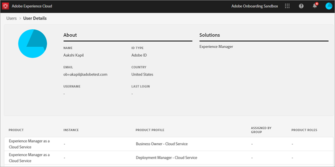

# 视图工具中的Experience Cloud用户

管理员可以在管理工具中视图所有Experience Cloud用户及其详细信息的可排序和可过滤的列表。 用户详细信息包括用户的产品访问、角色和上次访问信息。 (注&#x200B;**意：** 用户和产品管理在 [Admin Console中配置](admin-getting-started.md)。)

1. Log in to `https://experience.adobe.com/.`

   

1. 在Experience Cloud主页中，单击管 **[!UICONTROL 理工具。]**

   (或者，在主页URL中，您可以用 _admin替换__主页。_)

   此时将 [!UICONTROL 显示] “用户”页面。

## “用户”页

此页显示有权访问您组织中的Experience Cloud的用户的完整列表。 它提供有关解决方案授权和上次登录的信息。 您可以搜索、排序和筛选用户列表的自定义视图。

| 元素 | 描述 |
|---|---|
| [!UICONTROL 名称] | 用户的名和姓。 您可以将此列从A排序到Z，将Z排序到A。 单击用户名可查看有关该用户的更多详细信息。 |
| [!UICONTROL 电子邮件] | 与用户关联的电子邮件地址。 列可以按A->Z、Z->A排序。 |
| [!UICONTROL ID类型] | 用户帐户的标识类型。 过滤器可以应用于视图特定的ID类型。 有关更 [多信息，请参阅](https://helpx.adobe.com/enterprise/using/identity.html) “管理标识类型”。 |
| [!UICONTROL 解决方案] | 用户可访问的Experience Cloud解决方案摘要。 您可以应用过滤器来缩小具有特定解决方案访问权限的用户的列表。 |
| [!UICONTROL 上次登录] | 最近用户登录Experience Cloud的时间和日期。 此列可以按升序或降序日期排序。   **重要说明：** 自2020年1月13日起，用户的上次登录数据将保留365天。 此信息旨在显示Experience Cloud中的当前登录活动，而不是建议在2020年1月13日之前对不活动帐户采取相应操作。 |

## 自定义用户列表视图

您可以搜索、排序或筛选列以自定义用户列表。

* 按名称或电子邮件搜索用户。 搜索与您键入的文本字符串匹配。
* 按升序或降序值对列排序。 这适用于“名 [!UICONTROL 称”、] “电 [!UICONTROL 子邮件”] 和“ [!UICONTROL 上次登录] ”列。
* 单击“筛 **[!UICONTROL 选依据]** ”图标，将多个过滤器应用于具有特定条件的列表用户。 应用多个过滤器类别后，搜索将包含电子邮件域 `AND` ID类型解决 `AND` 方案。

| 元素 | 描述 |
|---------|----------|
| [!UICONTROL 电子邮件域过滤器] (Email Domain filter) | 在“电子邮件”列中搜索字符串，将结果缩小到一个或多个域。 在每个搜索词后按Enter可添加多个过滤器 |
| [!UICONTROL ID类型过滤器] (I) | 从可用的ID类型中进行选择。 可以将多个ID类型用作过滤器。 |
| [!UICONTROL 解决方案] (Solution)过滤器 | 从可用的解决方案中进行选择。 多个解决方案过滤器搜索包含Solution 1 `OR` Solution 2的结果。 |

## 视图用户详细信息

在“用 [!UICONTROL 户] ”页面上，要视图用户的详细信息，请单击用户的电子邮件。

每个用户的详细视图显示有关用户的解决方案访问、管理员和产品角色以及上次访问信息的重要详细信息。

## 关于章节

此部分显示用户帐户的摘要，包括：

* 用户头像和系统管理徽章（如果适用）
* 名称
* 电子邮件
* 用户名（Federated ID帐户的用户名可能与电子邮件地址不同）
* [ID类型](https://helpx.adobe.com/enterprise/using/identity.html)
* 国家／地区
* 上次登录

## 解决方案摘要

此部分显示用户可访问的Experience Cloud解决方案摘要。 包括产品管理角色（如果适用）。

## 详细的产品访问列表

此部分显示用户所有产品用户档案会员资格的完整列表。

| 元素 | 描述 |
|---------|----------|
| [!UICONTROL 产品] | 与产品用户档案关联的产品名称。 |
| [!UICONTROL 实例] | 与产品和产品公司关联的实例的名称(如登录用户档案或租户)。 |
| [!UICONTROL 产品配置文件] | 产品用户档案的唯一名称。 |
| [!UICONTROL 按组分配] | 将用户关联到产品用户档案的用户组的名称。 空白结果表示用户直接分配到产品用户档案，而不是通过组分配。 |
| [!UICONTROL 产品角色] | 产品用户档案中用户的角色分配。 目前，此信息仅适用于Adobe目标产品用户档案。 |
