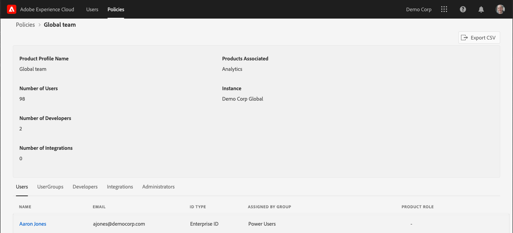

# 视图Experience Cloud工具中的用户和策略

管理员可以使用管理工具中的详细信息视图所有Experience Cloud用户和策略的可排序和可过滤的列表。 用户详细信息包括用户的产品访问、角色和上次访问信息。 策略详细信息包括策略的(产品用户档案)用户、组、开发人员、集成和管理列表，以及策略的详细权限和资源信息。

>[!NOTE]
>
>User and product management is configured in the [Admin Console](admin-getting-started.md).

1. 登录 `https://experience.adobe.com/.`

   

1. 在“快 [!UICONTROL 速访问]”下，单 **[!UICONTROL 击“管理工具”。]**

   （或者，在主页 URL 中，您可以将 _home_ 替换为 _admin_。）

   此时，将显示[!UICONTROL 用户]页。

## “用户”页面

此页面显示贵组织中有权访问 Experience Cloud 的完整用户列表。它会提供有关解决方案权利和上次登录的信息。您可以搜索、排序和过滤用户列表的自定义视图。

| 元素 | 描述 |
|---|---|
| [!UICONTROL 名称] | 用户的名字和姓氏。您可以按从 A 到 Z 以及 Z 到 A 对此列进行排序。单击用户名可查看有关该用户的更多详细信息。 |
| [!UICONTROL 电子邮件] | 与用户关联的电子邮件地址。此列可以按 A->Z、Z->A 进行排序。 |
| [!UICONTROL ID 类型] | 用户帐户的标识类型。可应用过滤器以查看特定 ID 类型。有关更多信息，请参阅[管理标识类型](https://helpx.adobe.com/cn/enterprise/using/identity.html)。 |
| [!UICONTROL 解决方案] | 用户可访问的 Experience Cloud 解决方案摘要。您可以应用过滤器来缩小具有特定解决方案访问权限的用户列表。 |
| [!UICONTROL 上次登录] | 用户最近登录 Experience Cloud 的时间和日期。此列可以按升序或降序日期排序。  **重要信息：**&#x200B;自 2020 年 1 月 13 日起，用户的上次登录数据将保留 365 天。该信息旨在显示 Experience Cloud 中的当前登录活动，而不是建议在 2020 年 1 月 13 日之前对不活动帐户采取行动。 |

## 自定义用户列表视图

您可以搜索、排序或过滤列以自定义用户列表。

* 按名称或电子邮件搜索用户。搜索与您键入的文本字符串匹配。
* 按升序或降序值对列排序。这适用于[!UICONTROL 名称]、[!UICONTROL 电子邮件]和[!UICONTROL 上次登录]列。
* 单击&#x200B;**[!UICONTROL 过滤依据]**&#x200B;图标可应用多个过滤器以列出具有特定条件的列表。应用多个过滤类别后，搜索将包含“电子邮件域”`AND`“ID 类型”`AND`“解决方案”。

| 元素 | 描述 |
|---------|----------|
| [!UICONTROL 电子邮件域]过滤器 | 在“电子邮件”列中搜索字符串，以将结果范围缩小到一个或多个域。在每个搜索词后按 Enter 键可添加多个过滤器 |
| [!UICONTROL ID 类型]过滤器 | 从可用的 ID 类型中进行选择。可以将多个 ID 类型用作过滤器。 |
| [!UICONTROL 解决方案]过滤器 | 从可用的解决方案中进行选择。多个解决方案过滤器搜索包含“解决方案 1”`OR`“解决方案 2”的结果。 |

## 查看用户详细信息

在[!UICONTROL 用户]页面上，要查看用户的详细信息，请单击用户的电子邮件。

每个用户的详细视图将显示有关用户的解决方案访问权限、管理员和产品角色以及上次访问信息的重要详细信息。

## 关于部分

此部分显示用户帐户的摘要，包括：

* 用户头像和系统管理员徽章（如果适用）
* 名称
* 电子邮件
* 用户名（Federated ID 帐户的用户名可能与电子邮件地址不同）
* [ID 类型](https://helpx.adobe.com/cn/enterprise/using/identity.html)
* 国家/地区
* 上次登录

## 解决方案摘要

此部分会显示用户可访问的 Experience Cloud 解决方案的摘要。包括产品管理角色（如果适用）。

## 详细的产品访问列表

此部分显示用户的所有产品配置文件成员资格的完整列表。

| 元素 | 描述 |
|---------|----------|
| [!UICONTROL 产品] | 与产品配置文件关联的产品名称。 |
| [!UICONTROL 实例] | 与产品和产品配置文件关联的实例的名称（如登录公司或租户）。 |
| [!UICONTROL 产品配置文件] | 产品配置文件的唯一名称。 |
| [!UICONTROL 按组分配] | 将用户关联到产品配置文件的用户组的名称。空白结果表示未通过组直接将用户分配到产品配置文件。 |
| [!UICONTROL 产品角色] | 产品配置文件中用户的角色分配。目前，此信息仅适用于 Adobe Target 产品配置文件。 |

## 策略页

此页显示组织中Experience Cloud策略的完整列表。 它提供有关产品、实例、用户和开发人员的信息。 您可以搜索、排序和筛选策略视图的自定义列表。

| 元素 | 描述 |
|---|---|
| [!UICONTROL 产品配置文件] | 产品用户档案的名称。 列可以按A->Z、Z->A排序。单击产品用户档案的名称可查看有关策略的更多详细信息。 |
| [!UICONTROL 产品] | 与产品用户档案关联的产品。 此列可以按 A->Z、Z->A 进行排序。 |
| [!UICONTROL 实例] | 与产品公司关联的实例(例如租户或登录用户档案)。 没有唯一实例或租户的产品将显示“ - ”作为值。 此列可以按 A->Z、Z->A 进行排序。 |
| [!UICONTROL 用户数] | 与产品用户档案关联的唯一用户计数，包括直接分配和组分配。 列可以按最小到最大或最大到最小的顺序排序。 |
| [!UICONTROL 开发者数量] | 与产品用户档案关联的开发人员角色计数。 列可以按最小到最大或最大到最小的顺序排序。 |

## 自定义策略列表视图

您可以搜索、排序或筛选列以自定义策略列表。

* 按名称搜索产品用户档案。 搜索与您键入的文本字符串匹配。
* 按升序或降序值对列排序。这适用于产 [!UICONTROL 品用户档案、] 产 [!UICONTROL 品、] 实 [!UICONTROL 例、用] 户数、 [!UICONTROL 、开] 发者数量、列。
* Click the **[!UICONTROL Filter By]** icon to apply multiple filters to list product profiles with specific criteria. 应用多个筛选类别时，搜索包含与组关联的实 `AND` 例解决 `AND` 方案。

| 元素 | 描述 |
|---------|----------|
| [!UICONTROL 实例筛选] | 在实例列中搜索字符串，将结果缩小为一个或多个实例。 在每个搜索词后按 Enter 键可添加多个过滤器. |
| [!UICONTROL 解决方案]过滤器 | 从可用的解决方案中进行选择。多个解决方案过滤器搜索包含“解决方案 1”`OR`“解决方案 2”的结果。 |

## 视图策略详细信息

在“策 [!UICONTROL 略] ”页面上，要视图策略的详细信息，请单击产品用户档案名称。

每个产品用户档案的详细视图会显示有关产品用户档案的主题（用户、组等）的重要详细信息。 它还显示产品用户档案启用的权限和资源。

产品用户档案的详细信息可导出为CSV文件。 “导 [!UICONTROL 出CSV] ”选项会生成两个CSV文件：

* 主题详细信息（用户、用户组、开发人员、集成、管理员）
* 权限和资源项目

## 摘要部分

此部分显示产品用户档案的摘要，包括：

* 产品用户档案名称
* 用户数
* 开发者数量
* 集成数
* 产品关联
* 实例

## 详细主题列表

此部分显示分配给产品列表的所有用户、用户组、开发人员、集成和管理员的完整用户档案。

| 制表符 | 描述 |
|---------|----------|
| [!UICONTROL 用户] | 产品列表中包含的用户用户档案。 用户组关联将显示在“按 [!UICONTROL 用户组分配] ”列中。 |
| [!UICONTROL 用户组] | 与产品列表关联的用户组用户档案。 |
| [!UICONTROL 开发人员] | 与产品用户档案关联的开发人员的列表。 |
| [!UICONTROL 集成] | 与产品列表关联的集成用户档案。 |
| [!UICONTROL 管理员] | 与产品用户档案关联的管理员列表。 |

## 详细权限和资源列表

此部分显示产品列表可用的权限和资源的完整用户档案。 产品用户档案中包含的权限和资源已标记为“✔”。 列表权限和资源已分为选项卡和列，以便更轻松地查看。 选项卡和列显示应用于当前产品的章节的列表。
