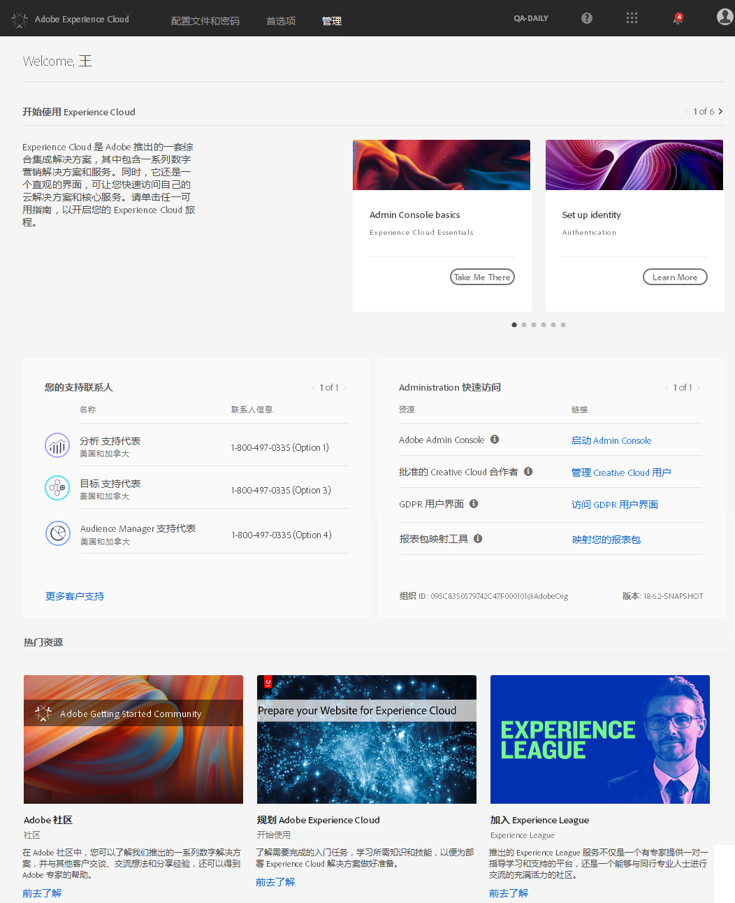
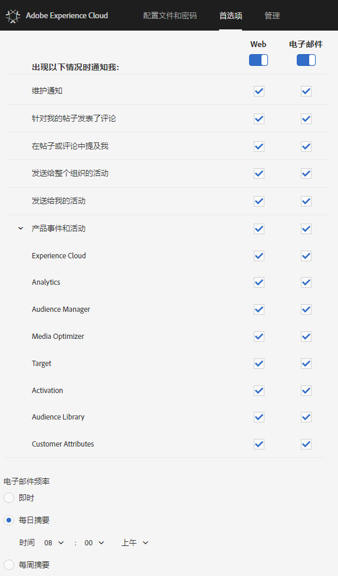

# 登录并管理Experience Cloud用户档案设置

登录Experience Cloud（而不是登录到单个解决方案）后，只需登录自己拥有的所有解决方案和服务。 此帮助描述如何登录Experience Cloud、管理密码和通知以及指定默认登陆页。

>[!IMPORTANT]
>
>对于管理员，请参阅[管理](../admin-getting-started/admin-getting-started.md#topic_3FCB4099640647E3B2411ADBFCE81909)以了解有关用户和产品管理更新的信息。

## 登录到 Experience Cloud（管理员）{#task_034FC955031347F3B02B686A09801A08}

登录并验证您是否处于正确的[组织](../admin-getting-started/organizations.md#topic_C31CB834F109465A82ED57FF0563B3F1)中。

1. 单击 Experience Cloud 下拉菜单 ()，然后单击&#x200B;**[!UICONTROL 管理]**。

   

   如果未显示&#x200B;**[!UICONTROL 管理]**&#x200B;链接，您便不是所显示[组织](../admin-getting-started/organizations.md#topic_C31CB834F109465A82ED57FF0563B3F1)（在此示例中为 Adobe Corp）的 Experience Cloud 管理员。有关成为管理员方面的帮助，请联系客户关怀团队或贵公司的现有 Experience Cloud 管理员。
1. 单击&#x200B;**[!UICONTROL 管理]**。

   
1. 单击以下链接之一，以便继续操作：

| 元素 | 描述 |
|--- |--- |
| [Admin Console基础知识](https://helpx.adobe.com/cn/marketing-cloud/how-to/first-time-setup.html) | 了解开始使用Experience Cloud解决方案时需要采取的初始步骤。 |
| [设置标识](https://helpx.adobe.com/cn/enterprise/using/set-up-identity.html) | 定义并设置一个标识系统，最终用户将通过该系统进行身份验证。 |
| [用户管理](https://helpx.adobe.com/cn/enterprise/using/users.html) | 了解如何登录到 Admin Console 并管理 Experience Cloud 用户权限和产品配置文件。 |
| [启动Admin Console](../admin-getting-started/admin-getting-started.md) | Admin Console是管理整个组织中的Adobe用户和产品授权的中心位置。 您也可以使用[直接链接](https://adminconsole.adobe.com)登录到 Admin Console。 |
| [管理 Creative Cloud 用户](../experience-cloud-assets/t-admin-add-cc-user.md) | Experience Cloud Assets使营销人员能够使用Creative Cloud与设计人员及其他创意资产共享、同步文件夹并展开协作。 您可以在此处管理获准与您的组织协作的Creative Cloud用户。 |
| [映射报表包](../core-services/core-services.md) | （仅限分析）Experience Cloud核心服务与组织而非单个报表包关联。 要确保这些服务能够正确运行，必须将每个Analytics报表包映射到一个组织。 (此任务是为核心服务启用Analytics的更 [广泛工作流程的一部分](../core-services/core-services.md#concept_07ED1D5C64234E77976E6D572E78FB9C))。 |
| [Organization ID](../admin-getting-started/organizations.md) | 组 *织ID* 位于“管理”页面的底部。 此ID是与您配置的Experience Cloud公司关联的ID。 此 ID 是由 24 个字符组成的字母数字字符串，其后跟（且必须包括）@AdobeOrg。 |

## 登录到 Experience Cloud（用户）{#task_1BFE87E20DCB44078CAC82F3CD44B985}

帮助非管理用户登录到 Experience Cloud。

1. 通过您的管理员验证您的[组织](../admin-getting-started/getting-started-experience-cloud.md#concept_384D169B0B724B799D573B8ECB5C39BF)是否已在 Experience Cloud 中配置。

1. Navigate to the [Adobe Experience Cloud](https://experiencecloud.adobe.com) ([!DNL experiencecloud.adobe.com]).
1. 单击&#x200B;**[!UICONTROL 使用 Adobe ID 登录]**。

   您的 Experience Cloud 管理员可以帮助您确定帐户类型（Adobe ID 或 Enterprise ID）。

1. 在登陆页中，单击选择器  图标以访问下拉菜单。

   

   此菜单中具体显示哪些解决方案和服务，取决于您的[管理员](../admin-getting-started/admin-getting-started.md#topic_3FCB4099640647E3B2411ADBFCE81909)定义的应用程序权限。

## 配置默认的个人帐户设置 {#task_73CBCAE6C91749D19C95421E5AC311BA}

您可以编辑个人详细信息，并指定在登录到 Experience Cloud 后要显示的默认[组织](../admin-getting-started/admin-getting-started.md#concept_705C626560A54CA2A4215F1C870C42B2)和登录页面。

1. 登录到 Experience Cloud，然后单击您的配置文件图标。

   
1. 单击&#x200B;**[!UICONTROL 编辑配置文件]**。

   
1. 继续配置和编辑个人信息，然后单击&#x200B;**[!UICONTROL 保存更改]**。

## 启用通知 {#concept_0105453AD71847B8BFCAF4A40915F157}

获得有关系统更新、维护通知、帖子、提及和共享资产的通知（通过电子邮件或产品内）。 您还可以指定要通知的产品和解决方案，包括客户属性的上传状态。

要导航到通知，请单击&#x200B;**[!UICONTROL 通知]**&#x200B;图标 ，然后单击&#x200B;**[!UICONTROL 设置]**&#x200B;图标 。

您可以根据重要的消息类型对通知显示进行排序，并搜索通知。 您还可以：

* 按重要的消息类型排序。
* 搜索通知。

**启用通知**

<!-- 
 <b>Analytics</b> 
 
<ul id="ul_91BF597858124FA5BF338C36F6C5533F"> 
 <li id="li_FAD3E93CDE6242F58F14D55C8A6E23D7">Contribution analysis completed </li> 
 <li id="li_03D33D3228884CECA371B58656B2F3E7">Guided analysis shared </li> 
 <li id="li_DCF710F89317487B8DAA86CC05C694CA">Scheduled report failure </li> 
</ul> 

 <b>Adobe Target</b> 
 

Test started or stopped 
 

 <b>Media Optimizer</b> 
 

Performance alerts 
 

 <b>Dynamic Tag Manager</b> 
 
<ul id="ul_9ACDA418933E40918744D9C32A57DD4B"> 
 <li id="li_4DD0FFD3D9F84A428703611EF767D4D0">New web property created </li> 
 <li id="li_C6B923012E9D40BA91F4CBF7D2D72986">New user added </li> 
 <li id="li_EB0B9D1CFDE24E6987935CCCBFC7892A">Approvals - publishing and approval status for new rules, data elements, and tools </li> 
 <li id="li_17B0B176FF85435FB7EDD4317BC18201">Property has been published </li> 
</ul> -->

## 管理用户档案和密码 {#task_7B89F4F38E5A4C4EB0FF842953856382}

您可以编辑 Experience Cloud 配置文件，指定默认的组织和登录页面，以及执行更多其他操作。

1. [登录到 Experience Cloud](../admin-getting-started/getting-started-experience-cloud.md#task_1BFE87E20DCB44078CAC82F3CD44B985).

1. 从 Experience Cloud 菜单中，单击您的配置文件图片。

   
1. 单击&#x200B;**[!UICONTROL 编辑配置文件]**。

   在“用户档案和密码”页面上，填写“个人详细信息”下的字段和选项。

## 恢复密码 {#task_46541A2806164CB1A4AE8239604E4EB1}

1. 导航至您的解决方案登录页面。
1. 单击&#x200B;**[!UICONTROL 忘记密码]**。

   重置解决方案密码应该能够解决 Experience Cloud 的密码关联问题。

   For Adobe Analytics users, navigate to [https://sc2.omniture.com/password_recovery.html](https://sc2.omniture.com/password_recovery.html).

## 使用直接链接配置解决方案登录 {#concept_8BE493A08786469B88B210E13F78FF2F}

或者，您也可以使用Experience Cloud界面提供的身份验证登录到解决方案中的特定页面。

### URL模板

`https://<tenantId>.experiencecloud.adobe.com/<solutionname>?destURL=<fullURL>`

示例 URL：

`https://aem62tenant.experiencecloud.adobe.com/analytics?destURL=https%3A%2F%2Fsc.omniture.com%2Freports%2F11562.html`

>[!NOTE]
>
>在将任何 URL 传递到 `destURL` 参数之前，您必须对其进行编码。(Encoder sites like [URL Decoder / Encoder](https://meyerweb.com/eric/tools/dencoder/) are available.)

| 参数 | 描述 | 示例 | 必需／可选 |
|--- |--- |--- |--- |
| tenantId | 用户应登录的租户的名称。 | aem62tenant | 可选 |
| destURL | 用户应转到的位置的完整URL。 | https://sc.omniture.com/x/1_7xxzf | 可选 |
| solutionname | 作为destURL参数所有者的MAC解决方案的名称。 用于验证用户是否有权访问拥有该 URL 的解决方案。解决方案应负责确保 solutionname 与 destURL 参数一致。例如： 如果URL包含社交解决方案名称，而提供的destURL是分析URL，则即使用户无权访问分析，也会将用户重定向到该URL。 MAC不会验证destURL的所有者是否与解决方案名称同步。 | analytics | 如果使用destURL参数，则此为必需字段。 |
