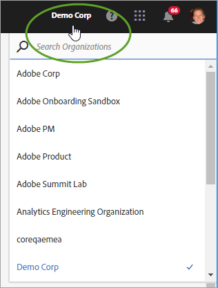
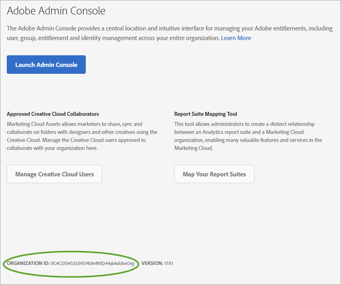
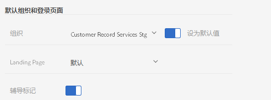

# 组织和帐户关联

了解管理组织并将解决方案帐户关联到 Experience Cloud 的信息。

<!-- accounts-experience-cloud.xml -->

## 识别您的组织 {#concept_384D169B0B724B799D573B8ECB5C39BF}

“组织”**&#x200B;是一个实体，它允许管理员配置群组和用户，并控制 Experience Cloud 中的单点登录。组织的作用类似于一个衔接所有 Experience Cloud 产品和解决方案的登录公司。大多数情况下，组织即是您的公司名称。但是，公司可以具有多个组织。

另外，要获得支持，您可能还需要找到组织 ID。您可以使用&#x200B;**[!UICONTROL 组织]菜单验证自己是否处于正确的组织中，或在不同组织之间切换。**

## 查找您的组织 ID {#concept_EA8AEE5B02CF46ACBDAD6A8508646255}

**组织 ID** 是与您配置的 Experience Cloud 公司关联的 ID。此 ID 是由 24 个字符组成的字母数字字符串，其后跟（且必须包括）@AdobeOrg。

要查看您的组织 ID，请导航至 Experience Cloud 登录页面，或单击 ()，然后单击&#x200B;**[!UICONTROL 管理]**。您可以在 [!UICONTROL Experience Cloud 快速入门]页面或[!UICONTROL 管理]页面的底部找到组织 ID。

## 将解决方案帐户关联到 Adobe ID {#task_FD389E78640848919E247AC5E95B8369}

通常，Experience Cloud 管理员可授予对解决方案和服务的访问权限。在极少数情况下，您可能需要将解决方案凭据关联到 Adobe ID。

1. 按照邀请您加入 Experience Cloud 的电子邮件中的步骤操作。
1. 使用您的 Adobe ID 或 Enterprise ID 登录。
1. 单击解决方案选择器 ()。

   

   您有权访问的解决方案会用彩色标出。
1. 单击所需的解决方案。

   

   如果您属于相应的群组（并拥有解决方案的访问权限），但还没有将帐户凭据关联到 Adobe ID，则会显示此类型的消息。
1. 单击&#x200B;**[!UICONTROL 关联帐户]**，然后提供您的凭据。

## 指定默认组织和登录页面 {#concept_6A191B42A9874A9780882903BA18F071}

您可以指定要在登录时使用的默认组织和登录页面。

在您的配置文件中，单击&#x200B;**[!UICONTROL 编辑配置文件]**。

在“默认组织和登录页面”下方，您可以定制登录体验。

## 解决帐户关联问题 {#concept_DFCB29A3B4834FC59AA29E0BBA301584}

帮助解决帐户关联问题。

通常，帐户关联失败的原因是，Adobe ID 关联到以前的用户。当帐户关联失败时，您可以：

* [联系 Adobe 支持](https://helpx.adobe.com/marketing-cloud/contact-support.html)。
* 在我们着手解决问题的同时，使用标准登录访问您的解决方案。
