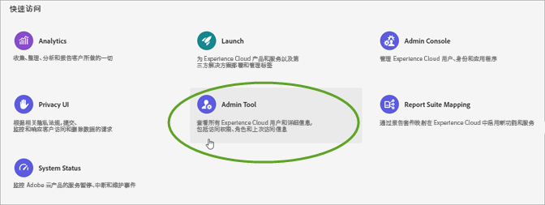
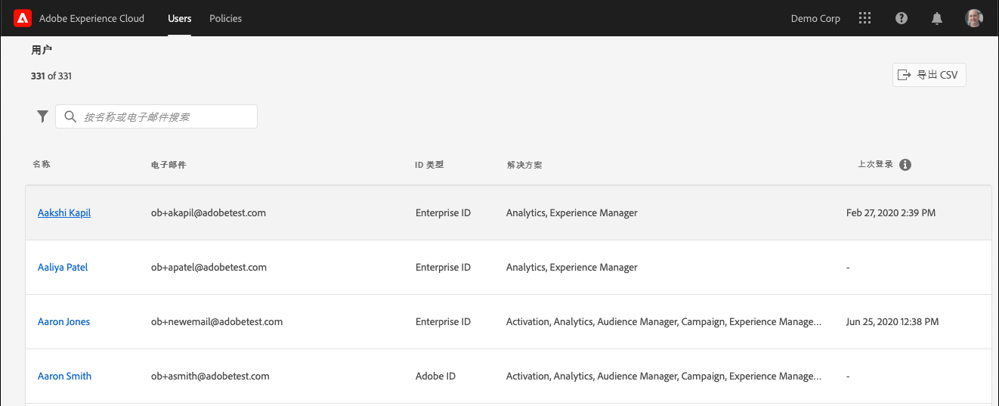
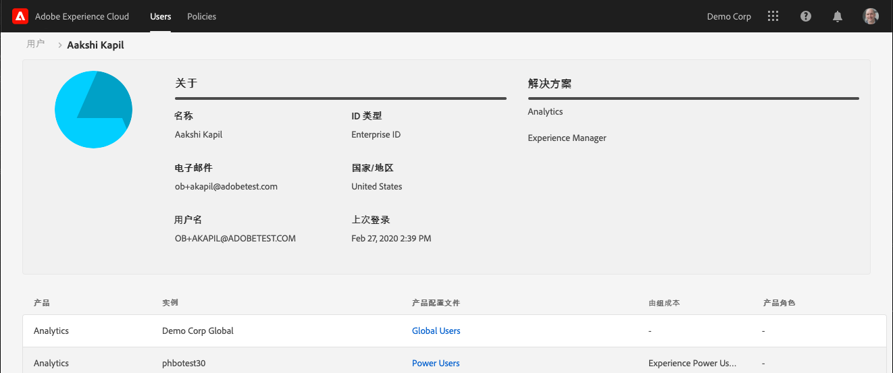
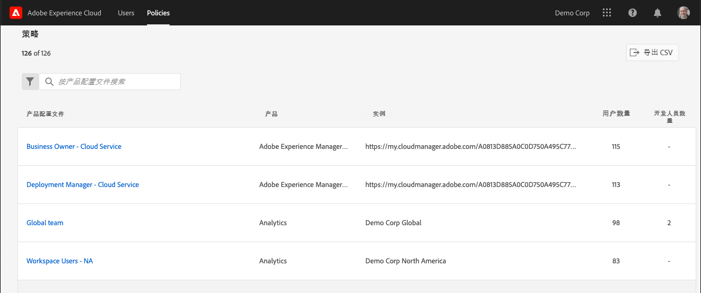
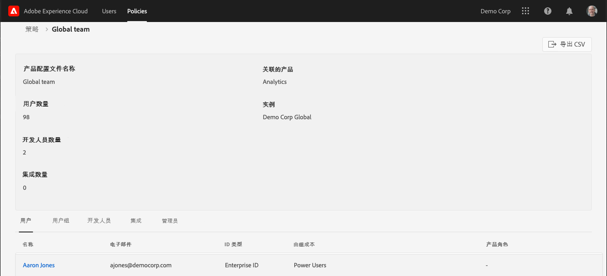

# 在“管理工具”中查看 Experience Cloud 用户和策略

管理员可以在“管理工具”中查看所有 Experience Cloud 用户和策略的可排序和可过滤列表及其详细信息。用户详细信息包括用户的产品访问、角色和上次访问信息。策略详细信息包括策略的（产品配置文件）用户、组、开发人员、集成和管理员列表，以及策略的详细权限和资源信息。

>[!NOTE]
>
>应在 [Admin Console](admin-getting-started.md) 中配置用户和产品管理。

1. 登录 `https://experience.adobe.com/.`

   

1. 在[!UICONTROL 快速访问]下，单击&#x200B;**[!UICONTROL 管理工具]**。

   （或者，在主页 URL 中，您可以将 _home_ 替换为 _admin_。）

   此时，将显示[!UICONTROL 用户]页。

## “用户”页面

此页面显示贵组织中有权访问 Experience Cloud 的完整用户列表。它会提供有关解决方案权利和上次登录的信息。您可以搜索、排序和过滤用户列表的自定义视图。

| 元素 | 描述 |
|---|---|
| [!UICONTROL 名称] | 用户的名字和姓氏。您可以按从 A 到 Z 以及 Z 到 A 对此列进行排序。单击用户名可查看有关该用户的更多详细信息。 |
| [!UICONTROL 电子邮件] | 与用户关联的电子邮件地址。此列可以按 A->Z、Z->A 进行排序。 |
| [!UICONTROL ID 类型] | 用户帐户的标识类型。可应用过滤器以查看特定 ID 类型。有关更多信息，请参阅[管理标识类型](https://helpx.adobe.com/cn/enterprise/using/identity.html)。 |
| [!UICONTROL 解决方案] | 用户可访问的 Experience Cloud 解决方案摘要。您可以应用过滤器来缩小具有特定解决方案访问权限的用户列表。 |
| [!UICONTROL 上次登录] | 用户最近登录 Experience Cloud 的时间和日期。此列可以按升序或降序日期排序。  **重要信息：**&#x200B;自 2020 年 1 月 13 日起，用户的上次登录数据将保留 365 天。此信息旨在显示Experience Cloud中的当前登录活动，而不是建议在2020年1月13日之前对不活动帐户采取操作。 |

## 自定义用户列表视图

您可以搜索、排序或过滤列以自定义用户列表。

* 按名称或电子邮件搜索用户。搜索与您键入的文本字符串匹配。
* 按升序或降序值对列排序。此排序适用于[!UICONTROL 名称、] [!UICONTROL 电子邮件、]和[!UICONTROL 上次登录]列。
* 要应用多个过滤器以列出具有特定条件的用户，请单击&#x200B;**[!UICONTROL 过滤依据]**&#x200B;图标。 应用多个过滤类别后，搜索将包含“电子邮件域”`AND`“ID 类型”`AND`“解决方案”。

| 元素 | 描述 |
|---------|----------|
| [!UICONTROL 电子邮件域]过滤器 | 在“电子邮件”列中搜索字符串，以将结果范围缩小到一个或多个域。在每个搜索词后按 Enter 键可添加多个过滤器 |
| [!UICONTROL ID 类型]过滤器 | 从可用的 ID 类型中进行选择。可以将多个 ID 类型用作过滤器。 |
| [!UICONTROL 解决方案]过滤器 | 从可用的解决方案中进行选择。多个解决方案过滤器搜索包含“解决方案 1”`OR`“解决方案 2”的结果。 |

## 查看用户详细信息

在[!UICONTROL 用户]页面上，要查看用户的详细信息，请单击用户的电子邮件。

每个用户的详细视图将显示有关用户的解决方案访问权限、管理员和产品角色以及上次访问信息的重要详细信息。

## “关于”部分

此部分显示用户帐户的摘要，包括：

* 用户头像和系统管理员徽章（如果适用）
* 名称
* 电子邮件
* 用户名(Federated ID帐户的用户名可能与电子邮件地址不同)
* [ID 类型](https://helpx.adobe.com/enterprise/using/identity.html)
* 国家/地区
* 上次登录

## 解决方案摘要

此部分会显示用户可访问的 Experience Cloud 解决方案的摘要。包括产品管理角色（如果适用）。

## 详细的产品访问列表

此部分显示用户的所有产品配置文件成员资格的完整列表。

| 元素 | 描述 |
|---------|----------|
| [!UICONTROL 产品] | 与产品配置文件关联的产品名称。 |
| [!UICONTROL 实例] | 与产品和产品配置文件关联的实例的名称（如登录公司或租户）。 |
| [!UICONTROL 产品配置文件] | 产品配置文件的唯一名称。 |
| [!UICONTROL 按组分配] | 将用户关联到产品配置文件的用户组的名称。空白结果表示用户是直接分配给产品配置文件的，而不是通过组分配的。 |
| [!UICONTROL 产品角色] | 产品配置文件中用户的角色分配。目前，此信息仅适用于 Adobe Target 产品配置文件。 |

## “策略”页面

此页面显示组织中 Experience Cloud 策略的完整列表。它提供了有关产品、实例、用户和开发人员的信息。您可以搜索、排序和过滤，以获取策略列表的自定义视图。

| 元素 | 描述 |
|---|---|
| [!UICONTROL 产品配置文件] | 产品配置文件的名称。列可以按A->Z、Z->A进行排序。要查看有关策略的更多详细信息，请单击产品配置文件的名称。 |
| [!UICONTROL 产品] | 与产品配置文件关联的产品。此列可以按 A->Z、Z->A 进行排序。 |
| [!UICONTROL 实例] | 与产品配置文件关联的实例（例如，租户或登录公司）。 对于没有唯一实例或租户的产品，该值会显示“ — ”。 此列可以按 A->Z、Z->A 进行排序。 |
| [!UICONTROL 用户数量] | 与产品配置文件关联的唯一用户计数，包括直接分配和组分配。此列可以按从最小到最大或从最大到最小的顺序进行排序。 |
| [!UICONTROL 开发人员数量] | 与产品配置文件关联的开发人员角色计数。此列可以按从最小到最大或从最大到最小的顺序进行排序。 |

## 自定义策略列表视图

您可以对各个列进行搜索、排序或过滤，以自定义策略列表。

* 按名称搜索产品配置文件。搜索与您键入的文本字符串匹配。
* 按升序或降序值对列排序。此排序适用于[!UICONTROL 产品配置文件] [!UICONTROL 产品、] [!UICONTROL 实例、] [!UICONTROL 用户数、]和[!UICONTROL 开发人员数，]列。
* 单击&#x200B;**[!UICONTROL 过滤依据]**&#x200B;图标可应用多个过滤器，以列出符合特定条件的产品配置文件。应用多个过滤类别时，搜索包含与 `AND` 实例 `AND` 解决方案关联的组。

| 元素 | 描述 |
|---------|----------|
| “[!UICONTROL 实例]”过滤器 | 在“实例”列中搜索字符串，以将结果范围缩小到一个或多个实例。在每个搜索词后按 Enter 键可添加多个过滤器。 |
| “[!UICONTROL 解决方案]”过滤器 | 从可用的解决方案中进行选择。多个解决方案过滤器搜索包含“解决方案 1”`OR`“解决方案 2”的结果。 |

## 查看策略详细信息

在“[!UICONTROL 策略]”页面上，要查看策略的详细信息，请单击产品配置文件名称。

每个产品配置文件的详细视图会显示有关产品配置文件主体（用户、组等）的重要详细信息。它还会显示产品配置文件启用的权限和资源。

产品配置文件的详细信息可导出为 CSV 文件。[!UICONTROL 导出 CSV] 选项会生成两个 CSV 文件：

* 主体详细信息（用户、用户组、开发人员、集成、管理员）
* 权限和资源项

## “摘要”部分

此部分显示产品配置文件的摘要，包括：

* 产品配置文件名称
* 用户数量
* 开发人员数量
* 集成数量
* 关联的产品
* 实例

## 详细的主体列表

此部分显示分配给产品配置文件的所有用户、用户组、开发人员、集成和管理员的完整列表。

| 选项卡 | 描述 |
|---------|----------|
| [!UICONTROL 用户] | 产品配置文件中包含的用户列表。用户组关联显示在[!UICONTROL 按组]分配列中。 |
| [!UICONTROL 用户组] | 与产品配置文件关联的用户组列表。 |
| [!UICONTROL 开发人员] | 与产品配置文件关联的开发人员列表。 |
| [!UICONTROL 集成] | 与产品配置文件关联的集成列表。 |
| [!UICONTROL 管理员] | 与产品配置文件关联的管理员列表。 |

## 详细的权限和资源列表

此部分显示产品配置文件可用的权限和资源的完整列表。产品配置文件中包含的权限和资源已标记“✔”。权限和资源列表已分类为不同的选项卡和列，以便更轻松地查看。选项卡和列显示应用于当前产品的各个部分的列表。
