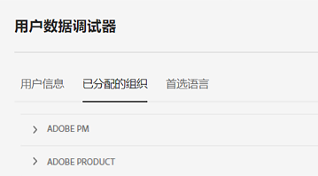

# Experience Cloud 中的组织

*组织* （组织ID）是一个实体，它允许管理员配置组和用户，并控制Experience Cloud中的单点登录。

组织的功能类似于跨所有 Experience Cloud 产品和应用程序的登录公司。大多数情况下，组织是您的公司名称。但是，公司可以具有多个组织。

要验证您是否已登录到正确的组织，请单击&#x200B;**[!UICONTROL 配置文件]**&#x200B;查看默认组织名称。 如果您有权访问多个组织，则还可以在标题栏中查看和切换到另一个组织。

>[!NOTE]
>
>在组织之间切换允许您访问该特定组织的Admin Console。 如果您未看到列出的所需组织，则可能需要请求该组织中的管理员授予访问权限。 (如果您需要合并多个Admin Console，请联系Adobe客户支持寻求帮助。)

## Federated ID

如果您的组织使用 Federated ID，则 Experience Cloud 允许您使用组织的单点登录进行登录，而无需输入您的电子邮件地址和密码。将 `#/sso:@domain` 添加到 Experience Cloud URL (`https://experience.adobe.com`) 以完成此任务。

例如，对于带 Federated ID 和域 `adobecustomer.com` 的组织，请将 URL 链接设置为 `https://experience.adobe.com/#/sso:@adobecustomer.com`。您还可以通过为此 URL 添加书签并追加应用程序路径，直接转到特定应用程序。（例如，对于 Adobe Analytics，使用 `https://experience.adobe.com/#/sso:@adobecustomer.com/analytics`。）

## 查看您的组织ID {#concept_EA8AEE5B02CF46ACBDAD6A8508646255}

出于支持目的，您可以查找分配的组织ID。 您可以使用标头中的&#x200B;**[!UICONTROL 组织]**&#x200B;选择器验证自己所在的组织是否正确，或者在不同组织之间切换。

组织 ID 是与您配置的 Experience Cloud 公司关联的 ID。此 ID 是由 24 个字符组成的字母数字字符串，其后跟（且必须包括）`@AdobeOrg`。

您可以在`https://experience.adobe.com`的任何页面上使用键盘快捷键&#x200B;**Ctrl+i**&#x200B;查看您的组织ID以及其他帐户信息。

**查看您的组织ID**

1. 在[Experience Cloud](https://experience.adobe.com)中，按键盘上的&#x200B;**Ctrl+i**。

   

1. 在&#x200B;**[!UICONTROL 用户信息]**&#x200B;下，查找&#x200B;**[!UICONTROL 当前组织ID]**，您可以找到组织ID。

   或者，管理员还可以登录Admin Console(导航到[https://adminconsole.adobe.com](https://adminconsole.adobe.com))，并在URL中查看您的组织ID。

   例如，在以下 URL 中：

   `https://adminconsole.adobe.com/C538193582390300A495CC9@AdobeOrg/overview`

   ID 为：

   `C538193582390300A495CC9@AdobeOrg`

## 将应用程序帐户关联到 Adobe ID {#task_FD389E78640848919E247AC5E95B8369}

通常，Experience Cloud 管理员会授予对应用程序和服务的访问权限。在极少数情况下，您可以将应用程序凭据关联到Adobe ID。

1. 按照邀请您加入Experience Cloud的电子邮件中的步骤操作。

1. 使用您的 Adobe ID 或 Enterprise ID 登录。

1. 单击&#x200B;**[!UICONTROL 应用程序选择器]**。 （）。

   

   您有权访问的应用程序会用彩色标出。

1. 单击所需的应用程序。

   

   如果您属于相应的群组（并拥有应用程序的访问权限），但还没有将帐户凭据关联到 Adobe ID，则会显示此类型的消息。

1. 单击&#x200B;**[!UICONTROL 关联帐户]**，然后提供您的凭据。

## 指定默认组织 {#concept_6A191B42A9874A9780882903BA18F071}

您可以指定登录时使用的默认组织。

1. 在标题中，单击&#x200B;**[!UICONTROL 配置文件]**，然后单击“首选项”。

1. 在[!UICONTROL 常规]下，选择一个默认组织。

## 解决帐户关联问题 {#concept_DFCB29A3B4834FC59AA29E0BBA301584}

帮助解决帐户关联所引起的问题。

通常，帐户关联会失败，因为 Adobe ID 已关联到先前的用户。当帐户关联失败时，您可以：

* [联系 Adobe 支持](https://experienceleague.adobe.com/?support-solution=General#support)。
* 在我们着手解决问题的同时，使用标准登录访问您的应用程序。
