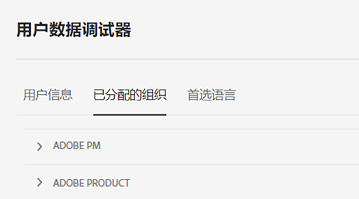

# 组织和帐户

*组织* （组织ID）是一个实体，它允许管理员配置组和用户，并控制CX Enterprise中的单点登录。

组织的作用类似于一个跨所有CX Enterprise产品和应用程序的登录公司。 大多数情况下，组织是您的公司名称。 但是，公司可以具有多个组织。

**组织菜单**

要验证您是否已登录到正确的组织，请单击&#x200B;**[!UICONTROL 配置文件]**&#x200B;查看默认组织名称。 如果您有权访问多个组织，则还可以在标题栏中查看和切换到另一个组织。

>[!NOTE]
>
>在组织之间切换允许您访问该特定组织的Admin Console。 如果您未看到列出的所需组织，则可能需要请求该组织中的管理员授予访问权限。 （如果您需要合并多个Admin Console，请联系Adobe客户支持寻求帮助。）

## Federated ID

如果您的组织使用Federated ID，则CX Enterprise允许您使用组织的单点登录进行登录，而无需输入您的电子邮件地址和密码。 将`#/sso:@domain`添加到CX Enterprise URL (`https://experience.adobe.com`)以完成此任务。

例如，对于带 Federated ID 和域 `example.com` 的组织，请将 URL 链接设置为 `https://experience.adobe.com/#/sso:@example.com`。 您还可以通过为此 URL 添加书签并追加应用程序路径，直接转到特定应用程序。 （例如，对于 Adobe Analytics，使用 `https://experience.adobe.com/#/sso:@example.com/analytics`。）

## 联合来宾帐户

您可以启用[联合来宾访问](https://helpx.adobe.com/business/enterprise/using/federated-guest-access.html)，以在您自己的域上安全地验证来宾用户。 启用后，“组织”菜单将更改，以便这些用户可以在任何CX Enterprise页上的现有组织内的帐户之间进行切换。

若要切换到联合来宾帐户，请在任何[CX Enterprise](https://experience.adobe.com)页面上的&#x200B;**[!UICONTROL 组织]**&#x200B;菜单中找到&#x200B;**[!UICONTROL 其他帐户]**。

联合来宾帐户的&#x200B;**组织菜单**

## 查看您的组织ID

出于支持目的，您可以查找分配的组织ID。 您可以使用标头中的&#x200B;**[!UICONTROL 组织]**&#x200B;选择器验证自己所在的组织是否正确，或者在不同组织之间切换。

组织ID是与您配置的CX Enterprise公司关联的ID。 此 ID 是由 24 个字符组成的字母数字字符串，其后跟（且必须包括）`@AdobeOrg`。

您可以在`https://experience.adobe.com`的任何页面上使用键盘快捷键&#x200B;**Ctrl+i**&#x200B;查看您的组织ID以及其他帐户信息。

**查看您的组织ID**

1. 在[CX Enterprise](https://experience.adobe.com)中，按键盘上的&#x200B;**Ctrl+i**。

   

1. 在&#x200B;**[!UICONTROL 用户信息]**&#x200B;下，查找&#x200B;**[!UICONTROL 当前组织ID]**，您可以找到组织ID。

   或者，管理员还可以登录Admin Console（导航到[https://adminconsole.adobe.com](https://adminconsole.adobe.com)），并在URL中查看您的组织ID。

   例如，在以下 URL 中：

   `https://adminconsole.adobe.com/C538193582390300A495CC9@AdobeOrg/overview`

   ID 为：

   `C538193582390300A495CC9@AdobeOrg`

## 指定默认组织

您可以指定登录时使用的默认组织。

1. 在标题中，单击&#x200B;**[!UICONTROL 配置文件]**，然后单击“首选项”。

1. 在[!UICONTROL 常规]下，选择一个默认组织。

