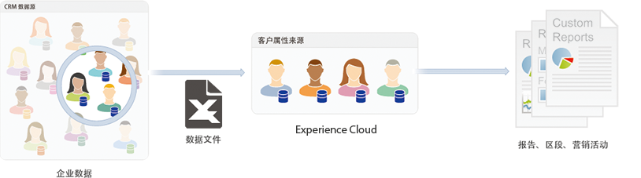

# 客户属性

## 概述

To locate [!UICONTROL customer attributes] navigate to **[!DNL Experience Platform]** > **[!UICONTROL People]** > **[!UICONTROL Customer Attributes]**

如果您在客户关系管理 (CRM) 数据库中捕获到企业客户数据，则可以将该数据上传到 Experience Cloud 中的客户属性数据源。上传后，即可利用 [!DNL Adobe Analytics] 和 [!DNL Adobe Target] 中的数据。

## 上传客户属性的先决条件 {#section_BD38693AFBF34926BA28E964963B4EA0}

* **解决方案启用：**[为核心服务启用解决方案](../core-services/core-services.md#concept_07ED1D5C64234E77976E6D572E78FB9C)。

* **群组成员资格：**&#x200B;要上传客户属性数据，用户必须是[客户属性群组](../admin-getting-started/admin-getting-started.md#task_3295A85536BF48899A1AB40D207E77E9)的成员。此外，您还必须属于 Adobe Analytics 群组或 Adobe Target 群组。

   要知道您的公司是否具有客户属性的访问权限，您的 [!DNL Experience Cloud] 管理员应当登录到 [!DNL Experience Cloud]。Navigate to **[!UICONTROL Administration]** > **[!UICONTROL Launch Admin Console]** > **[!UICONTROL Groups]**. 如果&#x200B;*客户属性*&#x200B;显示为其中一个群组，则表示您已经可以开始。

   添加到客户属性群组的用户将在 Experience Cloud 界面的左侧看到“[!UICONTROL 客户属性]”菜单项.

* **客户属性** 需要Adobe目标 [!DNL at.js] （任何版本） [!DNL mbox.js] 或版本58或更高版本。

   请参 [阅如何部署at.js](https://docs.adobe.com/content/help/en/target/using/implement-target/client-side/deploy-at-js/how-to-deployatjs.html) 或 [Mbox.js实施](https://docs.adobe.com/content/help/en/target/using/implement-target/client-side/mbox-implement/mbox-download.html)。

## What is enterprise customer data? {#section_6F34C29F11414842AA57D2B1248FA3C6}

企业数据驻留在其他系统中。 它可能是复杂的，对不同的人来说意味着不同的事情。 此数据可包括会员资格、忠诚度级别、年龄、性别、拥有的产品、兴趣和终身价值等信息。

下图是显示产品（包括成员ID、授权产品、启动次数最多的产品等）的订阅者数据的数据文件示例。

After you create the data file, you can upload it to the customer attribute source that you create in **[!UICONTROL Experience Cloud]** > **[!UICONTROL Customer Attributes]**.

请参阅[上传客户属性数据](../attributes/t-crs-usecase.md#task_BCC327B2A0EF4A1BBB2934013AB92B78)，以了解此工作流程。

## 解决方案用例 {#section_4E77650F6CEE4C4ABCD0B3221A5AE5D9}

在数据驻留在Experience Cloud中后，您可以对其进行自定义，并将其共享到报告、细分、活动和活动的解决方案。

例如：

| 解决方案 | 优势和用例 |
|--- |--- |
| Adobe Analytics | 营销人员和分析师可以理解：<ul><li>对黄金级客户最有效的在线活动。</li><li>黄金级客户搜索的产品与白金级客户搜索的产品。</li><li>重新设计的网站是否对老客户的转化率产生了积极影响。</li><li>对于终身价值较低的客户来说，哪些产品倾向于在我的网站上进行研究。</li></ul> |
| Adobe Target | 属性数据使Adobe目标用户能够：<ul><li>向忠诚俱乐部会员展示特别折扣和优惠。</li><li>向您的奢侈品客户推荐更昂贵的产品。</li><li>对于已收到电子邮件的客户，在通常为电子邮件注册而保留的空间中显示追加销售优惠</li></ul> |
