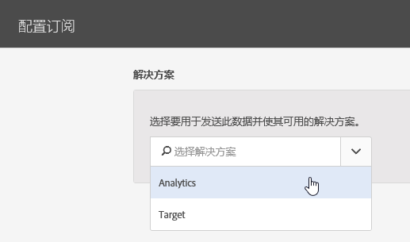

# 配置订阅

了解解决方案数据源和配置订阅。订阅后，可在 Experience Cloud 和解决方案（Analytics 和 [!DNL Target]）之间传输客户属性数据流。

例如，Adobe Analytics 订阅允许将属性数据纳入报表中。如果您使用Adobe Target，则可以上传客户属性进行定位和细分。

**[!UICONTROL 客户属性来源]** > **[!UICONTROL 新建客户属性来源]****[!UICONTROL > 新建]**

| Element | 描述 |
|--- |--- |
| 解决方案 | **Adobe Analytics ** 选择 Analytics，指定要接收属性数据的报表包，以及要包含的属性。 **Adobe Target** 您可以上传客户属性进行定位和细分。 当您想要基于属性数据来定位测试，或者希望数据可在 Analytics 中用于分段时，此功能非常有用。 登录后，单击&#x200B;**[!DNL Target]**>**&#x200B;受众&#x200B;**，即可使用访客的上传客户属性数据。 支持多个数据源。在您的网站上[设置客户 ID](../core-services/core-services.md)后，请确认至少有一个别名已订阅到[!DNL Target]. |
| 报表包 (Analytics) | 报表包来自 Analytics。 您无法在一个属性来源内向 Analytics 订阅添加总计 10 个以上的报表包。选择要包含的报表包时，请考虑以下建议：<ul><li>选择具有一组共同的已经过身份验证的客户的报表包。如果一个报表包中的经过身份验证的客户与另一报表包中的经过身份验证的客户不重叠，请将这些报表包分成不同的属性源。</li><li>如果可能，属性源中包含的报表包应具有相似的流量。</li></ul> 如果您有 10 个以上的报表包具有一组共同的经过身份验证的客户，则可以配置更多的客户属性来源，使每个来源最多包含 10 个报表包。 |
| 要包含的属性（Analytics 和 [!DNL Target]） | 您希望发送至解决方案的属性。 在配置订阅和选择属性时，根据您拥有的解决方案，_每个报表包_&#x200B;将会受到以下限制：<ul><li>Foundation：0 个</li><li>Select：3 个</li><li>Prime：15 个</li><li>Ultimate：200 个</li><li>Standard：总共允许 3 个</li><li>Premium：每个报表包允许 200 个</li><li>[!DNL Target] Standard：5 个</li><li>[!DNL Target] Premium：200 个</li></ul> **注意：**当您升级到 Analytics Premium 时，附加属性会在延迟 24 小时后才可用。在此延迟期间，您可能会看到出现属性订阅达到最大值错误。 |
