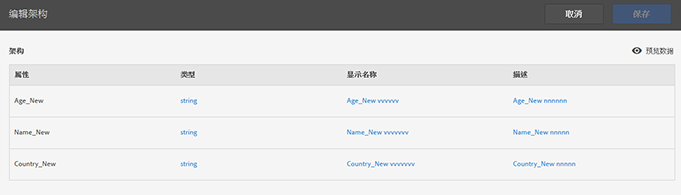

# 验证架构

验证过程允许您将显示名称和描述映射到已上传的属性（字符串、整数、数字等等）。架构是基于这些设置创建的。架构用于验证未来所有上传到此数据源的数据。此映射过程不更改原始数据。

>[!NOTE]
>
>验证后更新架构会删除客户属性。请参阅[更新架构（同时删除属性）](../attributes/t-crs-usecase.md#task_6568898BB7C44A42ABFB86532B89063C)。

**[!UICONTROL 客户属性来源]** &gt; **[!UICONTROL 新建客户属性来源]** &gt; **[!UICONTROL 查看/编辑架构]**

在“[!UICONTROL 验证架构]”页面中，架构的每一行都表示一列上传的 CSV 文件。

* **[!UICONTROL 添加数据：]**&#x200B;将新属性数据上传到此数据源。

* **[!UICONTROL 查看/编辑架构：]**&#x200B;将显示名称映射到属性数据，如下一步骤中所述。

* **[!UICONTROL FTP 设置：]**[通过 FTP 上传数据](../attributes/t-upload-attributes-ftp.md#task_591C3B6733424718A62453D2F8ADF73B)。

* **[!UICONTROL ID 查找：]**&#x200B;输入客户 ID (CID)，从 `.csv` 查找有关此 ID 的 Experience Cloud 信息。此功能可用于解决为何属性数据不对访客显示的问题：

   * **[!UICONTROL MCID (Experience Cloud ID)：]**&#x200B;在您使用最新的 Experience Cloud ID 服务时显示。如果您在使用 MCID 服务，但这里没有列出 ID，则表示 Experience Cloud 还未收到此 CID 对应的别名。这意味着访客还没有登录，或您的实施没有传递此 ID。

   * **[!UICONTROL CID（客户 ID）：]**&#x200B;与此 CID 关联的属性。如果您使用 prop 或 eVar 上传 CID (AVID)，并且只看到了显示的属性而没有看到 AVID，这说明访客还没有登录到您的站点。

   * **[!UICONTROL AVID（Analytics 访客 ID）：]**&#x200B;在您使用 prop 或 eVar 上传 CID 时显示。如果这些 ID 被传递到 Experience Cloud，则与您输入的 CID 关联的所有访客 ID 都将在此处显示。

当您在 Experience Cloud 中创建客户属性来源和 FTP 帐户后，还可以通过 FTP 上传数据。您可以针对每个属性来源创建一个 FTP 帐户。已上传的文件存储在该帐户的根文件夹中。该数据必须为 .csv 格式，并通过另一个 .fin 文件指示上传已完成

指定给字符串、整数和数字的名称会用于创建 [!DNL Analytics] 量度。请参阅 帮助中的[客户属性报表](https://docs.adobe.com/help/en/analytics/components/variables/dimensions-reports/reports-customer-attributes.html)，以了解详细信息。[!DNL Analytics]

* **[!UICONTROL 属性：]**&#x200B;从上传的 `.csv` 文件中读取的属性数据。

* **[!UICONTROL 类型：]**&#x200B;数据类型，例如：

   * **String：**&#x200B;字符序列。

   * **Integers：**&#x200B;整数。

   * **Numbers：**&#x200B;最多可有两位小数。

* **[!UICONTROL 显示名称：]**&#x200B;属性的易记名称。例如，您可以从&#x200B;*客户年龄*&#x200B;更改为&#x200B;*自从以下时间以来的客户*。

* **[!UICONTROL 描述：]**&#x200B;属性的易懂描述。
