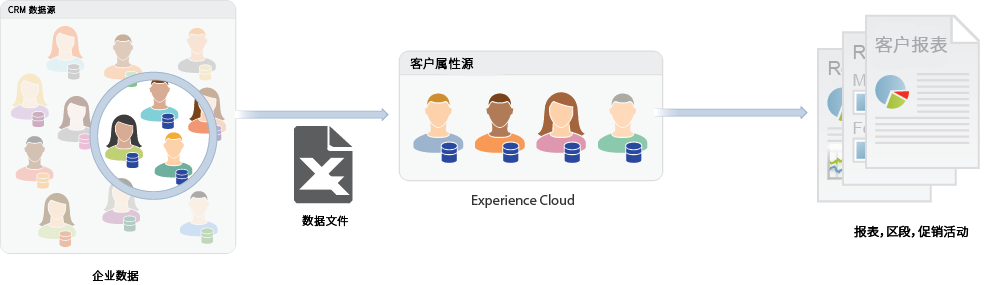
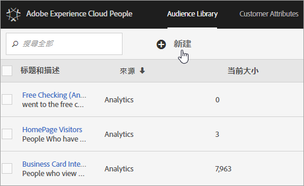

# Experience Cloud 受众 {#topic_679810123CAA4E0CA4FA3417FB0100C7}

此 [!DNL Audience Library] 在Experience Cloud中显示受众。 受众是访客的集合（列表） [!DNL Experience Cloud] IDs)。 您可以管理如何将访客数据转换为受众分段。 因此，创建和管理受众与创建和使用区段类似。您还可以将受众区段共享到 [!DNL Experience Cloud] 中的产品和服务。

受众可从各种来源创建或派生，如：

* 在 [!DNL Experience Cloud] 中创建的新受众
* 发布到 [!DNL Experience Cloud] 的 [!DNL Analytics] 区段
* [!DNL Audience Manager]

**实时与历史受众比较**

所有受众，无论其来源如何，都可供实时定位用例访问。但是，从 Analytics 共享到 Audience Manager 的受众不可供实时定位访问。系统将以两种方式评估受众：

* 每四小时对 Analytics 的历史受众评估一次。处理和共享的总时间最长可能需要八小时。历史受众始终包括回访访客。
* 实时受众源于Experience Cloud受众，并且是实时评估的。

## 应用程序如何使用受众 {#concept_01EB9345C5344597BC94A864EDD38EE1}

下表介绍了受众在 Experience Cloud 应用程序中的使用方式：

| 解决方案 | 描述 |
|--- |--- |
| Experience Cloud 受众 | 使用在本地创建、管理和共享受众 [[!DNL Audience Library]](audience-library.md). 您可以：<ul><li>通过原始 Analytics 属性使用实时受众</li><li>合并受众以创建复合受众，从而将实时数据和历史数据联合起来</li><li>查看估计的受众量的图形视图</li></ul> 有关要创建的受众类型的建议，请参阅 [受众创建选项](https://experienceleague.adobe.com/docs/experience-cloud-kcs/kbarticles/KA-16471.html?lang=zh-Hans). |
| Analytics | 在分段中，您可以构建区段，将其与报表包组合，然后将该区段发布到Experience Cloud。 发布区段会将该区段显示在 [!DNL Audience Library] Experience Cloud中的页面。 (请参阅 [将区段发布到Experience Cloud](https://experienceleague.adobe.com/docs/analytics/components/segmentation/segmentation-workflow/seg-publish.html?lang=zh-Hans) 在 [!DNL Analytics] 帮助了解详细信息。) 受众还可用作由提供的营销活动体验的目标受众 [!DNL Adobe Target]、和 [!DNL Audience Manager]. 共享受众之后 [!DNL Adobe Analytics]，并选择它以在活动的营销活动中使用，过去90天内符合区段定义标准的访客资料将被发送到 [!UICONTROL 受众服务]. 共享受众数量的限制已增加到 75 个。共享给Experience Cloud的受众 [!DNL Analytics] 独特成员不能超过2000万。 此外，由于缓存，在Analytics中删除报表包12小时后，该删除操作才能反映在Experience Cloud中。 |
| Mobile Services | 使用[!UICONTROL 设备类型]报表中的旭日可视化图表分析移动流量。 |
| [!DNL Target] | 利用 [ID 服务](https://experienceleague.adobe.com/docs/id-service/using/home.html?lang=zh-Hans)将访客 ID 和数据统一到单个可操作的个人资料中，以供在应用程序间使用。此 [发布到Experience Cloud](audience-library.md) 在Adobe Analytics的区段创建过程中显示的复选框，允许该区段在Adobe Target的自定义受众库中可用。 在中创建的区段 [!DNL Analytics] 或 [!DNL Audience Manager] 可用于中的活动 [!DNL Target]. 例如，您可以根据 [!DNL Analytics] 转化量度和在 [!DNL Analytics] 中创建的受众区段，来创建营销活动。 |
| [!DNL Audience Manager] | 共享受众位于 [!DNL Audience Manager] 分段。 所有Experience Cloud受众均可在中本地使用 [!DNL Audience Manager]，它提供：<ul><li>关于如何在应用程序工作流程中共享和使用受众的内置自动化功能</li><li>非现场目标</li><li>相似建模</li></ul> |
| Campaign | <ul><li>将从不同 Adobe Experience Cloud 应用程序共享的受众导入到 Adobe Campaign。</li><li>以共享受众的形式导出收件人列表。这些共享受众可在您使用的其他 Adobe Experience Cloud 应用程序中使用。</li></ul> |
| Advertising Cloud | 将受众用作目标。 |

{style="table-layout:auto"}

>[!IMPORTANT]
>
>在访客有资格成为从 Analytics 共享的受众后，该信息需经过 4 - 8 小时的延迟，才能在 [!DNL Target]、Ad Cloud 和 Campaign Standard 中使用。

## 更多帮助 - 问题、指导和用例 {#section_C7F151644D8A45F7B6FC54F58845635D}

| 帮助信息 | 资源 |
|--- |--- |
| 找不到受众？ | 确保您已进行配置。请参阅[快速入门 - 为核心服务启用应用程序](core-services.md)。 转到[此处](https://adobe.allegiancetech.com/cgi-bin/qwebcorporate.dll?idx=X8SVES)请求“个人资料与受众”（集成配置表单）的访问权限。 |
| 论坛 | [受众论坛](https://experienceleaguecommunities.adobe.com/t5/Adobe-Experience-Cloud-Audiences/ct-p/experience-cloud-audiences-community)是获取受众相关帮助的另一资源。 |

{style="table-layout:auto"}

## 受众库界面元素 {#section_D04ACEF61CEF4B189AE6BA9F40D0DBF4}

[!DNL Experience Cloud] 提供了一个供创建和管理受众的库，且使用的是实时的本地受众识别。

**[!UICONTROL Experience Cloud]** > **[!UICONTROL Experience Platform]** > **[!UICONTROL 人员]** > **[!UICONTROL 受众库]**

| 元素 | 描述 |
|--- |--- |
| 新建 | [创建受众](audience-library.md)。 |
| 标题和描述 | 列标题，用于识别和描述受众。 |
| 作者 | 创建受众区段的人员。 |
| 来源 | 标识创建受众的位置。<ul><li>**Analytics：** 在Adobe Analytics中创建的区段，然后 [已发布到Experience Cloud](audience-library.md).</li><li>**Experience Cloud：**&#x200B;新受众[在 Experience Cloud 受众中创建](audience-library.md)。</li><li>**Audience Manager：** Audience Manager创建的受众会自动显示在“Experience Cloud受众”中。</li></ul> |
| 当前数量 | 当前受众数量。 |
| 活动 | 区段的活动状态。 |

{style="table-layout:auto"}
