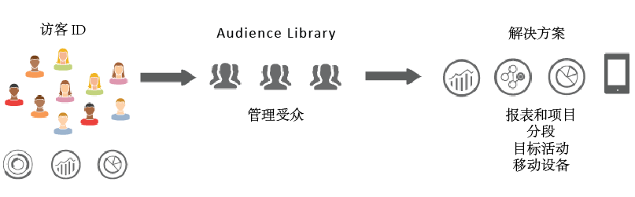
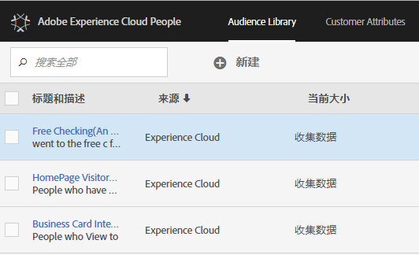

# Experience Cloud 受众 {#topic_679810123CAA4E0CA4FA3417FB0100C7}

受众是访客的集合（访客 ID 列表）。通过 Adobe 的受众库，您可以管理如何将访客数据转换为受众分段。就这点而论，创建和管理受众与创建和使用区段类似，只是前者增加了一项将受众区段共享到 [!DNL Experience Cloud] 中产品和服务的功能。

受众可从各种来源创建或派生，如：

* 在 [!DNL Experience Cloud] 中创建的新受众
* 从发布到 [!DNL Analytics] 的 [!DNL Experience Cloud] 区段
* 从 [!DNL Audience Manager]

**实时与历史受众比较**

所有受众，无论其来源如何，都可供实时定位用例访问。但是，从 Analytics 共享到 Audience Manager 的受众不可供实时定位访问。系统将以两种方式评估受众：

* 每 4 小时对 Analytics 的历史受众评估一次。处理和共享的总时间最长可能需要 8 小时。历史受众始终包括回访访客。
* 实时受众源于 Experience Cloud 受众并接受实时评估。

## 解决方案如何使用受众 {#concept_01EB9345C5344597BC94A864EDD38EE1}

下表介绍了受众在 Experience Cloud 解决方案中的使用方式：

| 解决方案 | 描述 |
|--- |--- |
| Experience Cloud 受众 | 使用[受众库](../audience-library/audience-library.md)界面在本地创建、管理和共享受众。您可以：<ul><li>通过原始 Analytics 属性使用实时受众</li><li>合并受众以创建复合受众，从而将实时数据和历史数据联合起来</li><li>查看估计的受众量的图形视图</li></ul> 有关要创建哪种受众类型的建议，请参阅：[Experience Cloud 受众](https://helpx.adobe.com/cn/marketing-cloud-core/kb/People/Audience-Creation-Options.html)。 |
| Analytics | 在分段中，您可以构建区段，将其与报表包组合，然后将该区段发布到 Experience Cloud。发布区段会将该区段显示在 Experience Cloud 的[!UICONTROL 受众库]页面上。（有关详细信息，请参阅 Analytics 帮助中的[将区段发布到 Experience Cloud](https://docs.adobe.com/content/help/zh-Hans/analytics/components/segmentation/segmentation-workflow/seg-publish.html)。）该受众还会作为一个目标受众在以下两个位置可用：Adobe Target 提供的营销活动体验中，以及在 Audience Manager 中。从 Adobe Analytics 共享受众并选择该受众以在活动的营销活动中使用后，过去 90 天内所有符合区段定义标准的访客资料均会发送到 Experience Cloud [!UICONTROL 受众服务]平台。共享受众数量的限制已增加到 75 个。从 Analytics 共享到 Experience Cloud 的受众数量不能超过 2000 万个独特成员。另外由于缓存，在 Analytics 中删除报表包 12 小时后，该删除操作才能反映在 Experience Cloud 中。 |
| Mobile Services | 使用[!UICONTROL 设备类型]报表中的旭日可视化图表分析移动流量。 |
| [!DNL Target] | 利用 [ID 服务](https://docs.adobe.com/content/help/zh-Hans/id-service/using/home.html)将访客 ID 和数据统一到单个可操作的配置文件中，以便跨解决方案使用。在 Adobe Analytics 的区段创建过程中显示的[发布到 Experience Cloud](../audience-library/audience-library.md) 复选框，允许该区段在 Adobe Target 的自定义受众库中可用。在 Analytics 或 Audience Manager 中创建的区段可用于 [!DNL Target] 中的活动。例如，您可以根据 [!DNL Analytics] 转化量度和在 [!DNL Analytics] 中创建的受众区段，来创建营销活动。 |
| Audience Manager | 共享受众可在 Audience Manager 分段中使用。所有 Experience Cloud 受众均可在 Audience Manager 本地使用，Audience Manager 提供了以下功能：<ul><li>关于如何在解决方案工作流程中共享和使用受众的内置自动化功能</li><li>非现场目标</li><li>相似建模</li></ul> |
| Campaign | <ul><li>将从不同 Adobe Experience Cloud 解决方案共享的受众导入到 Adobe Campaign。</li><li>以共享受众的形式导出收件人列表。这些共享受众可在您使用的其他 Adobe Experience Cloud 解决方案中使用。</li></ul> |
| Media Optimizer | 将受众用作目标。 |

>[!IMPORTANT]
>
>在访客有资格成为从 Analytics 共享的受众后，该信息需经过 4 - 8 小时的延迟，才能在 [!DNL Target]、Ad Cloud 和 Campaign Standard 中使用。

## 更多帮助 - 问题、指导和用例 {#section_C7F151644D8A45F7B6FC54F58845635D}

| 帮助信息 | 资源 |
|--- |--- |
| 找不到受众？ | 确保您已进行配置。请参阅[快速入门 - 为核心服务启用解决方案](../core-services/core-services.md)。 单击[此处](https://www.adobe.com/go/audiences)请求“配置文件与受众”（集成配置表单）的访问权限。 |
| 用例 | 有关使用哪种解决方案的更多指导，请转到知识库文章中的[受众创建选项](https://helpx.adobe.com/cn/marketing-cloud-core/kb/People/Audience-Creation-Options.html)。 |
| 论坛 | [受众论坛](https://forums.adobe.com/community/experience-cloud/platform/core-services/people-service/audiences)是获取受众相关帮助的额外资源。 |

## 受众库界面元素 {#section_D04ACEF61CEF4B189AE6BA9F40D0DBF4}

[!DNL Experience Cloud] 提供了一个供创建和管理受众的库，且使用的是实时的本地受众识别。

**[!UICONTROL Experience Cloud]** > **[!UICONTROL Experience Platform]** > **[!UICONTROL 人员]** > **[!UICONTROL 受众库]**

| 元素 | 描述 |
|--- |--- |
| 新建 | [创建受众](../audience-library/audience-library.md)。 |
| 标题和描述 | 列标题，用于识别和描述受众。 |
| 作者 | 创建受众区段的人员。 |
| 来源 | 标识创建受众的位置。<ul><li>**Analytics：**&#x200B;区段在 Adobe Analytics 中创建，然后[发布到 Experience Cloud](../audience-library/audience-library.md)。</li><li>**Experience Cloud：**&#x200B;新受众[在 Experience Cloud 受众中创建](../audience-library/audience-library.md)。</li><li>**Audience Manager：**&#x200B;由 Audience Manager 创建的受众自动显示在 Experience Cloud 受众中。</li></ul> |
| 当前数量 | 当前受众数量。 |
| 活动 | 区段的活动状态。 |
