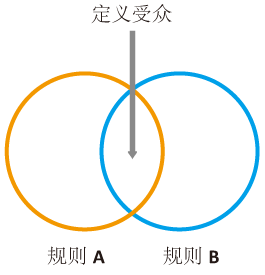
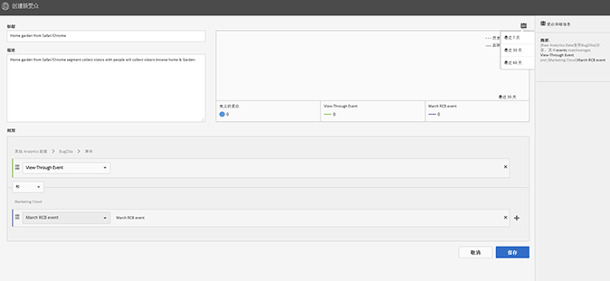
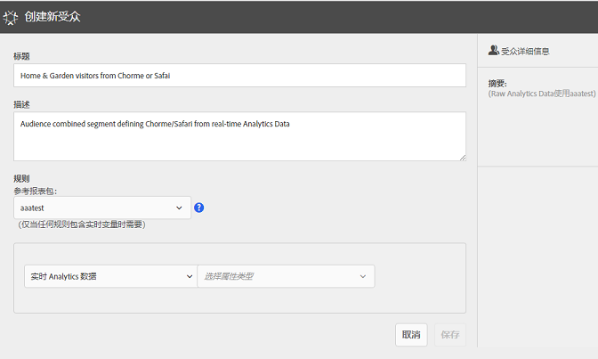
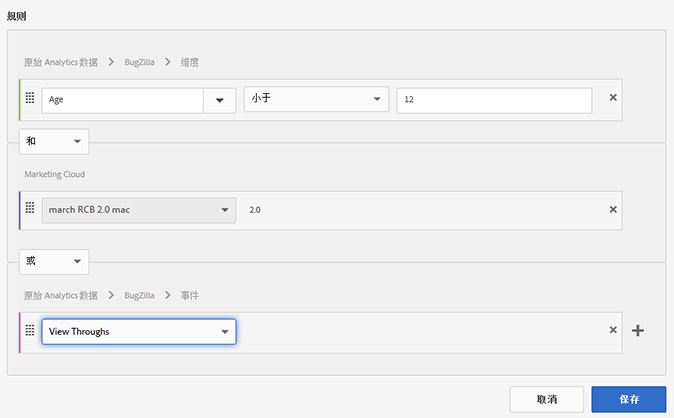
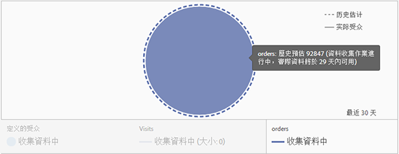

# 创建受众

了解如何在 Experience Cloud 中使用属性规则来创建受众和定义组合受众。

本文可帮助您掌握如何：

* 创建受众
* 创建规则
* 使用规则定义组合受众

下图表示一个组合受众中的两个规则。

每个圆圈表示了定义受众成员资格的一个规则。两个受众规则中具有成员资格的访客经过重叠称为定义的组合受众。

>[!NOTE]
>
>在完成指定期限的数据收集以后，受众会得到完全定义。以下示例显示如何创建组合受众的规则。此受众包含如下内容：

* 来源于页面数据或原始 Analytics 数据的家居和园艺部分。
* 来源于[发布](../audience-library/audience-library.md#task_32FEEFE0B32E4E388CD4D892D727282A)到 [!DNL Experience Cloud] 的 [!DNL Adobe Analytics] 区段的 Chrome 和 Safari 用户。

   

1. 在 [!DNL Experience Cloud] 中，单击 **[!UICONTROL 人员]** &gt; **[!UICONTROL 受众库]**。
1. 在[!UICONTROL 受众]页面，单击 **[!UICONTROL 新建]**。

1. 在[!UICONTROL 创建新受众]页面，指定标题和描述。
1. 在[!UICONTROL 规则]下，选择一个属性来源：

* **[!UICONTROL 实时 Analytics 数据：]**（或原始数据)此类数据是指从实时 Analytics 图像请求派生而来的属性数据，包括 eVar 和事件等数据。使用此属性来源时，您必须选择一个报表包，并定义要包含的维度或事件。此报表包选择提供报表包使用的变量结构。

   >[!NOTE]
   >
   >由于缓存，在 Analytics 中删除报表包 12 小时后，该删除操作才能反映在 Experience Cloud 中。

* **[!UICONTROL Experience Cloud：]** 从 [!DNL Experience Cloud] 来源派生的属性数据。例如，这可以是您在 [!DNL Analytics] 中创建的受众区段的数据，也可以是来自 [!DNL Audience Manager] 的数据。

1. 定义受众规则。

>[!NOTE]
>
>您在定义受众规则时，应该对实施变量有所了解。

在[!UICONTROL 规则]下，定义 *`Home & Garden`* 属性选择：

* **[!UICONTROL 属性来源：]** 原始 Analytics 数据
* **[!UICONTROL 报表包：]** 报表包 31
* 维度 = **[!UICONTROL 商店 (Merch) (v6)]** &gt; **[!UICONTROL 等于]** &gt; **[!UICONTROL 家居和园艺]**

   

   *Chrome 和 Safari 访客*是从 Analytics 中共享的受众区段：

* **[!UICONTROL 属性来源：]** Experience Cloud
* **[!UICONTROL 维度：]** Chrome 和 Safari 访客

   

   要进行比较，需要添加 *OR* 规则查看某个站点区域（例如庭院和家具）的所有访客。

   

1. 查看规则。

所生成规则的定义受众包含访问过家居和园艺部分的 Chrome 和 Safari 用户。庭院和家具区段对所有访问该站点区域的访客提供额外分析。

**历史估计：**（虚线圈）代表基于 [!DNL Analytics] 数据创建的规则。

**实际受众：**（实线圈）已创建并拥有 30 天 Audience Manager 数据的任何规则。当 Audience Manager 数据达到 30 天时，这条线变为实线，表示实际数量。

完成指定期限的数据收集以后，这些圈会进行合并以显示定义的受众。

1. 在定义规则后，单击 **[!UICONTROL 保存]**。

保存该受众后，即可用于其他解决方案。例如，您可以在一个 Target 活动中包含共享受众。
