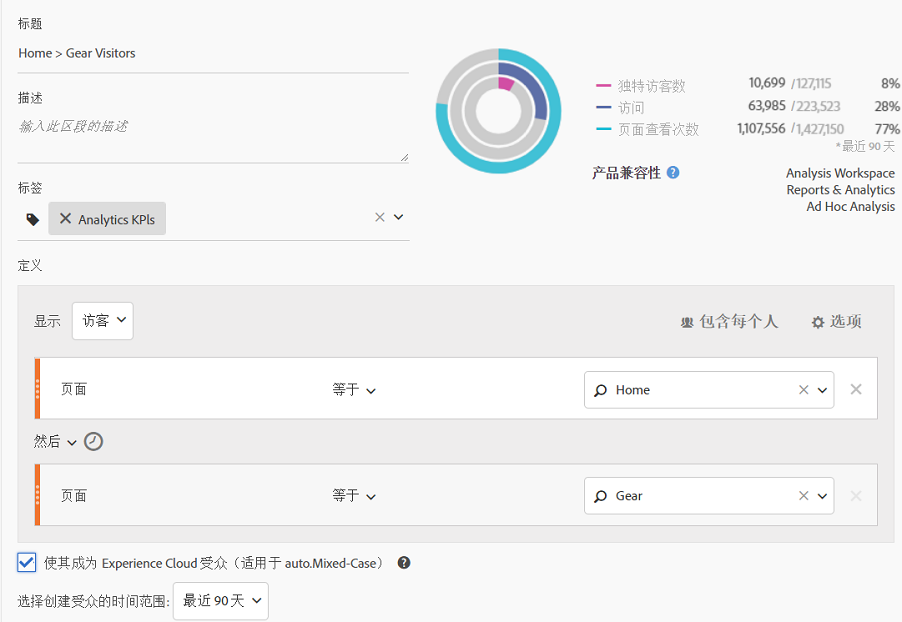

# 发布 Analytics 受众区段

将 Analytics 受众区段发布到 Experience Cloud 和 Adobe Target，以便开展受众市场营销活动。

1. 在 Analytics 中[创建区段](https://marketing.adobe.com/resources/help/en_US/analytics/segment/seg_build.html)。
1. 在区段生成器上，启用&#x200B;**[!UICONTROL 将此区段发布到 Experience Cloud]** 选项。

   

   | 元素 | 描述 |
   |--- |---|
   | 将此区段发布到 Experience Cloud（对于 &lt;报表包名称&gt;） | 将此区段发布到 Experience Cloud。您可以将该受众用于 Adobe Target、Audience Manager、Advertising Cloud、Campaign 和 Audience Analytics 中的营销和分段活动。 对于要发布的区段，必须填写其标题和描述字段。 在启用此选项后，会共享标题和受众区段定义，但不共享实际数据。当该受众与 Target 中的某个活动关联时，Analytics 将开始发送具有 Experience Cloud 和 Target 受众资格的访客的 ID。此时，受众名称和相应的数据开始显示在“Experience Cloud 受众”页面中。 从 Analytics 共享到 Experience Cloud 的受众数量不能超过 2000 万个受众成员。 由于缓存，在 Analytics 中删除报表包 12 小时后，该删除操作才能反映在 Experience Cloud 中。 要删除已发布到 Experience Cloud 的区段，必须先取消发布该区段。要取消发布区段，只需&#x200B;**取消选中**&#x200B;用于发布该区段的复选框。您&#x200B;**无法**&#x200B;取消发布以下任何一个 Adobe 解决方案当前正在使用的区段：[!DNL Analytics]（位于 [!DNL Audience Analytics] 中）、[!DNL Campaign]、[!DNL Advertising Cloud]（适用于 [!DNL Core Service] 和 [!DNL Audience Manager] 客户）和所有其他外部合作伙伴（适用于 [!DNL Audience Manager] 客户）。您&#x200B;**可以**&#x200B;取消发布 [!DNL Target] 正在使用的区段。 在访客有资格成为从 Analytics 共享的受众后，该信息需经过 24 - 48 小时的延迟，才能在 Target、Advertising Cloud 和 Campaign 中使用。 **数据隐私** 受众并非基于访客的身份验证状态进行过滤。如果访客可在未验证或已验证的状态下浏览您的站点，则访客在处于未验证状态时执行的操作仍会导致访客被包含在受众中。请参阅 [Analytics 隐私概述](https://marketing.adobe.com/resources/help/en_US/reference/?f=c_Privacy_Overview)，以了解受众共享对隐私的全部影响。 |
   | 选择用于创建受众的窗口 | 请注意，这是一个&#x200B;**活络的**&#x200B;时间窗口，而不是一个固定窗口。 |

1. 单击&#x200B;**[!UICONTROL 保存]**。
1. 访问 [!DNL Adobe Target]，单击[!UICONTROL 受众]。
1. 在[!UICONTROL 受众]页面上，找到来源于 Experience Cloud 的受众。

   这些受众可在活动中使用。
