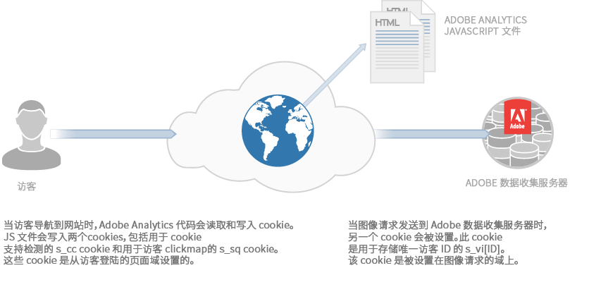
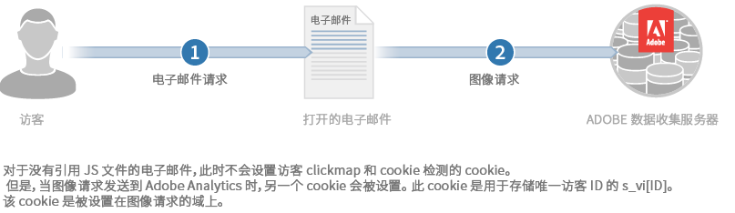

# 关于 Cookie 和隐私{#about-cookies-and-privacy}

维护客户隐私和数据安全是 Adobe 的首要任务。Adobe参与多个隐私组织，并与隐私法规和自我监管原则合作。 此合作包括Digital Advertising Alliance AdChoices计划，该计划为客户提供有关其信息如何使用的信息以及有关其使用的选择。

Experience Cloud 产品设置的大多数 Cookie 不包含任何个人身份信息。这些 Cookie 和关联数据是安全的，仅用于公司的报表，并用于提供相关内容和广告。除了在汇总行业报表中使用，这些数据不会提供给第三方或其他 Adobe 客户。例如，[!DNL Digital Marketing Insight Report] 会分析跨零售商的汇总和匿名数据。

Adobe 不会合并各个公司之间的浏览器级信息。为了保护客户数据的私密性和安全性，Experience Cloud 中的某些服务为公司提供了针对每个跟踪网站使用单独 Cookie 集的功能。某些报表包产品还为使客户提供了使用自己的域名作为 Cookie 所有者的功能。这种做法可创建一个额外的隐私和安全层，因为它使 Experience Cloud Cookie 成为永久属于公司网站的&#x200B;*第一方 Cookie*。

Cookie 只能存储和提供先前存储在其中的信息。它们无法执行代码或访问存储在计算机上的其他信息。此外，Web浏览器会限制对Cookie数据的访问。 浏览器强制实施 Cookie 安全策略，该策略使所有 Cookie 数据仅对最初设置信息的网站可用。

例如，Adobe.com 以外的任何其他网站不能查看从 Adobe.com 网站设置的 Cookie 中包含的数据。

下图说明了标准图像请求的 Cookie 用法：

下图说明了直接图像请求（在未加载 JS 文件的情况下使用）的 Cookie 用法：

