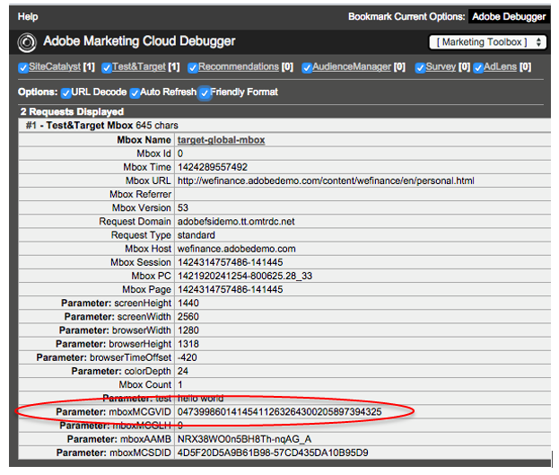

# 为 Experience Cloud 服务启用实施

如果您最近通过 Experience Platform Launch 实施了 Experience Cloud，那么您已经为客户属性和 Experience Cloud 受众进行了设置。您还可以在 Admin Console 中管理用户和产品。

现有客户可以使其解决方案实施符合现代化要求并实施Experience Cloud。 这样，您就可以在Adobe Analytics、Audience Manager和Adobe Target中使用客户属性和受众功能。 要完成此实施，您将执行以下操作：

1. [加入 Experience Cloud 并成为管理员](#section_2423F0BD3DF642658103310EE5EA6154)
1. [实施 Experience Cloud ID 服务](#section_3C9F6DF37C654D939625BB4D485E4354)
1. [将报表包映射到 Experience Cloud 组织](#section_7B08516B01BA421681DF03D0E86CE3BA)
1. [更新 Analytics AppMeasurement 代码](#section_1798D9D0F05C47E29816AC4EEB9A0913)
1. [更新 Adobe Target 实施](#section_C2F4493C7A36406DAE2266B429A4BD24)
1. [验证实施](#section_E641782A0F4F44AF8C9C91216BE330D5)
1. [管理用户和产品](#section_B6E95F4E0E12483CB9DA99CBC0C5A4AF)
1. [开始共享属性和受众数据](#section_960C06093623462E8EA247B3E97274A1)

## 加入 Experience Cloud 并成为管理员 {#section_2423F0BD3DF642658103310EE5EA6154}

加入 Experience Cloud 时必须执行的操作：

1. 确保您拥有适当的 Adobe Analytics 或 Adobe Target SKU。

   * **Adobe Analytics：** Standard 或 Premium（不是旧版 [!DNL SiteCatalyst] SKU）。
   * **Adobe Target：** Standard 或 Premium。

   >[!NOTE]
   >
   >对于 [!DNL Target]，请从 [!DNL mbox.js] 迁移到 at.js。请参阅[从 at.js 1.x 升级到 at.js 2.x](https://experienceleague.adobe.com/docs/target/using/implement-target/client-side/at-js-implementation/upgrading-from-atjs-1x-to-atjs-20.html?lang=en)。

1. 使您的实施符合现代化要求并进行管理员身份配置。

   * 请按照下文[实施 [!UICONTROL Experience Cloud ID 服务]](core-services.md#section_3C9F6DF37C654D939625BB4D485E4354)中的步骤执行操作。
   * 请联系您的客户经理，然后开始配置 Experience Cloud。

1. 在 [!UICONTROL Admin Console] 中管理用户和产品。

### 管理员登录

在成为管理员后，您可以登录到 [experience.adobe.com](https://experience.adobe.com)。

**[!UICONTROL Admin Console]**&#x200B;链接在Experience Cloud菜单导航中可用。

有关更多信息，请参阅 [Experience Cloud 用户和产品管理](admin-getting-started.md#topic_3FCB4099640647E3B2411ADBFCE81909)。

### 用户登录

要登录到 Experience Cloud，您的用户必须：

* 拥有 Adobe ID（或您公司的 Enterprise ID）。
* 登录到 [experience.adobe.com](https://experience.adobe.com)。
* 属于映射到企业群组的解决方案群组。
* 如有必要，请将其解决方案帐户关联到 Adobe ID（如下所述）。

### 可选：关联现有的用户帐户。

您的用户很有可能已经是解决方案群组的成员，例如先前在 [!UICONTROL Analytics] > [!UICONTROL 管理工具]中管理的 Analytics 群组。

将这些群组映射到 Experience Cloud 企业群组时，这些用户必须手动将其解决方案帐户凭据关联到其 Adobe ID。

请参阅[在 Experience Cloud 中关联帐户](organizations.md#topic_C31CB834F109465A82ED57FF0563B3F1)

>[!NOTE]
>
>在映射企业群组和解决方案群组后，将会自动关联新用户。（将自动创建解决方案凭据，并将凭据关联到其 Adobe ID。）

以下各节介绍如何使实施符合现代化要求。通过使实施符合现代化要求，可在 Experience Cloud 中启用核心服务。

## 实施 [!UICONTROL Experience Cloud ID 服务] {#section_3C9F6DF37C654D939625BB4D485E4354}

[!UICONTROL Experience Cloud ID 服务]为跨解决方案集成提供了一个通用 ID。它提供了跨域访客标识功能，并为基于通过[!UICONTROL 客户属性]上传的 CRM 数据进行跨设备/浏览器定位和个性化提供了一种途径。

启用 Experience Cloud 核心服务的最简单方法是，通过 [!UICONTROL Experience Platform Launch] 中的 [Experience Cloud ID 服务扩展](https://experienceleague.adobe.com/docs/launch/using/extensions-ref/adobe-extension/id-service-extension/overview.html?lang=zh-Hans#extensions-ref)为 Analytics 和 Adobe Target 自动激活核心服务。

有关完整的 Experience Cloud ID 服务帮助（以前称为访客 ID），请转到[此处](https://experienceleague.adobe.com/docs/id-service/using/intro/overview.html?lang=zh-Hans#intro)。

**没有使用 [!UICONTROL Experience Platform Launch] 或 [!UICONTROL Dynamic Tag Management]？**

如果您没有使用 [!UICONTROL Experience Platform Launch] 或 [!UICONTROL Dynamic Tag Management]，请通过 JavaScript 部署 ([!DNL VisitorAPI.js]) 手动实施 ID 服务，如下所示：

| 任务 | 描述 |
| -----------| ---------- |  
| [实施适用于 Analytics 的 Experience Cloud ID 服务](https://experienceleague.adobe.com/docs/id-service/using/implementation/setup-analytics.html?lang=en) | Adobe 还建议设置其他[客户 ID](https://experienceleague.adobe.com/docs/id-service/using/reference/authenticated-state.html?lang=en)。这些 ID 与每个访客相关联，并可以启用 Experience Cloud 中现有和未来的功能。 |
| 将现有的 [!DNL s_code] 更新到 H.27.3 或更高版本，或将现有的 [!DNL AppMeasurement.js] 更新到 1.4 或更高版本。 | 这些文件可通过在 Analytics 管理工具的[代码管理器](https://experienceleague.adobe.com/docs/analytics/admin/admin-tools/code-manager-admin.html?lang=en)中下载获得。（如果您需要了解有关 [!DNL AppMeasurement.js] 的更多信息，请参阅 [JavaScript 实施](https://experienceleague.adobe.com/docs/analytics/implementation/js/overview.html?lang=en#js)指南。） |
| 为 Analytics 同步客户 ID | 请参阅 [Analytics - 同步客户 ID](core-services.md#section_AD473A6A21C1446498E700363F9A8437)（如下）。 |

{style=&quot;table-layout:auto&quot;}

### Analytics 和 Adobe Target - 同步客户 ID {#section_AD473A6A21C1446498E700363F9A8437}

在设置 Experience Cloud ID 服务时，Adobe 建议您针对 Analytics 和 [!DNL Target] 考虑将自己的[客户 ID](https://experienceleague.adobe.com/docs/id-service/using/reference/authenticated-state.html?lang=en) 与 Experience Cloud 同步。

在Adobe Target中，`mbox3rdpartyid`必须获取客户ID并将其发送到[!DNL Target]。 （请参阅 [!DNL Target] 中的[使用客户属性](https://experienceleague.adobe.com/docs/target/using/audiences/visitor-profiles/working-with-customer-attributes.html?lang=en)。）

当访客在您的网站上进行身份验证或以其他方式标识自己时，您的实施必须向页面或应用程序公开该访客的CRM客户ID。 然后，您可以使用相应的函数调用将您的客户 ID 同步到 Experience Cloud。此同步会将访客的 CRM 客户 ID 存储在 Experience Cloud 中，并激活该客户的属性以在 Experience Cloud 中使用。

例如，假设 Bob 在您的 CRM 系统中具有客户 ID `52mc210tr42`。当 Bob 在您的网站上进行身份验证时，您必须在该页面上透露此 ID，并使用此 ID 以下面两种方式之一进行同步：

* 使用访客 ID 服务调用 `visitor.setCustomerIDs({"crm_id":"52mc210tr42"})`。或,
* 在 prop 或 eVar 中填充 *`Customer ID (52mc210tr42)`*。

在已知客户 ID 的情况下，必须在每次 [!DNL Analytics] 服务器调用中进行设置。

### Mobile SDK

有关如何在[Android™](https://experienceleague.adobe.com/docs/mobile-services/android/overview.html?lang=en)和[iOS](https://experienceleague.adobe.com/docs/mobile-services/ios/overview.html?lang=en)移动应用程序中设置其他客户ID的语法示例，请参阅&#x200B;*Experience CloudID服务*&#x200B;部分。

### 启用历史数据的属性

客户属性数据在访客登录后可用。如果您尚未实施ID服务，并且以前一直在跟踪prop或eVar中的客户ID，则可以请求一个流程，以将历史登录发送到Experience Cloud。 凭借此流程，您可以立即开始使用客户属性。

请联系客户关怀以启用历史数据。

## 将报表包映射到 Experience Cloud 组织 {#section_7B08516B01BA421681DF03D0E86CE3BA}

>[!NOTE]
>
>报表包映射功能已于 2020 年 11 月被弃用。如有任何问题，请联系客户支持。

Experience Cloud 服务（例如 Experience Cloud ID 服务和[!UICONTROL 人员服务]）与 Experience Cloud 组织相关联，而不是与单个 Analytics 报表包关联。为确保这些服务能够正确运行，必须将每个 Analytics 报表包映射到 Experience Cloud 组织。

## 更新 Analytics AppMeasurement 代码 {#section_1798D9D0F05C47E29816AC4EEB9A0913}

如果您使用的是 Analytics，请验证您是否使用区域数据收集 (RDC)。如果您的数据收集域是 `omtrdc.net`，或者，如果您的 CNAME 被映射到 `omtrdc.net`，则您使用的是 RDC。有关更多信息，请参阅[转换到 RDC](https://experienceleague.adobe.com/docs/analytics/technotes/rdc/regional-data-collection.html?lang=en)。如果您使用的是第一方 Cookie，请参阅 [CNAME 和 Experience Cloud ID 服务](https://experienceleague.adobe.com/docs/id-service/using/reference/analytics-reference/cname.html?lang=en)，以获取有关数据收集 CNAME 和跨域跟踪的信息。

建议您更新包括访客 API 在内的 JavaScript 库，以使您的 Analytics 实施现代化。要完成此操作，简单的方法是在Experience Platform数据收集(Launch)中添加[Adobe Analytics扩展](https://experienceleague.adobe.com/docs/launch/using/extensions-ref/adobe-extension/analytics-extension/overview.html?lang=zh-Hans)。

## 更新 Adobe Target 实施 {#section_C2F4493C7A36406DAE2266B429A4BD24}

* 建议您在 [!UICONTROL Experience Platform Launch] 中添加 [Adobe Target 扩展](https://experienceleague.adobe.com/docs/launch/using/extensions-ref/adobe-extension/targetv2-extension/adobe-target-extension-v2.html?lang=en)，以便自动检索库。您还可以使用 [!UICONTROL Experience Platform Launch] 为 Adobe Target（和其他解决方案）设置 [Experience Cloud ID 服务扩展](https://experienceleague.adobe.com/docs/launch/using/extensions-ref/adobe-extension/id-service-extension/overview.html?lang=en)。Adobe Target **需要**&#x200B;进行 [!UICONTROL Experience Cloud ID 服务]更新才能使用核心服务。
* 如果您没有使用[!UICONTROL Experience Platform Launch]，则[请手动更新mbox库](https://experienceleague.adobe.com/docs/target/using/implement-target/client-side/mbox-implement/target-download-config-mbox.html?lang=en)。
* 请求访问权限，以使用 Adobe Analytics 作为 [!DNL Adobe Target] 的报告来源。[!DNL Target]在处理期间， 和 数据将组合在同一服务器调用中，这样两个解决方案之间的访客就可以连接在一起。[!DNL Analytics]请参阅 [Analytics for Target 实施](https://experienceleague.adobe.com/docs/target/using/integrate/a4t/a4t.html?lang=zh-Hans)。

   >[!IMPORTANT]
   >
   >已针对客户属性等核心服务配置了所有 Analytics 客户。如果您不是 Analytics 客户，请联系客户关怀团队以请求进行配置。

## 验证实施 {#section_E641782A0F4F44AF8C9C91216BE330D5}

请使用以下过程确保在您的网站上正确实施Experience CloudID服务。

1. 清除您网站的Cookie，以便您能够看到对Experience CloudID服务的请求（该请求在首次访问时发生，然后每位访客每周发生一次）。
1. 使用一个数据包分析程序或 Web 浏览器调试程序中的网络面板，查找到 [!DNL dpm.demdex.net] 的请求。
1. 验证响应中是否包含 `d_mid` 和一个值，例如：`_setMarketingCloudFields({"d_mid":"4235...`
1. 验证 Analytics 请求是否包含 `mid` 参数 (Experience Cloud ID)。在宽限期内（如果启用），您还应看到 `aid` 参数（Analytics 访客 ID）。

包含 Experience Cloud ID 的预期响应：

包含 Experience Cloud ID（也称为 `mid` 或&#x200B;_访客 ID_）的 Analytics 图像请求：

mbox 请求中的 Experience Cloud ID：

### 什么是宽限期？

在您部署 Experience Cloud ID 服务后，新的访客将不再从您的数据收集服务器中接收 Analytics Experience Cloud ID。如果您网站的某些部分尚未实施 ID 服务，那么当访客浏览这些部分时，将无法识别 Experience Cloud ID，与此同时，分配给访客的会是一个旧版 Analytics 访客 ID。这可能会导致潜在的问题，包括重复访问和错误归因。

例如，如果网站的支持部分是在单独的 CMS 中管理的，则此部分可能有不同的 Analytics JavaScript 文件。如果您在将ID服务部署到支持网站之前，在主网站上部署了Experience CloudID，则新访客在访问支持部分时会收到一个旧版Analytics ID。跨两个网站区域的访问将被报告为不同的访问。

在使用多个JavaScript文件或其他技术(如Experience Cloud)的网站上部署FlashID服务时，可能会导致协调问题。 出现这些问题是因为您必须同时对网站的所有部分都启用Experience CloudID服务。 通过配置宽限期，新访客可以继续从ID服务中接收Analytics访客ID。对于网站中尚未升级为使用访客ID服务的部分，可以始终如一地识别访客。

## 管理用户和产品 {#section_B6E95F4E0E12483CB9DA99CBC0C5A4AF}

启动并运行后，导航至 [Admin Console](https://adminconsole.adobe.com/)，您可以在其中管理用户和产品配置文件。

请参阅 [Experience Cloud 用户和产品管理](admin-getting-started.md#topic_3FCB4099640647E3B2411ADBFCE81909)。

### 客户属性

添加到[!UICONTROL 客户属性]组的用户可以在Experience Cloud左侧看到[!UICONTROL 客户属性]菜单项。

## 开始共享属性和受众数据 {#section_960C06093623462E8EA247B3E97274A1}

充分利用以下功能。

### [!UICONTROL 人员] > [!UICONTROL 客户属性]

如果您在客户关系管理(CRM)数据库中捕获到企业客户数据，则可以将该数据上传到Experience Cloud中的客户属性数据源。 上传后，使用[!DNL Adobe Analytics]和[!DNL Adobe Target]中的数据。

请参阅[客户属性](attributes.md#concept_ACFEE7C8B8E94875BA0825CDF4913AF1)。

### [!UICONTROL 人员] > [!UICONTROL 受众库]

Experience Cloud [!UICONTROL 受众]是一个界面，您可以从这里创建受众，合并现有受众以创建复合受众，以及查看所有共享受众。

请参阅[受众](audience-library.md#topic_679810123CAA4E0CA4FA3417FB0100C7)

## 数据存储和隐私披露

如果在Adobe[!DNL Experience Cloud]中使用实时受众分析和其他核心服务，那么使用这些服务可能会影响存储数据的数据中心（和国家/地区）。 具体来说，由于[!DNL Experience Cloud]使用Audience Manager，因此在[!UICONTROL People]服务中使用的数据必须存储在位于美国的Audience Manager服务器中。

使用通过[!UICONTROL People]服务提供的服务时，从其他Adobe产品向受众管理发送的数据类型包括：

* [!DNL Analytics] 键/值对（prop、eVar、list var 等等）。默认情况下，日志行包含 IP 地址，其中包含 IP 的最后一个八位字节（假定 IP 地址没有被 Adobe [!DNL Analytics] 中的 IP 模糊设置所修改）。
* 根据 Audience Manager 中设置的规则，受众符合资格的特征和区段。
* （可选）您的一个或多个 ID。根据 ID 服务的实施，您可能还会发送一个或多个 ID，例如 CRM ID 或哈希电子邮件地址。如果此数据被发送到 Adobe [!DNL Analytics]，则会转给 Adobe 受众管理。Adobe 不建议将个人数据提交给 Adobe [!DNL Analytics]。而是使用单向哈希对数据进行掩饰，然后再发送给 Adobe。
* 来自 [!DNL Analytics] 且通过后端区段共享功能获得的区段。
* 如果未阻止第三方 Cookie，则设置 demdex.net Cookie。`AMCV_###@AdobeOrg` 第一方 Cookie 始终通过 Experience Cloud ID 设置。

所有这些数据元素都将以日志文件的形式传送到 Adobe Audience Manager。Audience Manager 将在美国境内的服务器上处理并存储这些数据。Audience Manager 不提供在美国境外的服务器上存储或处理此数据的选项。

### Cookie 和退出

除了用于[!DNL Analytics]和[!DNL Target]的Cookie之外，使用实时受众分析还使用Audience ManagerCookie。

如果您希望向网站访客提供相应的退出选项，则必须将 Audience Manager 退出添加到现有退出过程。

有关说明，请参阅 [Adobe Experience Cloud - 实施 Adobe 退出](https://experienceleague.adobe.com/docs/analytics/implementation/js/opt-out.html)。

请参阅[数据收集 CNAME 和跨域跟踪](https://experienceleague.adobe.com/docs/id-service/using/reference/analytics-reference/cname.html?lang=en)，以启用跨域跟踪。
