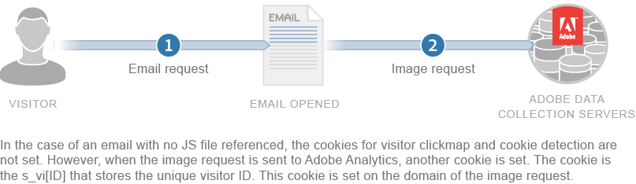

# Experience Cloud中使用的Cookie

Adobe Experience Cloud 中的许多服务都使用 Cookie。Cookie 是网站提供给 Web 浏览器的一小段数据。浏览器存储这段数据，允许网站在需要时引用其数据。 对每个后续的页面和图像请求都会执行此操作。

提供的 Cookie 可在访问网站期间和访问之间维护相关信息。Cookie 允许将设备与查看该网站的其他浏览器以独特的方式区分开。

法律、法规和自我监管原则可能要求您先获得访客的同意，然后才能存储或检索有关计算机或其他网络连接设备的信息。Adobe建议您与组织的法律顾问一起审查您对Cookie的使用受哪些法律、法规和原则控制。

## 关于第一方 Cookie

Adobe Experience Cloud服务使用Cookie来提供有关变量和组件的信息，这类信息无法在图像请求和浏览器会话之间永久保存。 在可能的情况下，Adobe使用第一方Cookie记录您网站上的活动。 记录不同网站（如您可能拥有的其他域）上的活动需要使用第三方 cookie。

许多浏览器和防间谍软件应用程序都设计为拒绝并删除第三方 Cookie。Adobe可确保始终设置Cookie，即使第三方Cookie被阻止也是如此。 具体行为取决于您使用的是Experience PlatformIdentity Service（ECID服务）还是Analytics旧版标识符(例如 `s_vi` Cookie)：

* 此 [Experience PlatformIdentity服务（ECID服务）](https://experienceleague.adobe.com/docs/id-service/using/intro/overview.html?lang=zh-Hans) 无论您的收集域是否与网站域匹配，都会自动设置第一方Cookie。 如果两者不匹配，Identity Service会使用JavaScript在网站的域上设置Cookie。
* 如果您使用 [Analytics旧版标识符](analytics.md) (例如 `s_vi` cookie)，它取决于您配置数据收集服务器的方式。 如果数据收集服务器与您网站的域相同，则 Cookie 被设置为第一方。如果收集服务器与您当前的域不同，则Cookie被设置为第三方。 在这种情况下，如果阻止第三方Cookie，Analytics会设置第一方回退ID (`s_fid`)而不是标准 `s_vi` Cookie。

如果要确保收集服务器与网站的域相匹配，则可以使用CNAME实现，从而支持从CNAME实现中指定的自定义域转发到Adobe的收集服务器。 此任务涉及更改贵公司的DNS设置以配置指向托管Adobe的域的CNAME别名。 请注意，尽管多种 Adobe 产品都支持使用 CNAME，但在所有情况下 CNAME 都用于为特定客户创建受信任的第一方端点，并归该客户拥有。如果您控制多个域，则它们可使用单个CNAME端点在其域间跟踪用户，但是，只要网站域与CNAME域不同，Cookie就被设置为第三方。

>[!NOTE]
>
>无论您的收集域是否与网站域相匹配，Apple的智能反预防(ITP)程序都会使Adobe设置的第一方Cookie在受ITP控制的浏览器上短暂存在，这些浏览器包括macOS上的Safari以及iOS和iPadOS上的所有浏览器。 自 2020 年 11 月起，通过 CNAME 设置的 Cookie 与通过 JavaScript 设置的 Cookie 具有相同的有效期。此有效期可能会有变化。

## Cookie 和隐私

维护客户隐私和数据安全是 Adobe 的首要任务。Adobe 加入多个隐私组织并与隐私管理机构合作，同时实行自我监管原则。其中包括与数字广告联盟广告选择计划合作，向客户提供有关如何使用他们的信息以及相关使用方式选择的信息。

Experience Cloud 产品设置的大多数 Cookie 不包含任何个人身份信息。这些 Cookie 和关联数据是安全的，仅用于公司的报表，并用于提供相关内容和广告。除了在汇总行业报表中使用，这些数据不会提供给第三方或其他 Adobe 客户。例如，[!DNL Digital Marketing Insight Report] 会分析跨零售商的汇总和匿名数据。

Adobe 不会合并各个公司之间的浏览器级信息。为了保护客户数据的私密性和安全性，Experience Cloud 中的某些服务为公司提供了针对每个跟踪网站使用单独 Cookie 集的功能。某些产品还为客户提供使用自己的域名作为Cookie所有者的功能。 这种做法可创建一个额外的隐私和安全层，因为它使 Experience Cloud Cookie 成为永久属于公司网站的&#x200B;*第一方 Cookie*。

Cookie 只能存储和提供先前存储在其中的信息。它们无法执行代码或访问存储在计算机上的其他信息。另外，Web 浏览器限制对 Cookie 数据的访问。浏览器强制实施 Cookie 安全策略，该策略使所有 Cookie 数据仅对最初设置信息的网站可用。

例如，Adobe.com 以外的任何其他网站不能查看从 Adobe.com 网站设置的 Cookie 中包含的数据。

下图说明了标准图像请求的 Cookie 用法：

下图说明了直接图像请求（在未加载 JS 文件的情况下使用）的 Cookie 用法：

