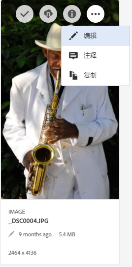
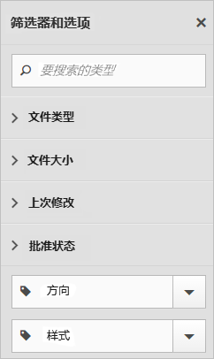

# Experience Cloud Assets 概述

>[!NOTE]
>
>Assets 是一项旧版核心服务，现在处于维护状态。

Experience Cloud Assets 为可在解决方案间共享的营销就绪型资源提供单个集中的存储库。资产是指数字文档、图像、视频或音频（或其中任一部分），它们可以具有多个演绎版，并可以具有子资产（例如，[!DNL Photoshop] 文件中的图层、[!DNL PowerPoint] 文件中的幻灯片、PDF 中的页面、ZIP 中的文件）。

资产服务包括：

* 资产存储、管理界面、嵌入式选择界面（通过解决方案访问）。
* 与 Creative Cloud、Experience Cloud 协作和 Experience Cloud 解决方案的集成。

使用资产可以提高一致性和品牌合规性，并缩短上市时间。您可以简化解决方案中的工作流：

* **[!DNL Social]** ：发布到社交属性、Facebook、Twitter、LinkedIn、Google+
* **[!DNL Target]**：创建 A/B 和多变量测试体验。
* **[!DNL Media Optimizer]**：跨不同渠道和营销活动制定广告单元
* **[!DNL Campaign]**：将资产放入电子邮件新闻稿和营销活动。

在 [!UICONTROL Experience Cloud Assets] 中，您可以：

* [导航到 Experience Cloud Assets](experience-cloud-assets.md#section_3657039DD3524F2AA88753BFF4781125)
* [访问工具栏](experience-cloud-assets.md#section_EC2E401D225148818F3753248556BE6B)
* [编辑资源](experience-cloud-assets.md#section_CD3C55A9D4574455B94D0955391C8FEC)
* [搜索资源](experience-cloud-assets.md#section_50FE049010B446FC9640AA6A30E5A730)
* [为资源作批注](experience-cloud-assets.md#section_67FE1DFAAB744DA5B1CD3AD3CCEABF7A)
* [查看全屏资源和缩放](experience-cloud-assets.md#section_A9F50D7D6BE341A2AB8244A4E42A4EF7)
* [查看资源属性](experience-cloud-assets.md#section_FED28711DAB14E1BBEEA7CA890EE9573)
* [运行使用情况报表](experience-cloud-assets.md#section_15D782FFB8D74CF4A735116CC03AD902)
* [用 Experience Manager 共享资源](experience-cloud-assets.md#section_45C1B72F4D274F54BC6CCB64D2580AC5)

## 导航到 Experience Cloud Assets {#section_3657039DD3524F2AA88753BFF4781125}

## 访问工具栏 {#section_EC2E401D225148818F3753248556BE6B}

导航到资产（或资产目录），然后选择&#x200B;**[!UICONTROL 选择]**。

您可以通过工具栏快速访问多种功能，包括搜索、时间轴、演绎版、编辑、批注和下载。

## 编辑资源 {#section_CD3C55A9D4574455B94D0955391C8FEC}

编辑资产时可启用多种功能，其中包括：

* 裁剪
* 旋转
* 翻转

## 搜索资源 {#section_50FE049010B446FC9640AA6A30E5A730}

可按关键词、文件类型、大小、上次修改时间、发布状态、方向和样式进行搜索。

## 为资源作批注 {#section_67FE1DFAAB744DA5B1CD3AD3CCEABF7A}

选择&#x200B;**[!UICONTROL 注释]**，方法是在图像上绘制圆圈或箭头，并在资产中添加批注以供合作者审阅。

## 查看全屏资源和缩放 {#section_A9F50D7D6BE341A2AB8244A4E42A4EF7}

选择&#x200B;**[!UICONTROL 视图]** > **[!UICONTROL 图像]**&#x200B;以查看完整的资产图像并启用缩放功能。

## 查看资源属性 {#section_FED28711DAB14E1BBEEA7CA890EE9573}

在带属性的卡视图、列表视图与列视图之间选择以更轻松地找到您的资源。

选择&#x200B;**[!UICONTROL 视图]** > **[!UICONTROL 属性]**&#x200B;以查看资产的属性：

## 运行使用情况报表 {#section_15D782FFB8D74CF4A735116CC03AD902}

查看用户数、已用存储容量和资源总数。

选择&#x200B;**[!UICONTROL 工具]** > **[!UICONTROL 报表]** > **[!UICONTROL 使用情况报表]**

