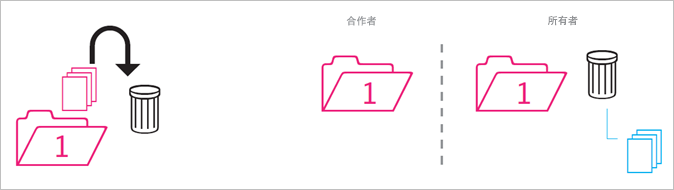
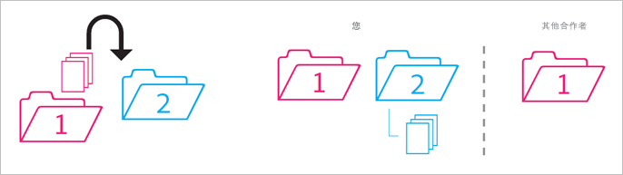
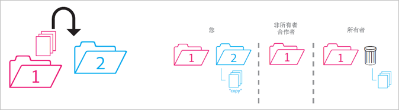
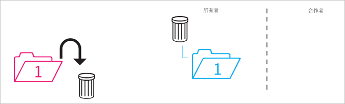
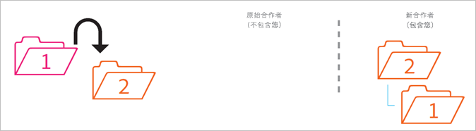
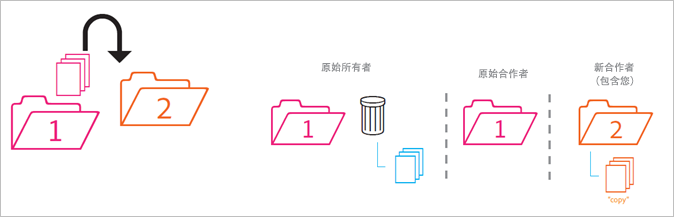
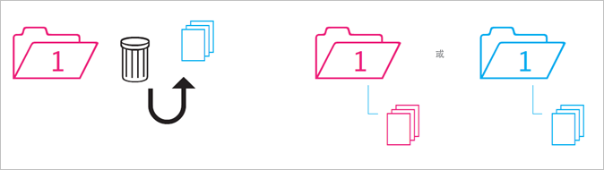

# 共享文件夹的行为

有关在移动、删除和还原共享文件夹时其行为方式的规则。

>[!NOTE]
>
>共享 Experience Cloud 文件夹和资产以 1:1 的关系镜像到 Creative Cloud 桌面。如果 Experience Cloud 用户更改文件夹（删除、添加或删除共享），此操作将镜像到 Creative Cloud 桌面和 Web 中。因此，如果取消共享文件夹，该文件夹及其资产将从本地计算机中删除。删除共享后，文件夹及其内容将移至本地计算机上的垃圾桶，您可以在垃圾桶中手动将它们还原到计算机。

## 将非共享文件夹移入共享文件夹 {#section_A9BAC1A244A246A984AC62660E61E0C0}

将非共享文件夹移入共享文件夹：

**结果**：两个文件夹都会共享。

## 将共享文件夹移入非共享文件夹 {#section_8BA83001DCEC4CF084B980C4A660F59A}

将共享文件夹移入非共享文件夹。

**结果**：非共享文件夹仍保持非共享状态。共享文件夹仍保持共享状态。

## 将内容从非共享文件夹移入共享文件夹 {#section_2941ED0DC52E4573AC1AB4C22313DD8E}

将内容从非共享文件夹移入共享文件夹。

**结果：**&#x200B;内容现已共享，所有协作者都可以看到。存储会增加内容的大小。

## 存档和删除的共享内容 {#section_5210D5F4943A44D0BA675D8EB4EAE20F}

存档或删除驻留在共享文件夹中的内容。

**结果：**&#x200B;为文件夹所有者存档内容。不拥有内容的协作者无法再访问该内容。

## 将自有的共享内容移入非共享文件夹 {#section_3810A364B67E4B8C9CA244BC52BF91BB}

将内容从您拥有的共享文件夹移入非共享文件夹。

**结果：**&#x200B;内容现已取消共享。共享文件夹的协作者无法再访问该内容。

## 将他人拥有的内容移入非共享文件夹 {#section_310766EBF0DC4C0BB4AB3E8A4DAEBE07}

将内容从其他人拥有的共享文件夹移入非共享文件夹。

**结果：**&#x200B;内容将显示在非共享文件夹中，并从共享文件夹中删除。共享文件夹的协作者无法再访问该内容。将为共享文件夹的所有者存档该内容。

所有者和编辑者可以移动他们不拥有的内容，但查看者无法移动。如果所有者和编辑者移动内容，任何用户都无法在共享文件夹中访问该内容。

## 存档或删除的自有文件夹 {#section_B314B13512A5409C87C49DFDB7602E14}

存档（通过 Web）或删除（通过桌面）您拥有的共享文件夹。

**结果：**&#x200B;将取消共享该文件夹，然后将其存档。协作者无法再访问该文件夹。

## 将共享文件夹移入其他共享文件夹 {#section_0A3F203D048D4D1586E9850DC92C51E9}

将您拥有的共享文件夹移入其他您可能拥有也可能不拥有的共享文件夹。

**结果：**&#x200B;由于文件夹被移入文件夹 2 中，将与新协作者共享。

## 将共享内容移入其他共享文件夹 {#section_69F6C312792A4CD2831BD14A340F850E}

将内容从共享文件夹移入另一个共享文件夹。

**结果：**&#x200B;内容显示在文件夹 2 中，并且现已与新协作者共享。内容将从文件夹 1 中删除，所有者将看到内容已存档，而其他协作者无法再访问此内容。

## 从存档还原的内容 {#section_DEA990B3581741F89FBB81D18C2AB449}

从属于共享文件夹的存档中还原内容。您在内容存档后拥有该内容。

**结果：**&#x200B;内容将还原到共享文件夹，所有协作者都可以再次访问。如果共享文件夹不再存在，内容将放入其原始父文件夹的未共享副本中。
