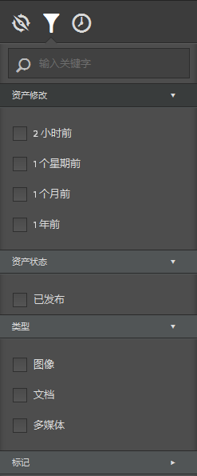
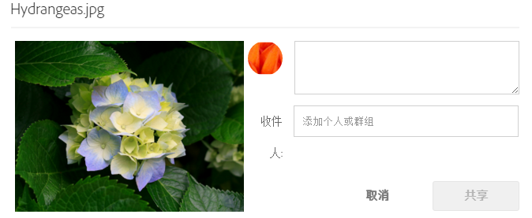
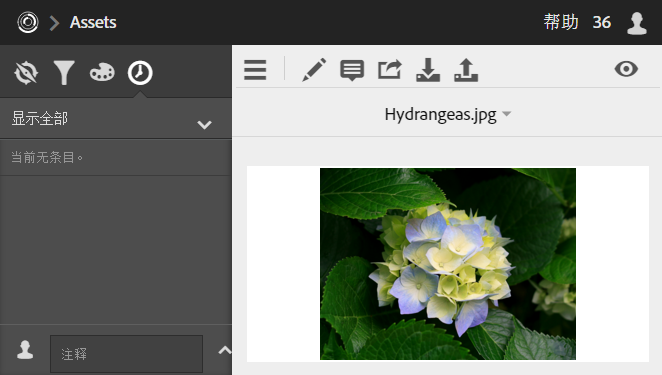
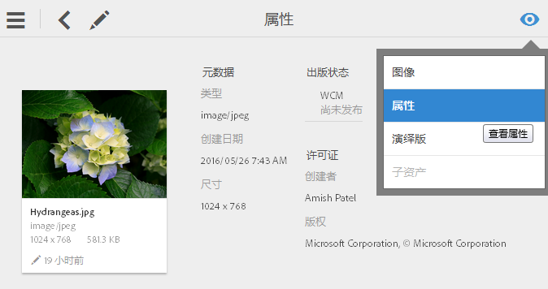

# 资产

Experience Cloud 资产提供了一个集中式市场营销类资产存储库，以便您在各解决方案中共享。资产指数字文档、图像、视频或音频（或其中的一部分），它可以有多个演绎版，也可以带有子资产（例如，Photoshop 文件中的图层、PowerPoint 文件中的幻灯片、PDF 中的页面以及 ZIP 包中的文件）。

<!-- asset.xml -->
资产服务包括：

* 资产存储、管理界面、嵌入式选择界面（通过解决方案访问）.
* 与 Creative Cloud、Experience Cloud 协作和 Experience Cloud 解决方案集成。

使用资产可提高一致性和品牌合规性，并加快投放市场的速度。您可以简化解决方案中的工作流程：

* **[!DNL Social]**：发布到社交属性、Facebook、Twitter、LinkedIn、Google+
* **[!DNL Target]**：创建 A/B 和多变量测试体验。
* **[!DNL Media Optimizer]**：跨不同渠道和营销活动制定广告单元
* **[!DNL Campaign]**：将资产放入电子邮件新闻稿和营销活动。

在 [!UICONTROL Experience Cloud 资产]中，您可以执行以下任务：

* [导航到 Experience Cloud 资产](../experience-cloud-assets/experience-cloud-assets.md#section_3657039DD3524F2AA88753BFF4781125)
* [访问工具栏](../experience-cloud-assets/experience-cloud-assets.md#section_EC2E401D225148818F3753248556BE6B)
* [编辑资产](../experience-cloud-assets/experience-cloud-assets.md#section_CD3C55A9D4574455B94D0955391C8FEC)
* [搜索资产](../experience-cloud-assets/experience-cloud-assets.md#section_50FE049010B446FC9640AA6A30E5A730)
* [在资产中添加批注](../experience-cloud-assets/experience-cloud-assets.md#section_67FE1DFAAB744DA5B1CD3AD3CCEABF7A)
* [将资产共享到信息源](../experience-cloud-assets/experience-cloud-assets.md#section_2CD53A99600D4A3D9AA82C3CDA666E6B)
* [全屏查看和缩放资产](../experience-cloud-assets/experience-cloud-assets.md#section_A9F50D7D6BE341A2AB8244A4E42A4EF7)
* [查看资产属性](../experience-cloud-assets/experience-cloud-assets.md#section_FED28711DAB14E1BBEEA7CA890EE9573)
* [运行使用情况报表](../experience-cloud-assets/experience-cloud-assets.md#section_15D782FFB8D74CF4A735116CC03AD902)
* [共享 Experience Manager 资产](../experience-cloud-assets/experience-cloud-assets.md#section_45C1B72F4D274F54BC6CCB64D2580AC5)

## 导航到 Experience Cloud 资产 {#section_3657039DD3524F2AA88753BFF4781125}

## 访问工具栏 {#section_EC2E401D225148818F3753248556BE6B}

导航到资产（或资产目录），然后单击&#x200B;**[!UICONTROL 选择]**。

通过工具栏，您可以快速访问各种功能，包括“搜索”、“时间轴”、“演绎版”、“编辑”、“注释”和“下载”。

## 编辑资产 {#section_CD3C55A9D4574455B94D0955391C8FEC}

编辑资产时将启用一些功能，包括：

* 裁剪
* 旋转
* 翻转

## 搜索资产 {#section_50FE049010B446FC9640AA6A30E5A730}

您可以按关键词、文件类型、大小、上次修改时间、发布状态、方向和样式进行搜索。

## 在资产中添加批注 {#section_67FE1DFAAB744DA5B1CD3AD3CCEABF7A}

单击&#x200B;**[!UICONTROL 注释]后，可以在图像上绘制圆圈或箭头，并在资产中添加批注，以供合作者审阅。**

## 将资产共享到信息源 {#section_2CD53A99600D4A3D9AA82C3CDA666E6B}

**从2019年11月1日开始，将不再支持Experience Cloud Feed，并将于2019年12月前弃用。**

单击工具栏中的&#x200B;**[!UICONTROL 共享]**，以将资产作为[信息源](../feed.md#concept_9256B8768A294009A777282DD8719213)共享到其他 Experience Cloud 用户。

共享后，您的信息源页面上将会显示相关图像，以及您与其共享信息卡的人员。

## 全屏查看和缩放资产 {#section_A9F50D7D6BE341A2AB8244A4E42A4EF7}

单击&#x200B;**[!UICONTROL 视图]** &gt; **[!UICONTROL 图像]**，可以查看完整的资产图像并启用缩放功能。

## 查看资产属性 {#section_FED28711DAB14E1BBEEA7CA890EE9573}

可以在属性信息卡视图、列表视图和列视图之间进行选择，以便更加轻松地查找您的资产。

单击&#x200B;**[!UICONTROL 视图]** &gt; **[!UICONTROL 属性]**，可以查看资产的属性：

## 运行使用情况报表 {#section_15D782FFB8D74CF4A735116CC03AD902}

可以查看用户数量、已用存储空间，以及资产总计等信息。

单击&#x200B;**[!UICONTROL 工具]** &gt; **[!UICONTROL 报表]** &gt; **[!UICONTROL 使用情况报表]**

