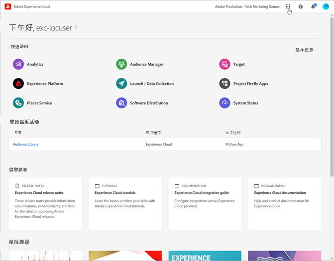
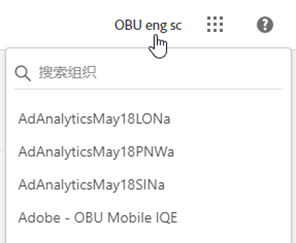
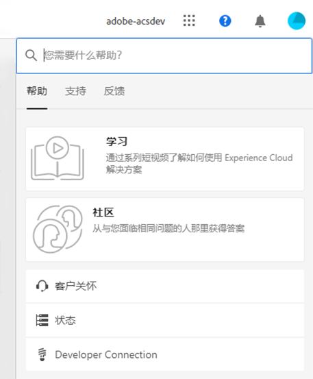
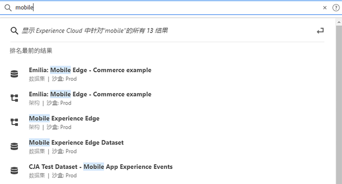
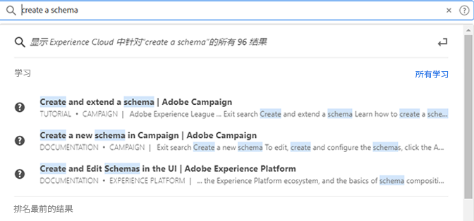
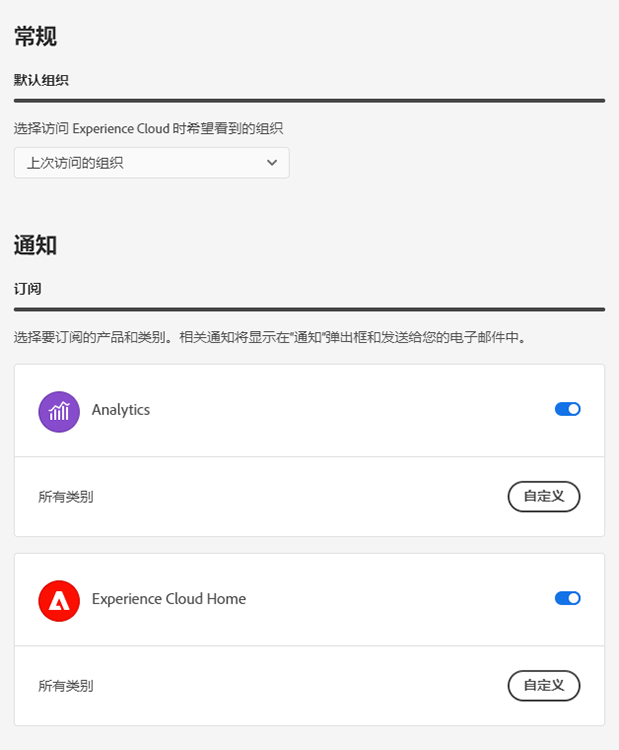
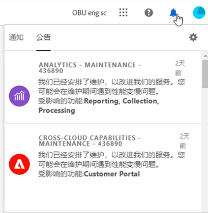

# Experience Cloud 中央界面组件指南

[Experience Cloud](https://experience.adobe.com) 是 Adobe 综合系列的数字营销应用程序、产品和服务。通过它的直观界面，您可以快速访问您的云应用程序、产品功能和服务。

通过 Experience Cloud 的标题，您可以：

* 访问您的应用程序和服务
* 搜索产品文档、教程和社区帖子
* 使用全局搜索的全局搜索业务对象（仅向 Experience Platform 用户开放）
* 管理您的帐户首选项（警报、通知和订阅）

## 登录到 Experience Cloud {#signin}

登录并验证您是否处于正确的[组织](organizations.md)中。

1. 导航到 [Adobe Experience Cloud](https://experience.adobe.com)。
1. 输入您的 Adobe 电子邮件地址，然后选择&#x200B;**[!UICONTROL 继续]**。

   管理员可查看 [Experience Cloud 用户身份验证](admin-getting-started.md#migration)，以获取身份类型的重要更新 (Business ID)。

1. 选择帐户。
1. 键入您的密码。
1. 验证您是否处于正确的组织中。

   

   **验证您的组织**

   要验证您是否已登录到正确的[组织](organizations.md)，请单击您的个人资料头像来查看组织名称。如果您有权访问多个组织，也可以直接在标题栏中查看和切换到另一个组织。

   如果您的组织使用 Federated ID，则 Experience Cloud 允许您使用组织的单点登录进行登录，而无需输入您的电子邮件地址和密码。为此，请将 `#/sso:@domain` 添加到 Experience Cloud URL (`https://experience.adobe.com`)。

   例如，对于带 Federated ID 和域 `adobecustomer.com` 的组织，请将 URL 链接设置为 `https://experience.adobe.com/#/sso:@adobecustomer.com`。您还可以通过为此 URL 添加书签并追加应用程序路径，直接转到特定应用程序。（例如，对于 Adobe Analytics，使用 `https://experience.adobe.com/#/sso:@adobecustomer.com/analytics`。）

## 访问 Experience Cloud 应用程序 {#navigation}

登录到 Experience Cloud 后，您可以从统一页头中快速访问您的所有应用程序、服务和组织。

要访问组织中为您配置的 Experience Cloud 应用程序和服务，请转至应用程序选择器 。

## Experience Cloud 中的浏览器支持 {#browser}

为了实现最佳性能，Experience Cloud 针对最流行的浏览器（包括最新版本以及上两个版本）进行了优化。

* Chrome
* Edge
* Firefox
* Opera
* Safari

如果您的浏览器不是上面列出的浏览器，它可能仍受支持，但建议您使用列出的浏览器之一。

>[!NOTE]
>
>并非所有在 Experience Cloud 域上运行的应用程序都支持所有浏览器。如果您不确定，请查看特定应用程序的文档。

## Experience Cloud 中的语言支持 {#languages}

Experience Cloud 支持每个用户的首选语言，如您的 Adobe 用户帐户偏好设置中所设定。当前支持的语言为：

* 简体中文
* 英语
* 法语
* 德语
* 意大利语
* 日语
* 朝鲜语
* 葡萄牙语
* 西班牙语
* 繁体中文

虽然所有应用程序团队都致力于提供全球语言支持，但并非所有应用程序都具有上述所有语言版本。如果 Experience Cloud 应用程序不支持您的主要语言，您也可以将辅助语言设置为默认语言（如果适用）。可以在 [Experience Cloud 用户偏好设置](https://experience.adobe.com/preferences)中执行此操作。

## 获取帮助和支持 {#support}

使用标头中的帮助图标（）访问学习和帮助，包括有关 [Experience League](https://experienceleague.adobe.com/?lang=zh-Hans#home) 的帮助内容（文档、教程和课程）以及各个应用程序的其他资源。您也可以提交开放式的反馈并创建优先支持服务单。

通过[!UICONTROL 帮助]菜单，您还可以访问：

* **[!UICONTROL 支持]：**&#x200B;创建支持工单或使用 Twitter 联系支持[!UICONTROL 支持]部门。
* **[!UICONTROL 反馈]：**&#x200B;共享您对 Experience Cloud 体验的反馈。您的反馈将用于改进 Adobe 的支持和服务。
* **[!UICONTROL 状态]：**&#x200B;导航到 `https://status.adobe.com/experience_cloud`，检查产品操作状态并[!UICONTROL 管理订阅]。
* **[!UICONTROL 开发人员连接]：**&#x200B;导航到 `adobe.io` 并查找开发人员文档。

## [!UICONTROL 统一搜索] 对象和实体 {#globally-search}

的 [!UICONTROL 统一搜索] 通过搜索，您可以在无缝、一致的一键式体验中查找可搜索的业务对象或实体。 该搜索会显示您最近访问的对象。

### 可用性

统一搜索显示在页面顶部(在Experience Cloud标题中)，并且始终对支持的产品可见，当前支持的产品有：

* Experience Platform(AEP)
* Journey Optimizer(AJO)

随着更多内容已编入索引，此功能将添加到相关应用程序中。

### 可搜索对象和字段

在键入时，匹配的顶部结果来自您有权显示的对象。

可搜索的业务对象包括：

* 区段（名称、描述）
* 架构（名称、描述）
* 数据集（名称、描述）
* 源（名称、描述）
* 目标（名称、描述）
* 查询（名称、描述）
* 消息（名称、描述）
* 选件（名称、描述）
* 组件（名称、描述）
* 历程（名称、描述）

如果关键字与导航页面匹配，则可以快速获取导航页面示例数据集的链接。

您还可以找到Experience League和社区中的帮助文章。 支持自然语言查询。

例如， _如何创建架构_ 在下Experience League生成结果 _[!UICONTROL 学习]_:

搜索算法首先显示最相关的记录。 结果的顺序取决于多个因素，例如：

* 访问对象的用户权限
* 匹配百分比
* 完全匹配
* 的 _[!UICONTROL 热门结果]_ 部分显示前30个结果。

要优化搜索，请单击以下任一项：

* **[!UICONTROL 全部学习]**:在Experience League中打开搜索。
* **[!UICONTROL 显示全部……]**:可让您进一步优化和筛选结果。

## 用户个人资料和帐户偏好设置 {#preferences}

Experience Cloud 首选项包括通知、订阅和警报。在帐户首选项菜单中，您可以：

* 指定深色主题（并非所有应用程序都支持此主题）
* 搜索[组织](organizations.md)
* 注销
* 配置帐户首选项、通知和订阅

要管理偏好设置，请选择帐户菜单  中的&#x200B;**[!UICONTROL 偏好设置]**。

在 [!UICONTROL Experience Cloud 首选项]上，您可以配置以下功能：

| 功能 | 描述 |
|--- |--- |
| 默认[组织](organizations.md) | 选择您要在启动 Experience Cloud 时看到的组织。 |
| [!UICONTROL 订阅] | 选择您要订阅的产品和类别。[!UICONTROL 通知]弹出窗口和电子邮件中的通知。 |
| [!UICONTROL 优先级] | 选择您希望视为高优先级的类别。这些类别标有“高”标签，可以配置为像警报一样发送。 |
| [!UICONTROL 警报] | 选择您希望在浏览器中显示警报所针对的通知。警报会在窗口右上角出现几秒钟。 |
| 电子邮件 | 指定您希望接收通知电子邮件的频率。（不发送、即时、每日或每周。） |

{style=&quot;table-layout:auto&quot;}

## 通知和公告 {#notifications}

选择&#x200B;**[!UICONTROL 通知]**，即可收到有关相关的可操作更新的通知，包括产品版本、维护通知、共享项和批准申请。

## Experience Cloud 域 {#domains}

Experience Cloud 使用以下主机来交付应用程序、提高性能和改善产品体验。Adobe 建议将这些域添加到防火墙的允许列表以获得最佳体验。其他域也可用于特定的 Experience Cloud 应用程序，例如 Adobe Analytics。有关更多信息，请查看这些应用程序的文档。

| 技术 | 域 |
|--- |--- |
| Adobe Experience Cloud 域 | `adobe.com`、`adobe.net`、`adobe.io` |
| Adobe Identity Management Service (IMS) | `adobelogin.com` |
| Experience Cloud 字体 | `typekit.net` |
| Gainsight（用于产品指导和帮助） | `esp.aptrinsic.com` |

## 获取有关管理和跨应用程序服务的帮助

本指南提供的帮助内容涉及如何在 Admin Console 中管理 Experience Cloud 用户和产品，以及如何启用面向平台服务的应用程序。另外，您还可以获取有关受众库、客户属性、Experience Cloud Assets 等更多方面的帮助：

* [[!UICONTROL 受众库]](audience-library.md)
* [[!UICONTROL 客户属性]](attributes.md)
* [[!UICONTROL 触发器]](triggers.md)
* [Experience Cloud [!UICONTROL Assets]](experience-cloud-assets.md)
* [Experience Cloud Cookie](cookies-privacy.md)
* [用户和产品管理](admin-getting-started.md) (Admin Console)
* [为核心服务启用应用程序](core-services.md)
* [常见问题](admin-getting-started.md)
* [组织和帐户关联](organizations.md)
* [集成](marketing-cloud-integrations.md)
* [将 Adobe Target 与 Experience Cloud 集成](https://experienceleague.adobe.com/docs/target/using/integrate/a4t/a4t.html?lang=zh-Hans)
* [Experience Cloud 隐私和安全性概述](assets/Adobe-Marketing-Cloud-Privacy-and-Security-Overview.pdf)
* [DNS 预获取](admin-getting-started.md#concept_6BC8C6856E3644F8956D7AD0A96383B7)

## 指南

相关的 Experience Cloud 指南包括：

* [Adobe Mobile](https://experienceleague.adobe.com/docs/mobile-services/using/home.html?lang=zh-Hans)
* [Experience Platform Co-op Graph](https://experienceleague.adobe.com/docs/device-co-op/using/home.html?lang=zh-Hans)
* [Exchange](https://exchange.adobe.com/experiencecloud)
* [Experience Cloud ID 服务](https://experienceleague.adobe.com/docs/id-service/using/home.html?lang=zh-Hans)
* [Experience Platform 数据收集/Launch](https://experienceleague.adobe.com/docs/launch.html?lang=zh-Hans)
* [Experience Cloud 调试器](https://experienceleague.adobe.com/docs/debugger/using/experience-cloud-debugger.html?lang=zh-Hans)
* [《通用数据保护条例》(GDPR) API](https://www.adobe.io/apis/experiencecloud/gdpr.html)
* [[!UICONTROL Dynamic Tag Management]](https://experienceleague.adobe.com/docs/experience-platform/tags/home.html?lang=zh-Hans)

## 教程

充分利用以下 Experience League 中的自助式教程和简短的使用说明：

* [Experience League 中的所有教程](https://experienceleague.adobe.com/?lang=zh-Hans#quick-how-tos)
* [Experience Platform 教程](https://experienceleague.adobe.com/docs/launch-learn/tutorials/overview.html?lang=zh-Hans)
* [实时客户数据平台](https://experienceleague.adobe.com/docs/platform-learn/tutorials/application-services/rtcdp/understanding-the-real-time-customer-data-platform.html?lang=zh-Hans)

## 发行说明和相关的 Experience Cloud 帮助

* [所有 Experience Cloud 应用程序的产品文档](https://experienceleague.adobe.com/docs/home.html?lang=zh-Hans) - 浏览 Experience Cloud 学习和支持页面以获取帮助
* [发行说明和产品更新](https://experienceleague.adobe.com/docs/release-notes/experience-cloud/current.html?lang=zh-Hans) — Experience Cloud 的新增功能，订阅可获取更新
* [实施核心服务的教程](https://experienceleague.adobe.com/docs/launch-learn/tutorials/overview.html?lang=en) — 浏览有关核心服务的视频和教程
* [Experience League 的专家帮助](https://experienceleague.adobe.com/cn) — 从专家和社区获得指导性学习
* [教育和培训](https://helpx.adobe.com/cn/learning.html?promoid=KAUDK) - 与 Adobe 互动以确保您能够充分利用 Adobe 的产品
* [客户体验博客](https://blog.adobe.com/en/topics/digital-transformation.html) — 阅读 Experience Cloud 博客
* [客户关怀](https://experienceleague.adobe.com/?support-solution=General#support) — 联系 Adobe 客户关怀部门
