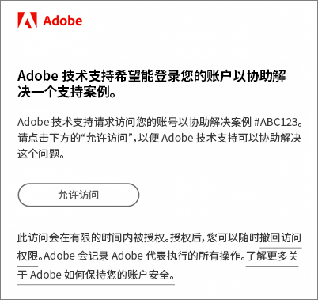

# 关于 Experience Cloud 的常见问题解答

了解 Experience Cloud 支持的浏览器，以及面向管理员的常见问题和解答。

## Experience Cloud 支持哪些浏览器？

* Microsoft® Edge（当前版本和之前两个版本）
* Google Chrome（当前版本及前两个版本）
* Mozilla Firefox（当前版本及前两个版本）
* Safari（当前版本及前两个版本）
* Opera（当前版本及前两个版本）

## 如何知道是否已为核心服务启用我的应用程序？

如果尚未为核心服务配置实施，请参阅[为核心服务启用应用程序](core-services.md#concept_07ED1D5C64234E77976E6D572E78FB9C)，其中介绍了以下操作说明：

1. [加入 Experience Cloud 并成为管理员](core-services.md#section_2423F0BD3DF642658103310EE5EA6154)
1. [使用Experience Platform标签实施Experience CloudID服务](https://experienceleague.adobe.com/docs/experience-platform/tags/get-started/quick-start.html?lang=zh-Hans).
1. [将报告包映射到 Experience Cloud 组织](core-services.md#concept_apg_zq2_rw)
1. [（仅限 Analytics）使您的 Analytics AppMeasurement 代码符合现代化要求](core-services.md#section_1798D9D0F05C47E29816AC4EEB9A0913)
1. [（仅限 Adobe Target）使您的 Adobe Target 实施符合现代化要求](core-services.md#section_C2F4493C7A36406DAE2266B429A4BD24)
1. [验证实施](core-services.md#section_E641782A0F4F44AF8C9C91216BE330D5)
1. [管理用户和产品](core-services.md#section_B6E95F4E0E12483CB9DA99CBC0C5A4AF)
1. [开始使用核心服务](core-services.md#section_960C06093623462E8EA247B3E97274A1)

要获得更多帮助，请联系 [Adobe 支持部门](https://experienceleague.adobe.com/?support-solution=General#support)。

## Adobe 会对我的公司收取 Experience Cloud 的访问费用吗？

不会。Experience Cloud 无需额外付费。但是某些核心服务可能收取额外的费用。

## 为什么我的公司必须通过 Experience Cloud 界面登录？

Experience Cloud 界面提供的功能为您的业务带来新价值。该界面也是今后访问应用程序的标准途径，最终将取代其他单独的应用程序登录流程。通过 Experience Cloud 登录有助于以后实现更平稳的过渡。

## 如何消除有关迁移我的公司的疑虑？

[联系 Adobe 支持部门](https://experienceleague.adobe.com/?support-solution=General#support)。

## [!DNL Adobe Support]如何访问我的 Adobe 云环境以进行故障排除？

[!DNL Adobe Support]会提交一个模拟请求，向您发送带有 Adobe 品牌标志的电子邮件（见以下示例），请求您的明确授权。授予的访问权限仅限于一段时间。授予访问权限后，您可随时撤销。Adobe 会记录 Adobe 代表执行的所有操作。

## 什么是&#x200B;_配置？_

Experience Cloud 中的配置表示：

* 您的用户可以开始登录到 [!DNL Experience Cloud] 并关联应用程序。
* 他们可以开始使用 Experience Cloud 提供的功能，如人员。
* 您可以准备停用特定于应用程序的登录流程。
* 您可以保留对应用程序的访问控制。

## 如何管理用户和产品配置文件？

* 有关帮助，请参阅 [Admin Console 用户指南](https://helpx.adobe.com/cn/enterprise/admin-guide.html)。

* 用户权限和产品管理在 [Adobe Admin Console](https://adminconsole.adobe.com/enterprise)（产品链接）中执行。

* **重要信息：**&#x200B;对于 Analytics 管理员，请参阅[在 Admin Console 中管理 Analytics 用户](https://experienceleague.adobe.com/docs/analytics/admin/user-product-management/migrate-users/c-migration-tool.html?lang=zh-Hans)，以了解如何将用户 ID 从 Analytics 管理工具迁移到 Admin Console。

## 如果有人无法登录到 Experience Cloud，我该怎么做？

Admin Console 管理员可以授予用户访问权限。将会向用户发送包含登录说明的电子邮件。

您可能需要[联系 Adobe 支持部门](https://experienceleague.adobe.com/?support-solution=General#support)来验证您的公司是否已完全配置。

## 用户可在何处管理帐户关联？

有些用户可能需要将其应用程序 (Analytics) 帐户关联到 Adobe ID 或 Enterprise ID。

请参阅[将应用程序帐户关联到 Adobe ID](organizations.md#task_FD389E78640848919E247AC5E95B8369)。

## 如何管理用户帐户配置文件和组织？

请参阅[管理用户帐户](organizations.md#topic_C31CB834F109465A82ED57FF0563B3F1)。

## 什么是组织？

[组织](organizations.md) 是一个实体，它允许管理员配置群组和用户，并控制 Experience Cloud 中的单点登录。组织的功能类似于跨所有 Experience Cloud 产品和应用程序的登录公司。大多数情况下，组织是您的公司名称。但是，公司可以具有多个组织。

## 在哪里可以找到我的 IMS 组织 ID？

有关详细信息，请参阅[查看您的组织 ID](organizations.md)。

## 如果我的一位用户离开了我的公司怎么办？

应将他们的访问权限从应用程序中删除。他们将无法从 Experience Cloud 中或通过直接登录访问产品。您还应在 Experience Cloud 级别删除它们。

## 什么是 Adobe ID？

请参阅[身份类型](https://helpx.adobe.com/cn/enterprise/using/identity.html)。

## 我可以为我的用户关联应用程序帐户吗？

不可以。用户必须将自己的应用程序与自己的用户名和密码相关联。

## 为什么我的公司没有 Social 但是我却能看到？

Adobe Social 是一款可与 Analytics 组合销售的产品。因此，如果您拥有 Analytics，将会看到此应用程序，但只有您购买它后，才有权访问它。
