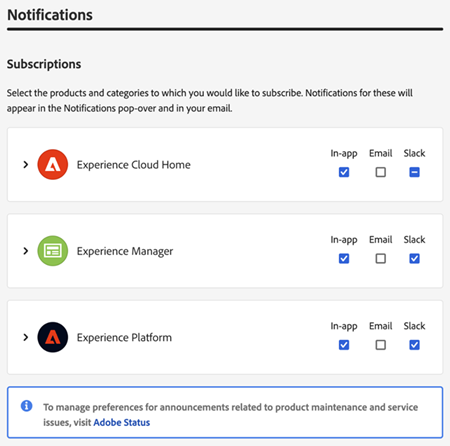
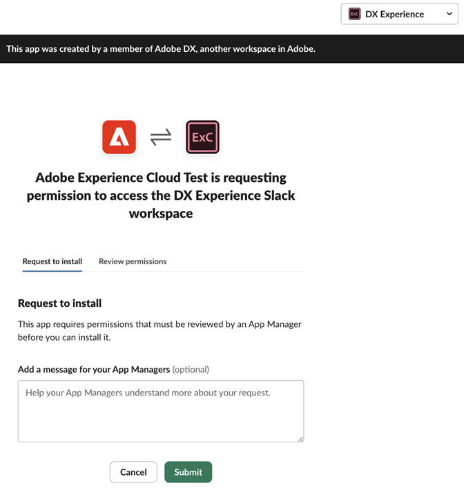

# 帐户首选项和通知 {#preferences}

要查找Experience Cloud首选项，请单击标题中的&#x200B;**[!UICONTROL 配置文件]** ，然后单击&#x200B;**[!UICONTROL 首选项]**。

{width="100" zoomable="yes"}

在[!UICONTROL Experience Cloud首选项]页面上，您可以管理以下帐户功能：

| 功能 | 描述 |
|--- |--- |
| [!UICONTROL 轮廓] | 更新您的[Adobe帐户配置文件](https://account.adobe.com/cn/profile)。 
当您登录到Adobe.com、Adobe产品和服务以及诸如[!DNL Behance]之类的面向公众的网站时，您的个人资料照片和名称会显示。 |
| [!UICONTROL 常规] | 选择[组织](../administration/organizations.md)。
此组织是登录Experience Cloud时使用的默认组织。 |
| [!UICONTROL 产品使用情况数据] | 在使用Experience Cloud应用程序时，您可以控制与Adobe共享哪些产品使用数据。 这些是有关您如何使用我们产品的数据，而不是您组织的内容或数据本身。 Adobe将使用此信息来帮助改进我们的产品、为您提供增强的产品内支持，以及个性化您的体验和我们之间的沟通。 
若要了解详细信息，请参阅[产品使用情况数据](#product-usage-data)（在此页面上）。 |
| [!UICONTROL 通知] | 配置您希望产品[通知](#subscribe-to-notifications-in-experience-cloud)和警报的方式和时间： <ul><li>选择要订阅警报的产品</li><li>配置通知类型([!UICONTROL 应用程序内]、[!UICONTROL 电子邮件]或[Slack](#slack-notifications))</li><li>指定您希望接收通知电子邮件的频率。（不发送、即时、每日或每周。）</li><li>确定警报优先级。 应用程序内警报会出现在窗口的右上角几秒钟。 或者，您可以指定在解除警报之前是否应显示警报。</li></ul> |

## [!UICONTROL 产品使用情况数据] {#product-usage-data}

您选择与Adobe共享的产品使用数据包括以下类型的信息，介绍了如何使用应用程序以及与Adobe应用程序进行交互：

* 浏览器和设备信息，如设备型号和操作系统、软件和硬件信息、浏览器和设备设置、唯一标识符（如IP地址、Cookie ID或设备ID）、安装的内存量、语言设置以及屏幕分辨率；
* 如何与Adobe Experience Cloud应用程序交互，包括您使用的功能和选择的选项；
* Adobe产品信息，如版本号；
* 有关您的内容和文档的信息（如页数和唯一标识符），但不包括内容本身；
* 内容使用信息，例如您访问内容的次数以及在应用程序中如何与您的内容交互；
* 崩溃和错误日志。

Adobe使用此信息帮助改进我们的产品，在产品内和通过客户关怀为您提供支持，并个性化您的体验和我们之间的沟通。 详细了解[个性化体验](personalized-learning.md)。

## 订阅Experience Cloud中的通知 {#notifications}

您可以选择要订阅的产品和类别。 通知显示在[!UICONTROL 通知]弹出框（应用程序内）、电子邮件或[Slack](#slack-notifications)中（具体取决于您的订阅）。

电子邮件和Slack通知对于您未登录Experience Cloud的情况非常有用。

### 订阅应用程序内通知和电子邮件通知

1. 导航到Experience Cloud[首选项](https://experience.adobe.com/preferences)。

1. 在&#x200B;**[!UICONTROL 通知]**&#x200B;下，启用&#x200B;**[!UICONTROL 应用程序内]**&#x200B;或&#x200B;**[!UICONTROL 电子邮件]**。

   对通知的更改会自动保存。

### 订阅[!DNL Slack]通知 {#slack}

您可以配置帐户首选项以将Experience Cloud通知发送到[!DNL Slack]频道。

**先决条件**

* 您必须拥有Experience Cloud帐户。
* 您必须拥有[!DNL Slack]帐户。 您的[!DNL Slack]管理员启用Experience Cloud与[!DNL Slack]的集成。
* 您必须是至少一个[!DNL Slack]工作区的一部分。

**订阅[!DNL Slack]通知**

1. 导航到Experience Cloud[首选项](https://experience.adobe.com/preferences)。

1. 找到[!DNL Slack]，然后单击&#x200B;**[!UICONTROL 添加到Slack]**。

   

   如果安装了[!DNL Slack]，则会打开应用程序并显示权限请求消息。 如果未安装Slack，您必须[请求权限](#slack-troubleshoot)。

1. 单击&#x200B;**[!UICONTROL 允许]**。

1. 在&#x200B;**[!UICONTROL 通知]**&#x200B;下，为所需的产品和类别启用[!DNL Slack]通知。

   

   通知更新会自动保存。

### 在[!DNL Slack]中请求权限（疑难解答） {#slack-troubleshoot}

如果未安装[!DNL Slack]，则当您单击“**[!UICONTROL 添加到Slack]**”后打开Slack时，会显示&#x200B;_[!UICONTROL 请求安装]_&#x200B;消息。 例如：

**在Slack**&#x200B;中请求权限

1. 在[!DNL Slack]中，从&#x200B;**[!UICONTROL Workspace]**&#x200B;菜单（右上角）中选择工作区。

1. 要请求[!DNL Slack]工作区经理的申请审批，请单击&#x200B;**[!UICONTROL 提交]**。

1. 申请请求获得批准后，您将在[!DNL Slack]中收到通知。

1. 收到[!DNL Slack]批准后，返回到Experience Cloud **[!UICONTROL 通知]**&#x200B;并按照步骤[订阅Slack](#slack-notifications)（如上所述）。

### 您将在[!DNL Slack]中看到的内容

成功集成[!DNL Slack]后，[!DNL Slack]通知显示以下信息：

* 将从应用程序名称&#x200B;_Adobe[!DNL Experience Cloud]_&#x200B;接收个人消息。
* 该消息包含特定应用程序的产品徽标，如Adobe[!DNL Experience Platform]、Adobe[!DNL Experience Manager]等。
* 用于查看Experience Cloud上所有通知的链接。
* 用于管理Experience Cloud通知首选项的链接。

## 查看Experience Cloud中的[!UICONTROL 通知]和公告 {#view-notifications}

在[!DNL Experience Cloud]标题中，您可以查看[订阅了](#notifications)的通知，以及查看公告。

1. 单击标题中的铃铛图标。 

1. 单击&#x200B;**[!UICONTROL 通知]**&#x200B;或&#x200B;**[!UICONTROL 公告]**。

   在此位置，您可以接收有关产品、与其他用户的协作以及其他相关更新的重要信息。 更新包括产品版本、维护通知、共享项和审批请求。
