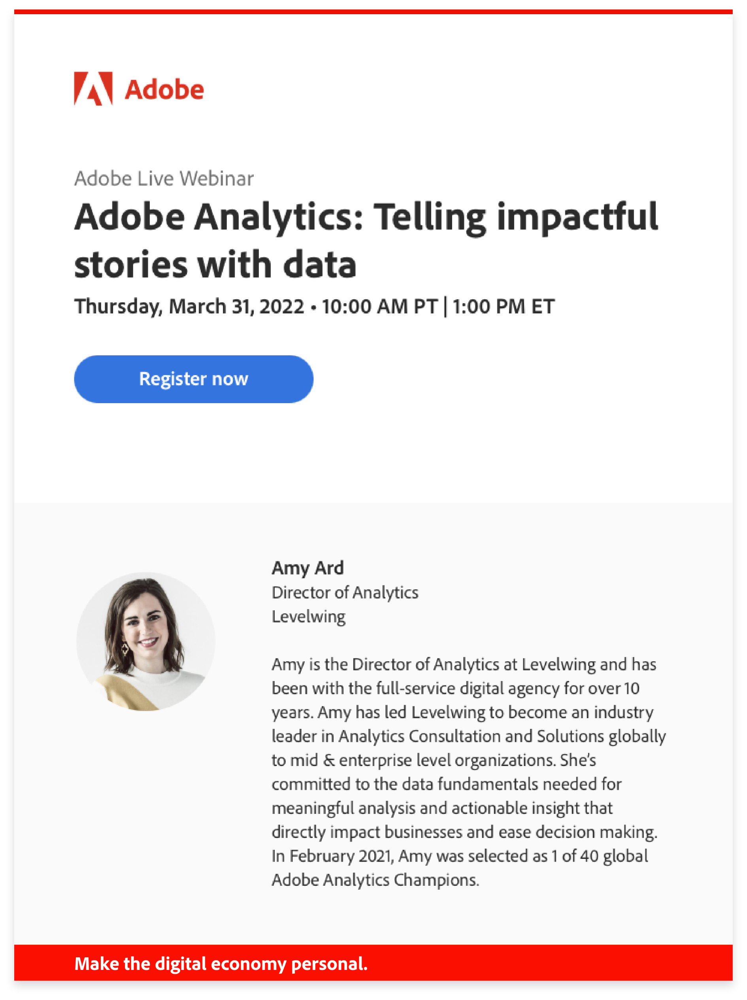

# 个性化的学习偏好设置

Adobe会根据您在Adobe产品中的工作，为您提供量身定制的有用内容。 产品使用情况数据会告知我们如何为您定制此上下文。 您可以在[CX Enterprise首选项](https://experience.adobe.com/preferences)页面上选择加入或选择退出共享您的产品使用情况数据。

<!--
## Personalized training and support recommendations for your Adobe products and services

Receive relevant best practices, tips & tricks, helpful walk throughs, and more based on your use of your Adobe products in each of these three ways...

<table>
<tbody>
  <tr>
    <td>In your Adobe products... </td>
    <td>See pop ups and tool tips for real-time help.</td>
    <td rowspan="3">This could include... <ul><li>Step-by-step guides and helpful tips from Adobe experts</li> 
    <li>Video tutorials and informational walkthroughs</li> 
    <li>In-depth training and education</li> 
    <li>Recommendations for videos and posts</li>
    </ul></td>
  </tr>
  <tr>
    <td>In email Adobe sends you...</td>
    <td>Seeing learning content that relates to your work in your product(s).</td>
  </tr>
  <tr>
    <td>In the Experience League Communities..</td>
    <td>See personalized recommendations for posts and articles based on what you're doing now.</td>
  </tr>
</tbody>
</table>

## Personalized information about Adobe products, services, events, and promotions

Receive tailored opportunities for learning events, research sessions, and integrations based on your work in each of these three ways...

<table>
<tbody>
  <tr>
    <td>In your Adobe products... </td>
    <td>See pop ups and tool tips for invitations and opportunities relevant to you.</td>
    <td rowspan="3">This could include... <ul>
    <li>Invitations to educational webinars and events</li> 
    <li>Opportunities to test and give input on future releases of the features you use</li>
    <li>Tips to use integrations between products you own</li> 
    <li>Highlights for key sessions at the Adobe Summit conference based on your work</li>
    </ul></td>
  </tr>
  <tr>
    <td>In email Adobe sends you...</td>
    <td>Get timely information from Adobe about additional learning opportunities.</td>
  </tr>
  <tr>
    <td>In the Experience League Communities..</td>
    <td>See personalized recommendations for events and services to enhance your learning.</td>
  </tr>
</tbody>
</table>

-->

<!-- 
{width="10%"} 
-->

## 自定义学习信息的示例

### 在您的 Adobe 产品中

{width="800"}

### 在 Adobe 发给您的电子邮件中

{width="400"}

### 在 Experience League 社区中

{width="800"}

<!-- {width="10%"} -->