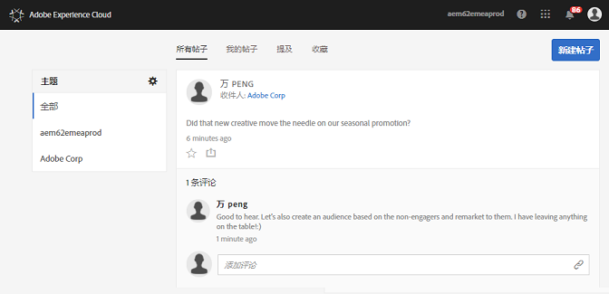

# 信息源

了解如何使用您的 Experience Cloud 信息源，直接与他人共享或向他人发布资产和 Analytics 报表。

在您首次登录到 Experience Cloud 时，信息源可能为空。在您创建帖子和共享内容时，以及其他用户与您共享内容时，信息源会自动填充，以帮助您和您的团队成员时刻掌握最新动态。

信息源中的设置包括：

* **主题：所有 \&lt;组织名称\&gt;：** 显示与您共享的所有帖子，以及您有权访问的所有帖子。
* **管理主题：** 允许您关注、取消关注或建议主题。此外，管理员还可以批准、拒绝、停用和创建主题。
* **新建帖子：** 创建群组成员可以查看的帖子。
* **所有帖子：** 查看您的信息源中的所有帖子。
* **我的帖子：** 仅显示您自己的帖子。
* **提及：** 显示提及您或您的群组的帖子。
* **收藏：** 显示您标记为“收藏”的帖子。

## 将 Analytics 项目共享到信息源 {#section_F2BDF9FEF4394686BAC5051CBE913EE5}

您可以将来自 [!UICONTROL Reports &amp; Analytics] 的报表共享到 Experience Cloud 信息源。

1. 使用您的 Adobe ID [登录](admin-getting-started/getting-started-experience-cloud.md#topic_AC564B6795334DE39359ADD87F52F2E0)到 Experience Cloud。

1. 导航到 Reports &amp; Analytics，然后[创建一个项目](https://marketing.adobe.com/resources/help/zh_CN/analytics/analysis-workspace/index.html?f=freeform_overview)。

1. 单击 **[!UICONTROL 更多]** &gt; **[!UICONTROL 共享]**。

   

1. 在“共享”窗口中，添加收件人，然后单击 **[!UICONTROL 共享]**。
