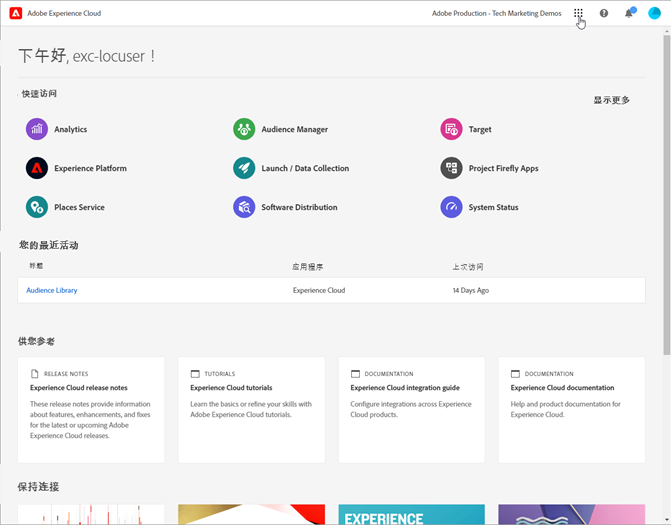
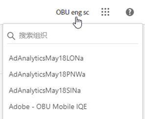
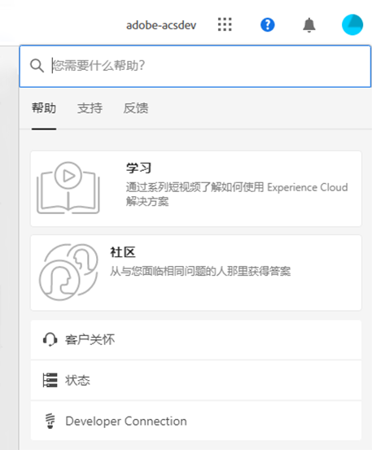
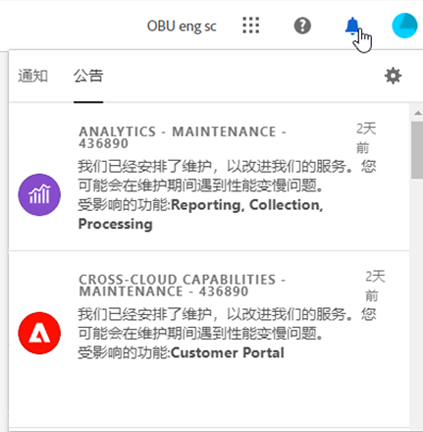

# CX Enterprise界面和管理

[CX Enterprise](https://experience.adobe.com)是Adobe的集成式数字营销应用程序、产品和服务系列。 通过其直观界面，您可以快速访问云应用程序、产品功能和服务。

10月30日隐藏

从CX Enterprise的标题中，您可以：

* 访问所有CX企业级应用程序和服务
* 从“帮助”菜单中，搜索产品文档、教程和社区帖子。 在 Experience League 中查看结果。
* 使用全局搜索在“搜索”字段中全局搜索业务对象（仅限 Experience Platform 用户）。
* 管理您的帐户[首选项](features/account-preferences.md)（警报、通知和订阅）

## 登录到CX Enterprise {#signin}

登录并验证您是否处于正确的[组织](administration/organizations.md)中。

1. 导航到[Adobe CX Enterprise](https://experience.adobe.com)。
1. 键入您的Adobe电子邮件地址，然后单击&#x200B;**[!UICONTROL Continue]**。
1. 单击帐户。
1. 键入您的密码。
1. 验证您是否处于正确的组织中。

   

   **验证您的组织**

   [组织](administration/organizations.md) 显示在界面标头中。

   如果您的组织使用Federated ID，则CX Enterprise允许您使用组织的单点登录进行登录，而无需输入您的电子邮件地址和密码。 将`#/sso:@domain`添加到CX Enterprise URL (`https://experience.adobe.com`)以完成此任务。

   例如，对于带 Federated ID 和域 `example.com` 的组织，请将 URL 链接设置为 `https://experience.adobe.com/#/sso:@example.com`。 您还可以通过为此 URL 添加书签并追加应用程序路径，直接转到特定应用程序。 （例如，对于 Adobe Analytics，使用 `https://experience.adobe.com/#/sso:@example.com/analytics`。）

## 访问CX企业级应用程序 {#navigation}

登录到CX Enterprise后，您可以从统一标题中快速访问您的所有应用程序、服务和组织。

要访问组织中为您预配的CX Enterprise应用程序和服务，请转到应用程序选择器。

## 获取帮助和支持 {#support}

使用标头中的&#x200B;**[!UICONTROL Help center]** （）访问学习和帮助，包括有关[Experience League](https://experienceleague.adobe.com/zh-hans?lang=zh-hans#home)的帮助内容（文档、教程和课程）以及各个应用程序的其他资源。 您也可以提交开放式的反馈并创建优先支持服务单。

[!UICONTROL Help]菜单还允许您访问：

* **[!UICONTROL Support]：**&#x200B;创建支持工单或使用Twitter联系[!UICONTROL Support]。
* **[!UICONTROL Feedback]：**&#x200B;分享有关您的CX Enterprise体验的反馈。 您的反馈将用于改进 Adobe 的支持和服务。
* **[!UICONTROL Status]：**&#x200B;导航到`https://status.adobe.com/zh-cn/experience_cloud`并检查产品操作状态和[!UICONTROL Manage Subscriptions]。
* **[!UICONTROL Developer Connection]：**&#x200B;导航到`adobe.io`并查找开发人员文档。

## 管理您的用户个人资料

在[!UICONTROL Profile]菜单中，您可以：

* 指定深色主题（并非所有应用程序都支持此主题）
* 管理CX Enterprise [首选项](features/account-preferences.md)
* 选择或搜索 [组织](administration/organizations.md)
* 查看[!UICONTROL Legal Notices]
* 注销
* 配置帐户首选项、通知和订阅

## 查看产品内的通知和公告 {#notifications}

单击铃铛图标即可查看通知和公告。 公告可以是相关且可操作的更新，包括产品发布、维护通知、共享项目和批准请求。

要管理通知和警报，请参阅 [帐户偏好设置和通知](features/account-preferences.md)
