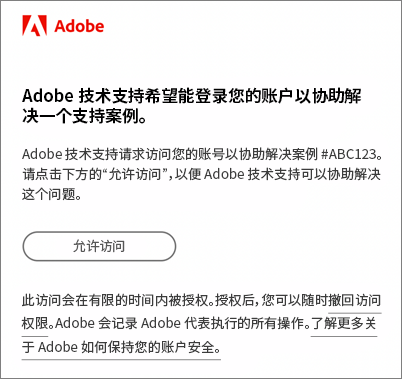

# 关于CX Enterprise的常见问题解答

了解CX Enterprise中的浏览器支持以及面向管理员的常见问题和解答。

+++CX Enterprise支持哪些浏览器？

Adobe支持以下浏览器的当前版本和前两个版本：

* ®Edge
* Google Chrome
* Mozilla Firefox
* Safari
* Opera

可以使用其他浏览器，但不保证支持。

>[!NOTE]
>
>并非所有在CX Enterprise域上运行的应用程序都支持所有浏览器。 如果您不确定，请查看特定应用程序的文档。

+++

+++支持哪些语言？

CX企业版支持每个用户的首选语言，如您的Adobe用户帐户首选项中所设置。 当前支持的语言为：

* 简体中文
* 英语
* 法语
* 德语
* 意大利语
* 日语
* 朝鲜语
* 葡萄牙语
* 西班牙语
* 繁体中文

虽然应用程序团队致力于提供全球语言支持，但并非所有应用程序都以上述所有语言提供。 如果CX Enterprise应用程序不支持您的主要语言，您也可以将辅助语言设置为默认语言（如果适用）。 这可以在[CX Enterprise用户首选项](https://experience.adobe.com/preferences)中完成。

+++

+++Adobe会向公司收取Adobe CX Enterprise的访问费用吗？

不是。 Adobe CX Enterprise无需额外付费。 但是某些核心服务可能收取额外的费用。

+++

+++为什么我的公司必须通过CX Enterprise界面登录？

CX Enterprise界面提供的功能为您的业务带来了新的价值。 该界面也是今后访问应用程序的标准途径，最终将取代其他单独的应用程序登录流程。 通过CX Enterprise登录有助于以后实现更平稳的过渡。

+++

+++Adobe如何访问我的Adobe云环境以进行故障排除？

Adobe客户关怀团队可以提交模拟请求，向您发送带有Adobe品牌标志的电子邮件（见以下示例），请求您的明确授权。 授予的访问权限仅限于一段时间。 授予访问权限后，您可随时撤销。 Adobe 会记录 Adobe 代表执行的所有操作。

+++

+++什么是“配置”？

CX Enterprise中的资源调配意味着：

* 您的用户可以开始登录到CX Enterprise并关联应用程序。
* 他们可以开始使用CX Enterprise提供的功能。
* 您可以准备停用特定于应用程序的登录流程。
* 您可以保留对应用程序的访问控制。

+++

+++如何管理用户首选项、通知和警报？

* 查看[帐户首选项和通知](/help/interface/features/account-preferences.md)

+++

+++如何管理产品配置文件和用户帐户凭据？

* 有关帮助，请参阅 [Admin Console 用户指南](https://helpx.adobe.com/cn/enterprise/admin-guide.html)。

* 用户权限和产品管理在 [Adobe Admin Console](https://adminconsole.adobe.com/enterprise)（产品链接）中执行。

* **重要信息：**&#x200B;对于 Analytics 管理员，请参阅[在 Admin Console 中管理 Analytics 用户](https://experienceleague.adobe.com/docs/analytics/admin/user-product-management/migrate-users/c-migration-tool.html?lang=zh-Hans)，了解如何将用户 ID 从 Analytics 管理工具迁移到 Admin Console。

+++

+++如果有人无法登录到CX Enterprise ，我该怎么办？

Admin Console 管理员可以授予用户访问权限。 将会向用户发送包含登录说明的电子邮件。

您可能需要[联系 Adobe 支持部门](https://experienceleague.adobe.com/zh-hans?support-solution=General#support)来验证您的公司是否已完全配置。

+++

+++用户可在何处管理帐户关联？

有些用户可能需要将其应用程序 (Analytics) 帐户关联到 Adobe ID 或 Enterprise ID。

请参阅[将应用程序帐户关联到 Adobe ID](../administration/organizations.md)。

+++

+++如何管理用户帐户轮廓和组织？

请参阅[管理用户帐户](../administration/organizations.md)。

+++

+++什么是组织？

[组织](../administration/organizations.md)是一个实体，它允许管理员配置组和用户，并控制CX Enterprise中的单点登录。 组织的作用类似于一个跨所有CX Enterprise产品和应用程序的登录公司。 大多数情况下，组织是您的公司名称。 但是，公司可以具有多个组织。

+++

+++在哪里可以找到我的 IMS 组织 ID？

有关详细信息，请参阅[查看您的组织 ID](../administration/organizations.md)。

+++

+++如果我的一位用户离开了我的公司怎么办？

应将他们的访问权限从应用程序中删除。 他们将无法从CX Enterprise或通过直接登录访问产品。 您还应该在CX Enterprise级别删除它们。

+++

+++什么是 Adobe ID？

请参阅[身份标识类型](https://helpx.adobe.com/cn/enterprise/using/identity.html)。

+++

+++我可以为我的用户关联应用程序帐户吗？

不可以。 用户必须将自己的应用程序与自己的用户名和密码相关联。

+++

