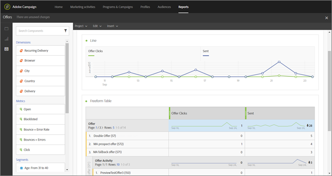

# Campaign{#campaign}

了解如何使用Adobe Campaign standard中的选件和共享字段。

在至少创建一个回退选件和一个常规选件后，您可以在Campaign standard中使用电子邮件创建选件活动。 只能在常规电子邮件营销活动中创建选件活动。 它不能添加到交易电子邮件营销活动（例如，由活动触发的循环电子邮件，如购物车放弃电子邮件）。

选件活动将提示您选择一组选件和一个备用选件，这些选件可能显示在电子邮件模板中的某个位置。 根据投放位置、日期、优惠状态和客户档案数据，在准备电子邮件时从这些优惠中选出最佳优惠。

## 将营销活动属性共享到 [!UICONTROL 选件管理]{#task_4DFA9A20D7B04E1F9AFF4774D67B6EBC}

在“选件管理”中创 [!UICONTROL 建选件时]，您可以设置资格规则，以限制哪些配置文件可以接收某些选件。 这些资格规则可以根据“营销活动”配置文件中存在的属性（或字段）进行设置。 这些字段必须先从Campaign中共享，然后才能在“选件管理”资格规 [!UICONTROL 则构建器中显示] 。

>[!NOTE]
>
>要共享属性，您必须在Campaign中拥有管理员权限。

1. 单击 **[!UICONTROL Adobe Campaign]**可访问导航。
1. 导航到“管 **[!UICONTROL 理]**”>“实例设**[!UICONTROL &#x200B;置”]** >“选件 **[!UICONTROL 管理”]**，然****后单击“属性”。

   此页显示已共享的属性。 您可以编辑或删除这些属性。

   

   >[!NOTE]
   >
   >如果资格规则中的选件管理当 [!UICONTROL 前正在使用某个属性] ，则无法删除该属性。

1. 单击&#x200B;**[!UICONTROL 创建]**。

1. 单击文件夹图标以定义营销活动数据源，然后选择要共享的元素。

   

1. 选择目标数据标签。

   这是将在“选件管理”的资格规则构建器中显示的属性 [!UICONTROL 名称]。

1. 单击&#x200B;**[!UICONTROL 创建]**。

   创建和编辑选件时，属 [!UICONTROL 性显示在“选件管理] ”资格规则构建器中。

   

## Create an offer activity {#task_F63ADDA52BD949779DB491E4D56E664E}

在Campaign standard的电子邮件模板中的任何图像或文本块中插入选件活动。

1. 要在图像位置中插入选件活动，请单击图像上的一次以显示“插入选件”图标。

   

1. （替代）:要在文本块中插入选件活动，请单击文本块上的两次以显示“插入选件”图标。

1. 在“创建选件活动”屏幕的“ [!UICONTROL 活动详细信息] ”选项卡 [!UICONTROL 中填写详细信息] :

   | 字段 | 描述 |
   |---|---|
   | 活动名称 | 为您的活动提供一个名称。不能输入已在其他选件活动中使用的活动名称。 |
   | 版面 | 选择将用于此位置的位置。 这是为了确保只有内容表示与向用户提供的位置匹配的选件。 在整个活动创建过程中，只有包含此位置的选件才会显示在选件列表中。 |

1. 在选 [!UICONTROL 择选件选项卡中] ，选择要包含在活动中的选件。

   您可以使用标签或单个选件逐个选择选件组。

   * **使用标签选择选件组：**

      要使用标签选择选件组，请单击“规 **[!UICONTROL 则生成器”选项卡]**，然后单击“添**[!UICONTROL &#x200B;加标签规则”]**。 要创建规则以确定要包含在选件活动中的选件，请选择标签。 标签 _之间将显示_ AND运算符。 要将运算符从 _AND_ 更改 _为OR_，请单击该运算符。

      

   * **选择单个选件：**

      要选择单个选件，请单击“选件 **[!UICONTROL 清单”选]**项卡。 用户可以按选件名称、选件ID或已添加到选件的标签在选件列表中进行搜索。

      单击加号，将选件添加到列表的“选定选件”部分。

      

      要使选件同时在规则构建器和选件清单中可用，它必须：

   * 匹配今天的日期。
   * 状态为已批准。
   * 使内容表示与步骤1中选定的位置相匹配。

      >[!NOTE]
      >
      >“选件清单”选项卡中列出的选件仅按放置和批准状态过滤。 尚未筛选这些内容以匹配Adobe Campaign中为电子邮件设置的定位条件。

1. 在回退选 [!UICONTROL 件选项卡上] ，选择一个回退选件。 回退选件仅在客户没有资格获得其他选件时发送给客户。 您只能从列表中选择一个备用选件。
1. 查看选件活动的摘要，然后单击“完 **[!UICONTROL 成”]**。

   在准备电子邮件时，将通过评估以下各项来确定为每位用户提供的最佳优惠：

* **** 位置检查：所有选件都必须具有与作为选件活动一部分的选定位置相匹配的内容表示形式。 如果在活动创建时间和准备时间之间（如果时间超过三分钟）删除了选件的位置，则不会考虑该选件。
* **** 日期检查：所有选件必须在当前日期有效(这不 _是_ “选件发送日期”)。 准备电子邮件营销活动的日期是确定要提供哪个选件的日期。 例如，如果您在2017年1月15日准备了电子邮件营销活动，并且其中一个选定的选件在2017年1月16日之前无效，则不会提供该选件。

* **** 资格规则检查：所有优惠必须满足资 [格规则](offers.md)。

* **** 优先级检查：如果用户有资格获得多个选件，  选件管理会使用用户设置的优先级来确定向每个用户显示哪个选件。

   您的电子邮件现已准备好发送。 选择主 [!UICONTROL 页上的] “报告”选 [!DNL Adobe Campaign] 项卡，以检查选件的执行方式。

   有关使用Adobe Campaign的其他信息，请参阅以下指南：

* [创建电子邮件](https://docs.campaign.adobe.com/doc/standard/en/CHA_Email_messages_Creating_an_email.html)
* [发送电子邮件](https://docs.adobe.com/content/help/en/campaign-standard/using/testing-and-sending/about-sending-messages-with-campaign.html)
* [关于动态报告](https://docs.campaign.adobe.com/doc/standard/en/RPT_About_reporting_About_dynamic_reports.html)

## 选件报告

Adobe Campaign为您提供三个选件维度（选件、选件活动、选件位置）和一个指标（选件点击），使您能够监控选件并衡量其影响。 要查看报告，请访问Adobe Campaign standard中的“报告”选项卡。 您可以创建报告，并将不同的选件维度拖放到报告面板中，开始筛选数据。

有关如何在Campaign中创建动态报表的详细信息，请参阅关 [于动态报表](https://docs.campaign.adobe.com/doc/standard/en/RPT_About_reporting_About_dynamic_reports.html)。