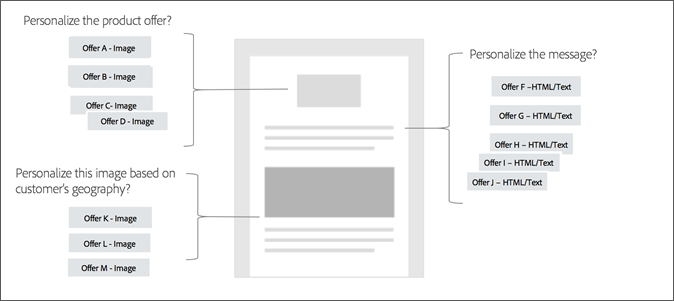

# 选件管理工作流{#offer-management-workflow}

了解优惠管理的高级 [!UICONTROL 工作流程]，包括放置和优惠创建、插入优惠活动和查看报告。

## 第1步——确定您在电子邮件模板中需要个性化推广信息的位置 {#section_F184E589428B403EA8EB921BF230CF87}

确定要在哪些电子邮件营销活动中插入个性化推广信息。 从此处，确定电子邮件模板中要插入这些选件的位置。 例如，您可能希望根据客户的行业或角色修改产品推广信息，根据相同的条件更改消息，并根据客户的地理位置更改图像。

## 第2步——确定您希望定位Campaign中的哪些属性，并与选件管理共享这些属性 {#section_1461F1FAC0B943E5BBDED6B3B00E9D5C}

在“选件管理”中创 [!UICONTROL 建选件时]，您可以设置资格规则，以限制哪些配置文件可以接收某些选件。 这些资格规则可以根据Adobe Campaign中存在的属性（或字段）来设置。 在“选件管理”资格规则构建器中显示这些字段之前，必须由管理级用户从Campaign [!UICONTROL 中共享] 这些字段。

有关共享这些属性的信息，请参阅将 [营销活动中的属性共享到选件管理](campaign.md#task_4DFA9A20D7B04E1F9AFF4774D67B6EBC)。

## 第3步——在“选件管理”中输入 [!UICONTROL 所需的版面]{#section_71619756A86F4DB58B8200D8A1CE1B87}

放置版面有助于确保在电子邮件模板中的正确位置显示正确的优惠内容。 向选件添加内容时，系统会要求您选择可在其中显示该内容的位置。

您可以有多个位置，且位置相同。 在以下示例中，两个不同大小的图像有两个位置，而在模板的顶部和底部显示的文本有一个位置。

确定所需的版面后，可将其添加到“版面”选 [!UICONTROL 项卡] 。

## 第4步——创建选件 {#section_C4F9732B0596425EB0BD5AE76E4BA6EF}

创建要在电子邮件营销活动中使用的选件。 可以向选件中添加数据和内容，以确定提供最佳选件的条件，并确定要显示的内容。 在创建内容表示时，请将其与“版面”中定义的某个版面相 [关联](placements.md)。 创建并提交选件后，该选件便可用于选件活动。

## 第5步——创建电子邮件营销活动并插入选件活动 {#section_6FD36404759B4C6E9FD3A65ACABB26C8}

现在，您已经创建了选件，可以在电子邮件营销活动中使用这些选件。 在内容编辑器中，您可以选择一个块并插入选件活动。 选件活动允许您从选件清单中选择一组选件，决策引擎将从中确定最适合每个用户的选件。

## 第6步——准备和发送电子邮件营销活动 {#section_EDD8EA4696664130A678D7C4483DA806}

现在，在您准备电子邮件营销活动时，  选件管理将根据当前日期、配置文件属性和优先级确定为每位访客提供最佳选件。 它还确定该位置的位置是否有可用的内容表示形式。

在以下示例中，假定您已设置一个电子邮件营销活动，其中的选件活动包含3个选件(A、B、C)。 您可以确定在我们电子邮件中的某个位置提供哪个优惠。 在准备时，优惠 [!UICONTROL 管理将] :

1. 分析当前日期、每个用户的个人资料数据和优先级。
1. 将该信息与选件上的数据进行比较。
1. 确定最佳推广信息。

## 第7步——查看报告 {#section_2104BAACAE154DE29B6EEB967C46F226}

您可以查看有关提供哪些选件以及它们在选件活动中的执行情况的报告。 通过选择Adobe Campaign standard主页中的“报告”选项卡，可以查看此报告。
