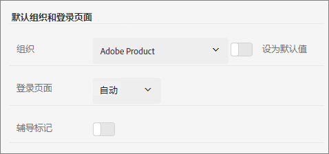

# Experience Cloud 中的组织

了解如何在 Experience Cloud 中管理和切换组织。

## 识别您的组织 {#concept_384D169B0B724B799D573B8ECB5C39BF}

安 *组织* （组织ID）是一个实体，它允许管理员配置组和用户，并控制Experience Cloud中的单点登录。 组织的功能类似于跨所有 Experience Cloud 产品和应用程序的登录公司。大多数情况下，组织是您的公司名称。但是，公司可以具有多个组织。

要验证您是否已登录到正确的组织，请单击您的个人资料头像来查看组织名称。如果您有权访问多个组织，也可以直接在标题栏中查看和切换到另一个组织。

如果您的组织使用 Federated ID，则 Experience Cloud 允许您使用组织的单点登录进行登录，而无需输入您的电子邮件地址和密码。将 `#/sso:@domain` 添加到 Experience Cloud URL (`https://experience.adobe.com`) 以完成此任务。

例如，对于带 Federated ID 和域 `adobecustomer.com` 的组织，请将 URL 链接设置为 `https://experience.adobe.com/#/sso:@adobecustomer.com`。您还可以通过为此 URL 添加书签并追加应用程序路径，直接转到特定应用程序。（例如，对于 Adobe Analytics，使用 `https://experience.adobe.com/#/sso:@adobecustomer.com/analytics`。）

## 查看您的组织ID {#concept_EA8AEE5B02CF46ACBDAD6A8508646255}

出于支持目的，您可以查找分配的组织ID。 您可以使用&#x200B;**[!UICONTROL 组织]**&#x200B;菜单验证自己是否处于正确的组织中，或在不同组织之间切换。

组织 ID 是与您配置的 Experience Cloud 公司关联的 ID。此 ID 是由 24 个字符组成的字母数字字符串，其后跟（且必须包括）`@AdobeOrg`。

您可以使用键盘快捷键查看您的组织ID以及其他帐户信息 **Ctrl+i** 从任意页面 `https://experience.adobe.com`.

**查看您的组织ID**

1. 在 [Experience Cloud](https://experience.adobe.com)，按 **Ctrl+i** 键盘上。

   

1. 在 **[!UICONTROL 用户信息]**，查找 **[!UICONTROL 当前组织ID]**，此时您将看到组织ID。

   或者，管理员也可以登录Admin Console(导航到 [https://adminconsole.adobe.com](https://adminconsole.adobe.com))，并在URL中查看您的组织ID。

   例如，在以下 URL 中：

   `https://adminconsole.adobe.com/C538193582390300A495CC9@AdobeOrg/overview`

   ID 为：

   `C538193582390300A495CC9@AdobeOrg`

## 将应用程序帐户关联到 Adobe ID {#task_FD389E78640848919E247AC5E95B8369}

通常，Experience Cloud 管理员会授予对应用程序和服务的访问权限。在极少数情况下，您可以将应用程序凭据关联到Adobe ID。

1. 按照邀请您加入 Experience Cloud 的电子邮件中的步骤操作。
1. 使用您的 Adobe ID 或 Enterprise ID 登录。
1. 选择应用程序选择器。 ( )。

   

   您有权访问的应用程序会用彩色标出。
1. 选择所需的应用程序。

   

   如果您属于相应的群组（并拥有应用程序的访问权限），但还没有将帐户凭据关联到 Adobe ID，则会显示此类型的消息。
1. 选择&#x200B;**[!UICONTROL 关联帐户]**，然后提供您的凭据。

## 指定默认组织和登录页面 {#concept_6A191B42A9874A9780882903BA18F071}

您可以指定要在登录时使用的默认组织和登录页面。

在您的个人资料中，选择&#x200B;**[!UICONTROL 编辑个人资料]**。

在“默认组织和登录页面”下方，您可以定制登录体验。

## 解决帐户关联问题 {#concept_DFCB29A3B4834FC59AA29E0BBA301584}

帮助解决帐户关联所引起的问题。

通常，帐户关联会失败，因为 Adobe ID 已关联到先前的用户。当帐户关联失败时，您可以：

* [联系 Adobe 支持](https://experienceleague.adobe.com/?support-solution=General#support)。
* 在我们着手解决问题的同时，使用标准登录访问您的应用程序。
