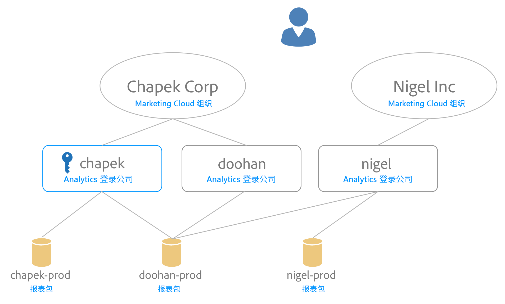

# 将报表包映射到组织 {#topic_7C4740559EAC4E0FA5F8DEF886B580DA}

>[!NOTE]
>
>报表包映射功能已于 2020 年 11 月被弃用。如有任何问题，请联系客户支持。

Experience Cloud 服务（例如 Experience Cloud ID 服务和[!UICONTROL 人员]）与组织关联，而不是与单个报表包关联。为确保这些服务能够正确运行，必须将每个 Analytics 报表包映射到组织。映射过程：

* 将Experience Cloud组织设置为报表包的主组织。
* 不要更改可以访问报表包的主体（访问权限仍由每个用户的 Adobe Analytics 登录帐户决定）

## 要求

您必须是登录公司内对要映射的报表包拥有访问权限的 Analytics 管理员。此外，此帐户必须[链接到Experience Cloud组织](organizations.md#topic_C31CB834F109465A82ED57FF0563B3F1)，才能将报表包映射到该组织。

如果您不具备组织下对给定报表包拥有访问权限的登录公司的 Analytics 管理员权限，则组织将呈灰显状态。

## 将一个报表包映射到组织 {#task_23993FE78DF6455FA8D7BE60686EA16C}

1. 在 [!DNL Analytics] > **[!UICONTROL 管理员]** > **[!UICONTROL 数据管理]**&#x200B;中导航到“数据管理报表包”（请参阅[查看/管理报表包的数据管理设置](https://experienceleague.adobe.com/docs/analytics/admin/data-governance/gdpr-view-settings.html?lang=en)）

1. 要查看对每个报表包拥有访问权限的登录公司，请选择&#x200B;**[!UICONTROL 对登录公司可见]**。

   此视图可帮助您针对映射做出明智决定。

1. 选择报表包旁边&#x200B;**[!UICONTROL 已映射的组织]**&#x200B;列中的下拉列表，然后选择要映射到的组织。

   有关选择 Experience Cloud 组织的提示，请参阅下一部分。

## 将多个报表包映射到组织 {#task_94955B0D8ABA4CB1A38746ECF8E32711}

1. 选择&#x200B;**[!UICONTROL Experience Cloud]** > **[!UICONTROL 管理]** > **[!UICONTROL 报表包映射]**。

1. 选择要映射的报表包。

   

1. 选择组织（在此示例中为 Outdoors Inc），然后单击&#x200B;**[!UICONTROL 选择]**。

   有关选择 Experience Cloud 组织的提示，请参阅下一部分。

1. 选择&#x200B;**[!UICONTROL 保存映射]**。

## 关于选择 Experience Cloud 组织的提示 {#mapping-tips}

此部分包含一些提示，可帮助您选择应将报表包映射到的 Experience Cloud 组织。

### 我应该选择哪个组织？

如果Experience CloudID服务已部署在报表包上，请确保您在报表包映射工具中选择的组织与在您网站的[!DNL visitorAPI.js]文件中指定的组织相同。 您可以按照[测试和验证 Experience Cloud ID 服务](https://experienceleague.corp.adobe.com/docs/id-service/using/implementation/test-verify.html)中的说明来查找访客 ID 服务所使用的组织 ID。

确保您的部署与您在报表包映射工具中选择的组织匹配。

### 为什么某些组织呈灰显状态？

灰显的组织表示您没有足够的权限映射到呈灰显状态的报表包。 请仔细研究下面的示例：

在此图表中，蓝色钥匙表示管理员权限。灰色线条表示可见性。

此用户具有两个 Experience Cloud 组织的访问权限。他们执行了以下操作：

* 将他们在[!UICONTROL chapek] Analytics登录公司中的管理员帐户链接到其[!UICONTROL Chapek] CorpExperience Cloud组织帐户。
* 将他们在[!UICONTROL doohan] Analytics登录公司中的非管理员帐户链接到其[!UICONTROL Chapek]公司Experience Cloud组织帐户。
* 将他们在Nigel Analytics登录公司中的非管理员帐户关联到其Nigel IncExperience Cloud组织帐户。

以下几点列出了该用户可以和不可以对这些报表包执行的映射操作：

* 可以将 [!UICONTROL Chapek-prod] 报表包映射到 [!UICONTROL Chapek] Corp 组织，因为该用户是链接的 Analytics 登录公司 ([!UICONTROL chapek]) 的管理员，并且其帐户已链接到此组织。
* [!UICONTROL 此用户无] 法链接Nigel-prodreport包，因为他们不是显示此报表包的任何登录公司的管理员。
* 可以将 [!UICONTROL Doohan-prod] 报表包映射到 [!UICONTROL Chapek Corp]，因为该用户是链接到 Experience Cloud 组织的登录公司 ([!UICONTROL chapek]) 的管理员（请注意，他不是 doohan Analytics 登录公司的管理员）。请务必了解[!UICONTROL doohan-prod]报表包还有资格映射到Nigel IncExperience Cloud组织，即使此用户无法执行该映射也是如此。 在这种情况下，两个 Experience Cloud 组织都会显示在列表中，但 [!UICONTROL Nigel Inc] 呈灰显状态。在映射之前，该用户应该咨询 Nigel 登录公司的管理员，以确定适合映射的最佳候选组织。如果您选择的组织与最初创建报表包的组织不同，则UI会显示“可能冲突”警告。

## 常见问题 {#section_099E485805994C929FF9C9F75219BEE1}

### 我为何看不到所有的报表包？

您的某些报表包可能显示在其他登录公司下。您可以使用屏幕顶部的下拉菜单更改当前登录公司。

### 如果我无法分辨下拉列表中针对某个报表包列出的某些组织，该怎么办？

该列表显示了您的报表包可以映射到的所有&#x200B;*可能*&#x200B;组织，即使您并没有映射到所有这些报表包的权限。如果您不确定是否应将报表包映射到列表中呈灰显状态的其中一个报表包，请咨询贵组织的Experience Cloud管理员，以确定最佳选择。

### 如果我无法分辨“对登录公司可见”列中针对报表包列出的某些登录公司，该怎么办？

在某些时候，此报表包已与其他登录公司共享，该登录公司可能属于其他Experience Cloud组织。

### 关于其他组织正在生成的报表包的“可能冲突”错误是什么？为什么它很重要？

此通知可帮助您针对报表包映射做出明智决策。 我们希望您意识到报表包最初是在其他组织下创建的，以防该组织可能更适合此报表包。

### 如何知道报表包是否已映射？

映射的报表包以不可编辑的格式显示。 如果必须更改映射，请联系客户关怀团队。

### 如果我只知道 Experience Cloud 组织的组织 ID，该怎么办？如何查找我的组织 ID 的名称？

您可以在[组织和帐户设置](organizations.md)中找到您的组织名称。

### 我在“映射日期”列中看到一个日期。是谁执行了此映射？

您可以参考 Analytics 界面中的“报表包更改日志”，以查找做出更改的用户 ID。查找事件“与 IMS 组织相关的报表包”。
