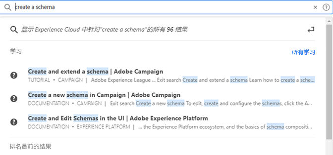

# [!UICONTROL 统一搜索]对象和实体 {#globally-search}

[!UICONTROL 统一搜索]让您在一种无缝、一致、只需点击一下的体验下，即可找到可搜索的业务对象或实体。此搜索可揭示您最近访问的对象。

## 访问统一搜索

统一搜索在页面顶部Experience Cloud标题中的每个页面上都可用。 您还可以使用键盘快捷键 `command /` 或 `ctrl /` 以访问搜索。

此功能仅适用于受支持的产品，当前支持的产品包括：

* Experience Platform (AEP)
* Journey Optimizer (AJO)

随着更多内容已编入索引，此功能会添加到相关应用程序中。

## 可搜索的对象和字段

随着键入，将显示从您有权访问的对象找到的最匹配的前几个结果。

我们的算法首先显示最相关的记录。 结果的顺序取决于多种因素，如：

您的功能和对象权限匹配百分比是否精确匹配

可搜索的业务对象包括：

* 区段（名称、描述）
* 架构（名称、描述）
* 数据集（名称、描述）
* 源（名称、描述）
* 目标（名称、描述）
* 查询（名称、描述）
* 消息（名称、描述）
* 选件（名称、描述）
* 组件（名称、描述）
* 历程（名称、描述）

如果关键字与导航页面匹配，则可以快速获取导航页面示例数据集的链接。 顶部结果部分显示前30个结果。

还可从 Experience League 和 Communities 找到帮助文章。支持自然语言查询。

例如， _如何创建架构_ 在下Experience League生成结果 _[!UICONTROL 学习]_:

搜索算法首先显示最相关的记录。结果的顺序取决于多种因素，如：

* 用户是否有权访问对象
* 匹配百分比
* 精确匹配
* _[!UICONTROL 前几个结果]_&#x200B;部分显示前 30 个结果。

要细化搜索，请单击以下各项之一：

* **[!UICONTROL 所有学习]**：在 Experience League 中打开搜索。
* **[!UICONTROL 全部显示...]**：使您可进一步细化和筛选结果.

## 统一搜索功能

统一搜索中提供了以下功能。

| 功能 | 描述 |
| ------- | ------- |
| 全球语言支持 | 全球搜索可以理解德语、西班牙语、法语、意大利语、日语、韩语、葡萄牙语和中文的查询并生成结果。 |
| 打字容差 | 统一搜索使用高级算法提供强大的类型容差。 这些算法计算编辑并提供适当的结果。 |
| 突出显示 | 搜索响应会突出显示搜索查询中匹配的关键词，以便您能够轻松找到与查询匹配的部分和词。 突出显示也适用于拼写错误的词语。 |
| 代码片段 | 在搜索响应中，您可以看到结果的代码片段。 代码片段返回匹配关键词周围的匹配词语和一些内容。 |
| 停止词 | 英语中一些常用词语的定义为 _停止词语_. 如果搜索查询中包含停止词，则对其赋予的权重会较小。  停止词包括： _a，a，和，是，a，a，t，b，但是，对于，如果，in，in，i，是，它，不，o，on，或者，这样，t，t，the，the，te，te，to，w，t，w，t_.  其他全球语言不支持停止词。 |
| 自然语言查询 | 在Experience League社区中搜索帮助文章或讨论时，可以使用自然语言键入问题并获得响应。 示例搜索：“如何创建架构？” |
| 精确搜索引号 | 您可以在查询中使用引号进行精确搜索。 对于精确马赫查询，不进行打字更正。 例如：《卢玛历程2022》。 |
| 筛选器 | 您可以应用过滤器，例如 _对象类型_ 以及完整搜索结果弹出窗口中的其他特定对象过滤器。 当您在绑定搜索查询后按Enter键时，将打开包含这些过滤器的完整页面弹出窗口。 |

{style=&quot;table-layout:auto&quot;}

## 找不到预期结果或获得的结果过多？

尝试使用以下提示：

* 输入更具体的搜索词
* 检查拼写
* 尝试编写完整的搜索词
* 确保您拥有对象的权限，您正在搜索

