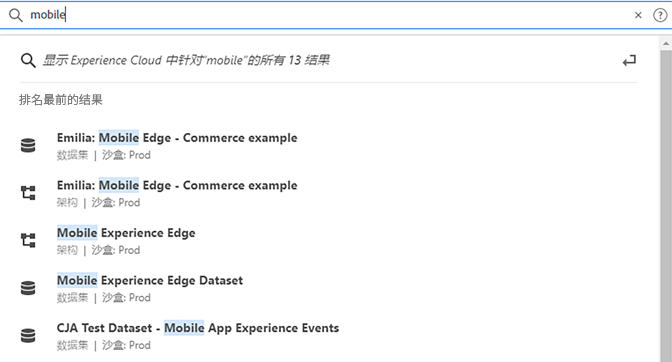

# [!UICONTROL 统一搜索]对象和实体 {#globally-search}

[!UICONTROL 统一搜索]让您在一种无缝、一致、只需点击一下的体验下，即可找到可搜索的业务对象或实体。此搜索也会显示您最近访问的对象。

## 访问统一搜索功能

可以在每个页面的顶部的 Experience Cloud 标题中找到统一搜索功能。您也可以使用键盘快捷键 `command /` 或 `ctrl /` 来访问此搜索功能。

此功能仅适用于受支持的产品，这些产品目前为：

* Experience Platform (AEP)
* Journey Optimizer (AJO)

随着将更多内容加入索引，此功能将添加到相关的应用程序。

## 可搜索的对象和字段

随着键入，将显示从您有权访问的对象找到的最匹配的前几个结果。

我们的算法首先显示最相关的记录。结果的顺序取决于多种因素，如：

您的功能和对象权限
匹配百分比
是否有准确匹配项

可搜索的业务对象包括：

* 区段（名称、描述、ID）
* 架构（名称、描述、ID）
* 数据集（名称、描述、ID）
* 源（名称、描述、ID）
* 目标（名称、描述、ID）
* 查询（名称、描述、ID）
* 消息（名称、描述、ID）
* 选件（名称、描述、ID）
* 组件（名称、描述、ID）
* 历程（名称、描述、ID）

如果关键字与某个导航页面匹配，则您可获得该导航页面的示例数据集的快速访问链接。“最匹配结果”部分显示前 30 个结果。

还可从 Experience League 和 Communities 找到帮助文章。支持自然语言查询。

例如，_如何创建架构_&#x200B;将从 Experience League 中的&#x200B;_[!UICONTROL 学习]_&#x200B;下产生结果：

搜索算法首先显示最相关的记录。结果的顺序取决于多种因素，如：

* 用户是否有权访问对象
* 匹配百分比
* 精确匹配
* _[!UICONTROL 前几个结果]_&#x200B;部分显示前 30 个结果。

要细化搜索，请单击以下各项之一：

* **[!UICONTROL 所有学习]**：在 Experience League 中打开搜索。
* **[!UICONTROL 全部显示...]**：使您可进一步细化和筛选结果。

## 统一搜索功能

下列功能适用于统一搜索功能。

| 功能 | 描述 |
| ------- | ------- |
| 全局语言支持 | 全局搜索能够理解查询，并会生成德语、西班牙语、法语、意大利语、日语、朝鲜语、葡萄牙语和中文结果。 |
| 拼写容错 | 统一搜索使用高级算法提供了可靠的拼写容错。这些算法计算编辑内容并提供适当的结果。 |
| 突出显示 | 搜索响应会突出显示搜索查询中的匹配关键词，以便您轻松找到符合查询条件的部分和单词。突出显示也可用于拼写错误的单词。 |
| 片段 | 在搜索响应中，您可以看到结果的一个片段。片段将返回匹配的单词和围绕匹配关键词的一些内容。 |
| 停用词 | 英语中的一些常用单词被定义为&#x200B;_停用词_。如果在搜索查询中包含停用词，则会给予它们较少的权重。 停用词包括：_a、an、and、are、as、at、be、but、by、for、if、in、into、is、it、no、not、of、on、or、such、that、the、their、then、there、these、they、this、to、was、will、with_。 其他全局语言不支持停用词。 |
| 自然语言查询 | 在 Experience League 社区搜索帮助文章或讨论时，您可以使用自然语言键入您的问题并获得回应。示例搜索：“如何创建模式？” |
| 带引号的精确搜索 | 您可以通过在查询中使用引号来执行精确搜索。精确匹配查询中不会纠正拼写错误。例如：“Luma Journey 2022”。 |
| 筛选器 | 您可以在完整搜索结果弹出窗口中应用&#x200B;_对象类型_&#x200B;等筛选器以及其他对象特定的筛选器。在键入搜索查询内容并按 Enter 键后，将打开一个包含筛选器的完整页面弹出窗口。 |

{style=&quot;table-layout:auto&quot;}

## 找不到它？

尝试按以下提示操作：

* 输入更具体的搜索词
* 检查拼写
* 尝试键入完整搜索词
* 确保您拥有搜索对象的相应权限
