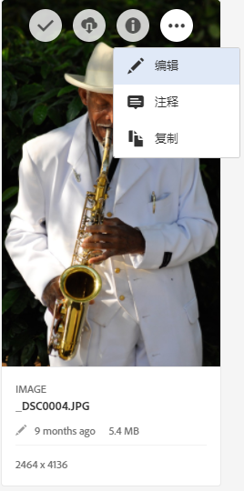
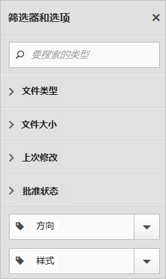

# CX Enterprise Assets概述

CX Enterprise Assets为可在应用程序间共享的营销就绪型资源提供了一个集中的存储库。 资产是指数字文档、图像、视频或音频（或其中任一部分），它们可以具有多个演绎版，并可以具有子资产（例如，[!DNL Photoshop] 文件中的图层、[!DNL PowerPoint] 文件中的幻灯片、PDF 中的页面、ZIP 中的文件）。

资产服务包括：

* 资源存储、管理界面、嵌入式选择界面（通过应用程序访问）。
* 与Creative Cloud 、 CX Enterprise Collaboration和CX Enterprise应用程序的集成。

使用资源可以提高一致性和品牌合规性，并缩短上市时间。 您可以简化应用程序中的工作流：

* **[!DNL Adobe Target]**：创建 A/B 和多变量测试体验。
* **[!DNL Ad Cloud]**：跨不同渠道和营销活动制定广告单元
* **[!DNL Adobe Campaign]**：将资源放入电子邮件新闻稿和营销活动。

## 导航到CX Enterprise Assets

## 访问工具栏

导航到资产（或资产目录），然后单击&#x200B;**[!UICONTROL Select]**。

您可以通过工具栏快速访问多种功能，包括搜索、时间线、呈现形式、编辑、批注和下载。

>[!NOTE]
>
>必须先从 Adobe Target 活动中移除资产，然后才能成功将其从 [!DNL Target] 中删除。

## 编辑资源

编辑资源时可启用多种功能，其中包括：

* 裁剪
* 旋转
* 翻转

## 搜索资源

可按关键词、文件类型、大小、上次修改时间、发布状态、方向和样式进行搜索。

## 为资源作批注

通过在图像上绘制圆圈或箭头而单击&#x200B;**[!UICONTROL Annotate]**，并在资源中添加批注以供同事审阅。

## 查看全屏资源和缩放

单击&#x200B;**[!UICONTROL Views]** > **[!UICONTROL Image]**&#x200B;可查看完整的资源图像并启用缩放。

## 查看资源属性

在带属性的卡视图、列表视图与列视图之间选择以更轻松地找到您的资源。

单击&#x200B;**[!UICONTROL Views]** > **[!UICONTROL Properties]**&#x200B;可查看资源的属性：

## 运行使用情况报表

查看用户数、已用存储容量和资源总数。

单击&#x200B;**[!UICONTROL Tools]** > **[!UICONTROL Reports]** > **[!UICONTROL Usage Report]**

