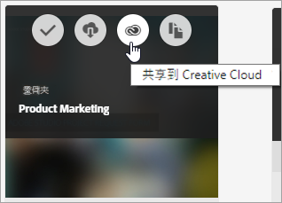
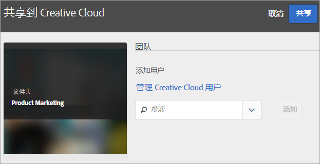
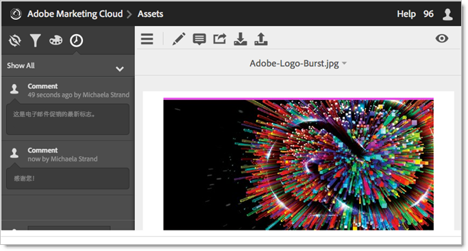
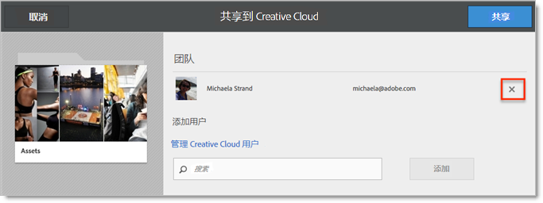

# 共享 Experience Cloud 资源文件夹

在 Experience Cloud 和 Creative Cloud 之间共享文件夹和资产。在Experience Cloud应用程序(如Adobe Target)中进行协作、对共享资源添加批注和使用它们。 共享文件夹必须源于 Experience Cloud。

**共享的好处**

* 简化审阅、批准和发布阶段的创意制作工作流
* 花费更少的时间来管理多个位置中正在处理的文件和版本
* 更有效地跟踪和管理创意资产
* 提高企业安全性
* 轻松地在创意人员和营销人员之间共享文件、保存和发送文件

在Creative Cloud用户有权访问资源之前，必须在Experience Cloud中将这些资源添加到允许列表。 [管理 Creative Cloud 用户](manage-cc-users.md)。

**共享Experience Cloud资源文件夹**

1. 在资产文件夹中，单击&#x200B;**[!UICONTROL 共享到 Creative Cloud]**。

   
1. 在“共享到 Creative Cloud”页面中，搜索用户，然后单&#x200B;**[!UICONTROL 添加]**。

   

1. 单击&#x200B;**[!UICONTROL 共享]**。
1. 启动 [!DNL Creative Cloud] 桌面版（或在浏览器中导航到“[!UICONTROL Creative Cloud 文件]”页面），并查找请求通知。

   
1. 打开请求，然后单击&#x200B;**[!UICONTROL 接受]**。

   
1. 要访问文件夹内容，请单击&#x200B;**[!UICONTROL 打开文件夹]**（或&#x200B;**[!UICONTROL 在 Web 上查看]**）。

   
1. 在共享资源中添加评论以继续：

   在Creative Cloud中，您可以选择进入图像，然后单击&#x200B;**[!UICONTROL 活动]**&#x200B;以在图像上添加评论。 评论会在 [!DNL Creative Cloud] 和 [!DNL Experience Cloud] 的资源中同步。

   

   在Experience Cloud中，选择一个图像，然后选择时间线图标以在图像上添加评论。 评论会在 Creative Cloud 和 Experience Cloud 的资源中同步。

   

1. 要取消共享文件夹，请单击“使用Creative Cloud共享”****（类似于[步骤3](share.md)），选择X以删除用户，然后单击“共享”****。

   

   一旦删除完所有的 Creative Cloud 用户，文件夹即被取消共享，且 Creative Cloud 用户不再具有访问权限。

更多使用共享资源的方法包括加载或交换Adobe Target中[选件库](https://experienceleague.adobe.com/docs/target/using/experiences/offers/manage-content.html)中的资源以用于活动中的图像。

在将文件夹共享到 Creative Cloud 之后，您将在文件夹上看到 Creative Cloud 徽标。

。

相关帮助：

* [Creative Cloud 帮助 - 管理和同步文件](https://helpx.adobe.com/cn/creative-cloud/help/sync-creative-cloud-files.html)
* [Creative Cloud 帮助 - 与他人协作](https://helpx.adobe.com/cn/creative-cloud/help/collaboration.html)
* [Creative Cloud 帮助 - 协作常见问题解答](https://helpx.adobe.com/cn/creative-cloud/help/collaboration-faq.html)

## 关于与 Adobe Target 共享资源 {#section_B7CD64CAB35D43A4B12957B304072DC9}

在 [!DNL Adobe Target] 中创建活动时，您可以在[!UICONTROL 产品建议库]中交换图像时使用共享的图像资产。

请参阅 [!DNL Target] 帮助中的[产品建议库](https://experienceleague.adobe.com/docs/target/using/experiences/offers/manage-content.html)。