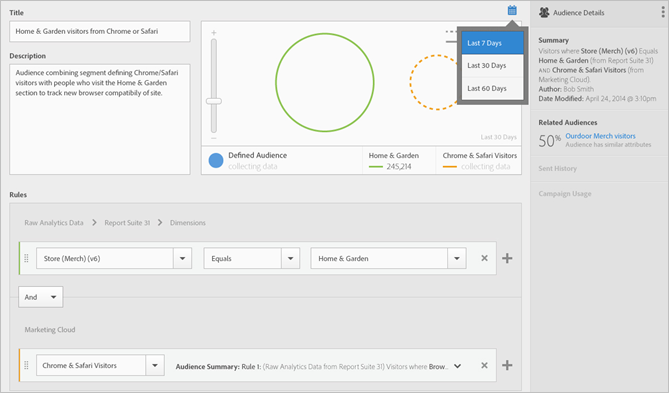

# 创建受众

在[!UICONTROL Audience Library]中，您可以使用属性规则来创建受众，并定义复合受众以便在CX Enterprise应用程序中共享。

本文可帮助您了解如何执行以下操作：

* 创建受众
* 创建规则
* 使用规则定义复合受众

下图表示复合受众中的两个规则。

每个圆圈表示定义受众成员资格的规则。 符合两个受众规则中的成员资格的访客会发生重叠，从而成为定义的复合受众。

>[!NOTE]
>
>在完成指定期限的数据收集后，将会对受众进行充分定义。

以下示例演示了如何为复合受众创建规则。 此受众包括：

* 从页面数据或原始分析数据派生的“家居和园艺”部分。
* 从[!DNL Adobe Analytics]区段[发布的](overview.md)到[!DNL CX Enterprise]派生Chrome和Safari用户。

  

**创建受众**

1. 单击[!DNL CX Enterprise]个应用（），然后单击&#x200B;**[!UICONTROL People]** > **[!UICONTROL Audience Library]。**

1. 在[!UICONTROL Audiences]页面上，单击&#x200B;**[!UICONTROL New]**。 

   

1. 在[!UICONTROL Create New Audience]页面上，完成&#x200B;**[!UICONTROL Title]**&#x200B;和&#x200B;**[!UICONTROL Description]**&#x200B;字段。
1. 在[!UICONTROL Rules]下，选择一个引用报表包，然后选择一个属性源：

   * **[!UICONTROL Real-Time Analytics Data:]** （或原始数据）这是从Real-Time Analytics图像请求派生的属性数据。 它包括eVar和事件。 使用此属性源时，必须选择一个报表包，并定义要包括的维度或事件。 此报表包选择提供了报表包使用的变量结构。

     >[!NOTE]
     >
     >由于缓存，在Analytics中删除报表包12小时后，该删除操作才能反映在CX Enterprise中。

   * 从[!DNL CX Enterprise]源派生的&#x200B;**[!UICONTROL CX Enterprise:]**&#x200B;属性数据。 例如，这可以是您在 [!DNL Analytics] 中创建的受众区段的数据，也可以是来自 [!DNL Audience Manager] 的数据。

1. 定义受众规则，然后单击&#x200B;**[!UICONTROL Save].**

**示例：为复合受众定义规则**

>[!NOTE]
>
>您在定义受众规则时，应该对实施变量有所了解。

在[!UICONTROL Rules]下，定义&#x200B;*`Home & Garden`*&#x200B;属性选择：

* **[!UICONTROL Attribute Source:]**&#x200B;原始Analytics数据
* **[!UICONTROL Report Suite:]**&#x200B;报表包31
* Dimension = **[!UICONTROL Store (Merch) (v6)]** > **[!UICONTROL Equals]** > **[!UICONTROL Home & Garden]**

*Chrome 和 Safari 访客*&#x200B;是从 Analytics 中共享的受众区段：

* **[!UICONTROL Attribute Source:]** CX企业版
* **[!UICONTROL Dimension:]**&#x200B;位Chrome和Safari访客

要进行比较，需要添加 *OR* 规则查看某个站点区域（例如庭院和家具）的所有访客。

由此产生的规则是由访问了“家居和园艺”的“Chrome 和 Safari 用户”组成的已定义受众。 “庭院和家具”区段提供了有关访问该网站区域的所有访客的更多洞察。

CX Enterprise中的

* **历史估计：**（虚线圈）代表基于 [!DNL Analytics] 数据创建的规则。
* **实际受众：**（实心圆）创建的任何规则，其中包含来自 Audience Manager 的 30 天数据。 当 Audience Manager 数据达到 30 天时，该行将变为实线并表示实际数字。

在指定的时间段内完成数据收集后，圆圈将合并起来以显示定义的受众。

保存受众后，该受众可用于其他CX Enterprise应用程序。 例如，您可以在Adobe Target [活动](https://experienceleague.adobe.com/zh-hans/docs/target/using/activities/activities)中包含共享受众。
