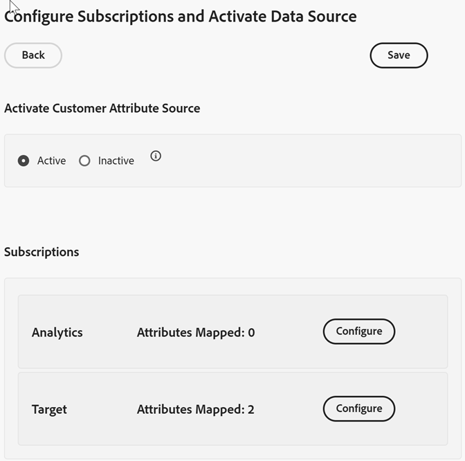
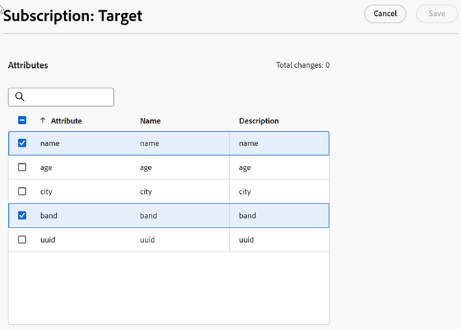

# 配置订阅并激活数据源

[!DNL Customer Attributes]订阅使客户属性数据能够在Experience Cloud和应用程序（[!DNL Analytics]和[!DNL Target]）之间流动。

例如，Adobe Analytics 订阅允许将属性数据纳入报表中。如果您使用[!DNL Adobe Target]，则可以上传客户属性以进行定位和分段。

**要配置订阅并激活数据源**

1. 在[!DNL Customer Attributes]中找到您的数据源以进行编辑：

   在[!DNL Experience Cloud]中，单击&#x200B;**[!UICONTROL 应用]** > **[!DNL Customer Attributes]**。

1. 在[!UICONTROL 编辑客户属性Source]上，单击&#x200B;**[!UICONTROL 文件上传]**。

1. 单击&#x200B;**[!UICONTROL 配置订阅]**。

   

1. 要激活客户属性来源，请单击“活动”****，然后单击“保存”****。

1. 要配置[!DNL Analytics]或[!DNL Target]的订阅，请单击&#x200B;**[!UICONTROL 配置]**。

   以下示例显示了[!DNL Target]订阅：

   

   | 元素 | 描述 |
   |--- |--- |
   | 解决方案 | **Adobe Analytics** &#x200B;选择[!DNL Analytics]，指定要接收属性数据的报表包，以及要包含的属性。 **Adobe Target** &#x200B;您可以上传客户属性，以便进行定位和分段。当您想要基于属性数据来锁定测试，或者希望数据可在 Analytics 中用于分段时，此功能非常有用。 登录后，单击 **[!DNL Target]** > **受众**，即可使用访客的上传客户属性数据。 支持多个数据源。在您的网站上设置客户ID后，请确认至少有一个别名已订阅到[!DNL Target]。 |
   | 报表包(Adobe Analytics) | 报表包来自 Analytics。 您无法在一个属性来源内向 Analytics 订阅添加总计 10 个以上的报表包。选择要包含的报表包时，请考虑以下建议：<ul><li>选择具有一组共同的已经过身份验证的客户的报表包。如果一个报表包中的经过身份验证的客户与另一报表包中的经过身份验证的客户不重叠，请将这些报表包分成不同的属性源。</li><li>如果可能，属性源中包含的报表包应具有相似的流量。</li></ul> 如果您有 10 个以上的报表包具有一组共同的经过身份验证的客户，则可以配置更多的客户属性来源，使每个来源最多包含 10 个报表包。 |
   | 要包含的属性（Analytics 和 [!DNL Target]） | 您希望发送至应用程序的属性。 在配置订阅和选择属性时，根据您拥有的应用程序，_每个报表包_&#x200B;将会受到以下限制：<ul><li>Foundation：0 个</li><li>Select：3 个</li><li>Prime：15 个</li><li>Ultimate：200 个</li><li>Standard：总共允许 3 个</li><li>Premium：每个报表包允许 200 个</li><li>[!DNL Target] Standard：5 个</li><li>[!DNL Target] Premium：200 个</li></ul> **注意：**&#x200B;当您升级到 Analytics Premium 时，附加属性会在延迟 24 小时后才可用。在此延迟期间，您可能会看到属性订阅数量达到最大值错误。 |

1. 单击&#x200B;**[!UICONTROL 保存]**。
