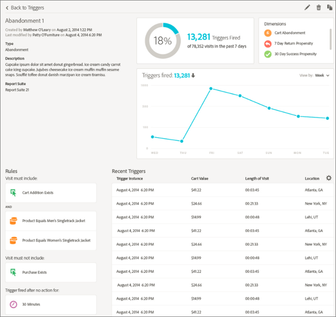
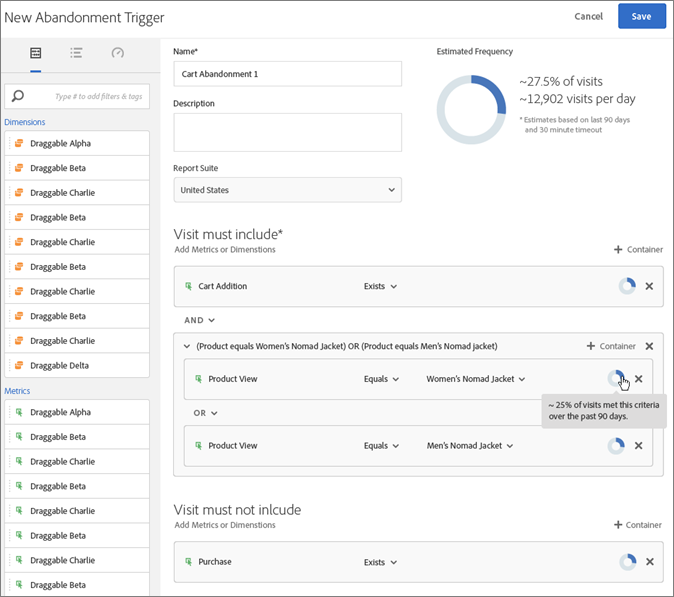
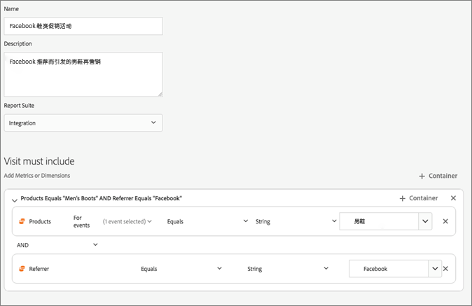

# CX Enterprise触发器

CX Enterprise中的[!UICONTROL Triggers]使您能够识别、定义并监视关键客户行为，然后生成跨应用程序通信以便重新吸引访客。 您可以在实时决策和个性化中使用触发器。

例如：

* 为购物车放弃或已删除产品的购物车放弃配置快速再营销
* 表单和应用程序不完整
* 网站上的任何操作或操作序列

>[!NOTE]
>
>有关使用[!UICONTROL Triggers]的详细信息，请参阅[Campaign Standard](https://experienceleague.adobe.com/docs/campaign-standard/using/integrating-with-adobe-cloud/working-with-campaign-and-triggers/using-triggers-in-campaign.html)。

## 触发器类型

通常，触发器可能要用 15-90 分钟时间才能启动市场营销活动。 此延迟根据数据收集的实施、管道的加载、定义触发器的自定义配置以及 Adobe Campaign 中的工作流而有所不同。

* **放弃：**&#x200B;可创建触发器，以便在访客查看产品却未将任何东西添加到购物车时触发。
* **操作：**&#x200B;可创建触发器，以便在例如新闻稿注册、电子邮件订阅或信用卡申请（确认）后触发。 如果您是零售商，则可以针对注册忠诚度计划的访客创建一个触发器。 在媒体和娱乐业中，可以为观看特定节目并且您可能想要收集调查结果的访客创建触发器。
* **会话开始和会话结束：**&#x200B;为会话开始和会话结束事件创建触发器。

## 创建CX Enterprise触发器

创建触发器并配置触发器的条件。 例如，您可以指定访问期间触发器规则的条件，如量度（购物车放弃）或维度（产品名称）。 当满足规则时，触发器会运行。

>[!NOTE]
>
>当前的技术限制为 100 个触发器。

1. 在CX Enterprise中，单击，然后单击&#x200B;**[!UICONTROL Data Collection/Launch]**。
1. 在[!UICONTROL Triggers]信息卡上，单击&#x200B;**[!UICONTROL Manage Triggers]**。
1. 单击&#x200B;**[!UICONTROL New Trigger]**，然后指定触发器的类型：

   

1. 通过填写以下字段，并将量度和维度项拖动到规则容器中以配置该触发器：

   | 元素 | 描述 |
   | --- | --- |
   | [!UICONTROL Name] | 此触发器的友好名称。 |
   | [!UICONTROL Description] | 此触发器的描述、使用方式等。 |
   | [!UICONTROL Report Suite] | 用于此触发器的 Analytics [报表包](https://experienceleague.adobe.com/docs/analytics/admin/manage-report-suites/report-suites-admin.html?lang=zh-Hans)。 此设置标识要使用的报表数据。 |
   | 必须包括的访问 必须排除的访问 没有行动后启动触发器 包括元数据 | 您可以定义希望发生的标准或访客行为，以及不希望发生的行为。 例如，一个简单的购物车放弃触发器规则可以是：<ul><li>访问必须包括：[!UICONTROL Cart Addition]（量度）和[!UICONTROL Exists]。 （您可以进一步完善规则，以包含特定产品视图或浏览器类型等维度。）</li><li>访问不能包括：[!UICONTROL Checkout]。</li><li>没有行动后启动触发器：10 分钟。</li><li>[!UICONTROL Include Meta Data]：允许您添加与访客行为相关的特定[!DNL Campaign]维度或变量。 此字段对 Adobe Campaign 生成正确的再营销电子邮件十分有用。</li></ul> 您可以在容器内或容器之间指定[!UICONTROL Any]、[!UICONTROL And]或[!UICONTROL Or]逻辑，具体取决于您确定的标准是否对规则很重要。 |
   | [!UICONTROL Container] | [!UICONTROL Containers]是您设置和存储定义触发器的规则、条件或过滤器的位置。 如果希望事件同时发生，请将其置于同一容器中。 这意味着，每个容器在命中级别中独立处理。 例如，如果您有两个由 And 运算符连接的容器，那么当两个命中符合要求时，可以预计这些规则符合条件。 |
   | 没有行动后开始新会话 | 为会话开始和会话结束事件创建触发器。 |

   {style="table-layout:auto"}

1. 单击 **[!UICONTROL Save]**。
1. 使用这些触发器在 [!DNL Adobe Campaign] 中进行[实时再营销](https://experienceleague.adobe.com/docs/campaign-standard/using/integrating-with-adobe-cloud/working-with-campaign-and-triggers/about-adobe-experience-cloud-triggers.html)。

## 触发器示例

CX Enterprise Triggers示例：

### 购物车放弃触发器

例如，以下页面显示了可用于[!UICONTROL Cart Abandonment]触发器的规则，该规则基于访问期间查看的产品。

### 反向链接触发器

当点击中包含 Men&#39;s Boots 的产品和 Facebook 的反向链接时，就会触发以下触发器。 对于要在同一点击中评估的两个条件（*产品*&#x200B;和&#x200B;*反向链接*），应将它们添加到同一容器中。

