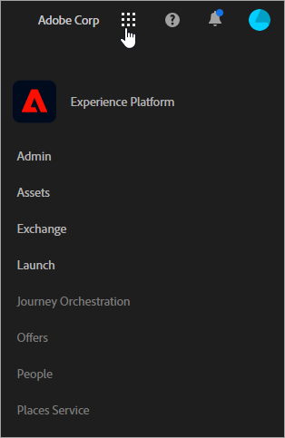

# 关于 Experience Cloud 中的新云名称 {#topic_BD726D3A649E4FC49063029E86B70C62}

了解云的最新品牌更新，如何导航界面，以及在何处查找有关解决方案和核心服务的帮助。

## 新云名称 {#concept_3D567681C3C94989AD1A30A1C5C41609}

最新的云名称和每个云中的解决方案：

 [Experience Cloud](https://www.adobe.com/experience-cloud.html?promoid=FZPQZ2HS&mv=other)

将 *Marketing Cloud* 替换为所有 Adobe 数字体验解决方案和服务的父级云名称。

>[!NOTE]
>
>您可以继续在以前的更广泛的上下文中看到对 *Marketing Cloud* 的引用，直到所有解决方案界面都被重新命名为 *Enterprise Cloud* 为止。

 [Marketing Cloud](https://www.adobe.com/marketing-cloud.html)

包含以下解决方案：

* Adobe Experience Manager
* Adobe Campaign
* Adobe Target
* Adobe Primetime
* Adobe Social

 [Analytics Cloud](https://www.adobe.com/data-analytics-cloud.html)

包含以下解决方案：

* Adobe Analytics
* Adobe Audience Manager

 [Advertising Cloud](https://www.adobe.com/advertising-cloud.html)

包含 Media Optimizer 和 TubeMogul。

## 有哪些解决方案？ {#concept_4F52341A45DC49B2B216824B14D54FDA}

以下信息简要说明了解决方案并提供了帮助链接。此外，还提供了[用例方法](https://helpx.adobe.com/marketing-cloud/how-to/use-cases.html)，以帮助您了解数字营销工作流程。

 [Adobe Analytics](https://docs.adobe.com/content/help/en/analytics/landing/home.html)

要开始使用 Analytics，请执行以下操作：

1. 使用 [Adobe Analytics 快速入门](https://docs.adobe.com/content/help/en/analytics/analyze/analysis-workspace/home.html)中介绍的步骤，创建您的第一个 Analytics 报表包（数据存储库）。
1. 然后，使用 [Experience Platform Launch部署Analytics代码](https://docs.adobe.com/content/help/en/launch/using/intro/get-started/quick-start.html)。

Experience Platform Launch是新一代标签管理工具，它为您提供了部署和管理所有分析、营销和广告标签的简单方法。

另请参阅:

* [我应该使用哪些 Analytics 产品？](https://docs.adobe.com/content/help/en/analytics/admin/admin-overview/which-analytics-tool.html)
* [Analytics 产品比较和要求](https://docs.adobe.com/content/help/en/analytics/admin/admin-overview/analytics-product-comparison.html)

 [Adobe Target](https://docs.adobe.com/content/help/en/target/using/target-home.html)

Adobe Target 与 Analytics 及其他 Experience Cloud 核心服务集成在一起。有用的入门主题：

* [设置 Target](https://docs.adobe.com/content/help/en/target/using/administer/administrating-target.html)
* [Target 的工作方式](https://docs.adobe.com/content/help/en/target/using/introduction/how-target-works.html)
* [管理员首要步骤](https://docs.adobe.com/content/help/en/target/using/administer/start-target.html)
* [使用 Analytics 作为 Target 的报表来源](https://docs.adobe.com/content/help/en/target/using/integrate/a4t/a4t.html)

 [Adobe Social](https://docs.adobe.com/content/help/en/social/using/home.html)

Social 提供基于订购的托管解决方案，帮助您实现社交媒体目标，并改善您的策略和绩效。您可以通过支持社交侦听、发布和分析的综合性平台，管理社交市场营销。

 [Adobe Experience Manager](https://helpx.adobe.com/support/experience-manager/6-5.html)

作为内容管理解决方案，Adobe Experience Manager 有助于您轻松管理网站、移动应用程序、社区和表单中的资产和内容。

请参阅 [Adobe Experience Manager 6.5](https://helpx.adobe.com/support/experience-manager/6-5.html) 以获取帮助。

 [Adobe Audience Manager](https://docs.adobe.com/content/help/en/audience-manager/user-guide/aam-home.html)

作为数据管理平台，Adobe Audience Manager 可帮助您构建独一无二的受众配置文件，以便您能够发现每个渠道中最具价值的客户群体，并针对他们开展活动。

 [Adobe Advertising Cloud](https://docs.adobe.com/content/help/en/release-notes/experience-cloud/current.html#adcloud)

Adobe Advertising Cloud 是一种程序化的广告购买解决方案。它有助于您根据预算，查找和预测最佳的广告渠道组合，然后可以自动将内容直接提供给您的受众。

 [Adobe Campaign](https://docs.adobe.com/content/help/en/campaign-standard/using/getting-started/about-adobe-campaign/campaign-orchestration.html)

利用 Adobe Campaign，您可以规划、交付和衡量所有线上和线下渠道的营销活动。它可以帮助您提高生产效率，同时为您的客户提供相关体验。

 [Adobe Primetime](https://help.adobe.com/en_US/primetime/)

Adobe Primetime 是一个多屏幕电视平台，可帮助广播公司为任意受众打造个性化十足的互动式电视和电影体验。

## 有哪些核心服务？ {#concept_38AC4888C3F84694AE4F60311C21B9C2}

[核心服务](core-services/core-services.md#concept_07ED1D5C64234E77976E6D572E78FB9C)包含的功能可简化产品实施并启用跨解决方案的工作流程，例如受众区段、客户属性上传和协作工具。

| 核心服务 | 描述 |
|--- |--- |
| [激活](activation/activation.md) | 标签管理系统（Experience Platform Launch和动态标签管理）。 通过触发器，您可以根据 Adobe Analytics 提供的分析信息在 Adobe Campaign 中采取实时行动。 |
| [管理](admin-getting-started/admin-getting-started.md) | 管理所有 Adobe 云和解决方案中的用户和产品权限。 |
| [资产](experience-cloud-assets/experience-cloud-assets.md) | 轻松地在一个中心位置存储、同步和共享所有数字资产，以节省时间并提供更加一致的客户体验。 |
| [Launch](https://docs.adobe.com/content/help/en/launch/using/overview.html) | Launch 是 Adobe 推出的新一代标签管理功能。Launch 为客户提供了一种简单的方式来部署和管理所有用来加强相关客户体验的分析、营销和广告标签。 |
| [旅程安排](https://docs.adobe.com/content/help/en/journeys/using/journey-orchestration-home.html) | 利用存储在事件或数据源中的情境数据构建实时安排使用案例。 [!UICONTROL 旅程安排] (Journey Orcheration)是与Experience Platform集成的应用程序服务。 |
| [位置服务](https://docs.adobe.com/content/help/en/places/using/home.html) | Adobe Experience Platform Location Service（位置服务）是一项地理位置服务，它通过使用丰富且易于使用的SDK界面以及灵活的兴趣点数据库(POI)，使具有位置感知的移动应用程序能够了解位置上下文。 |
| 选件 | 通过选件管理，您可以在 Experience Cloud 中跨所有渠道创建和管理选件，并做出相应决策。 |
| [Exchange](exchange.md) | 通过应用程序，搜索、浏览、选择、购买并下载 Digital Marketing 扩展。 |
| [Mobile Services](https://docs.adobe.com/content/help/en/mobile-services/using/home.html) | Adobe Mobile Services 可以在整个 Experience Cloud 范围内将移动设备应用程序的移动营销功能整合在一起，以便您了解和提高移动设备应用程序的用户参与度。 |
| 人员 | 通过在 Experience Cloud 解决方案中将 Adobe 和非 Adobe 数据联系到一起，全面了解单个客户。找出当他们在接触点中进行交互时最注重哪些方面。识别从陌生设备访问的熟悉客户。甚至为了达到目标营销效果，将用户分组为受众。 [受众](audience-library/audience-library.md) - 将不同类型的客户划分为受众，然后在各个 Marketing Cloud 解决方案中共享这些受众。 [客户属性](attributes/attributes.md) - 作为受众扩充，允许您在 Marketing Cloud 之外访问所收集的客户信息。 [设备图](https://landing.adobe.com/en/na/events/summit/275658-summit-co-op.html) - 与世界最流行的品牌协作，以便识别不熟悉设备背后的熟悉客户。（在测试版中，仅适用于 Marketing Cloud Device Co-op 成员。） |
