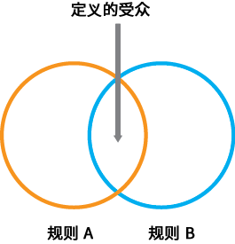
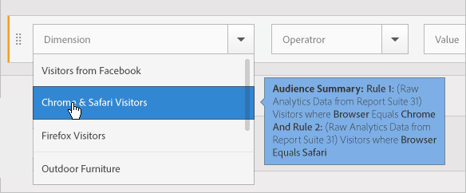

# 创建受众

了解如何在 Experience Cloud 中使用属性规则来创建受众和定义复合受众。

本文可帮助您了解如何执行以下操作：

* 创建受众
* 创建规则
* 使用规则定义复合受众

下图表示复合受众中的两个规则。

每个圆圈表示定义受众成员资格的规则。符合两个受众规则中的成员资格的访客会发生重叠，从而成为定义的复合受众。

>[!NOTE]
>
>在完成指定期限的数据收集后，将会对受众进行充分定义。

以下示例演示了如何为复合受众创建规则。此受众包括：

* 从页面数据或原始分析数据派生的“家居和园艺”部分。
* 来源于[发布](audience-library.md#task_32FEEFE0B32E4E388CD4D892D727282A)到 [!DNL Experience Cloud] 的 [!DNL Adobe Analytics] 区段的 Chrome 和 Safari 用户。

   

**创建受众**

1. 在 [!DNL Experience Cloud] 中的 [!DNL Experience Platform] 下，选择&#x200B;**[!UICONTROL 人员]** > **[!UICONTROL 受众库]。**
1. 在[!UICONTROL 受众]页面上，选择&#x200B;**[!UICONTROL 新建]**。

   

1. 在[!UICONTROL 创建新受众]页面，指定标题和描述。
1. 在[!UICONTROL 规则]下，选择一个属性来源：

   * **[!UICONTROL 实时 Analytics 数据：]**（或原始数据）此类数据是指从实时 Analytics 图像请求派生而来的属性数据，包括 eVar 和事件等数据。使用此属性源时，必须选择一个报表包，并定义要包括的维度或事件。此报表包选择提供了报表包使用的变量结构。
   >[!NOTE]
   >
   >由于缓存，在 Analytics 中删除报表包 12 小时后，该删除操作才能反映在 Experience Cloud 中。

   * **[!UICONTROL Experience Cloud：]**&#x200B;从 [!DNL Experience Cloud] 来源派生的属性数据。例如，这可以是您在 [!DNL Analytics] 中创建的受众区段的数据，也可以是来自 [!DNL Audience Manager] 的数据。

1. 定义受众规则，然后选择&#x200B;**[!UICONTROL 保存]。**

>[!NOTE]
>
>您在定义受众规则时，应该对实施变量有所了解。

在[!UICONTROL 规则]下，定义 *`Home & Garden`* 属性选择：

* **[!UICONTROL 属性来源：]**&#x200B;原始 Analytics 数据
* **[!UICONTROL 报表包：]**&#x200B;报表包 31
* 维度 = **[!UICONTROL 商店 (Merch) (v6)]** > **[!UICONTROL 等于]** > **[!UICONTROL 家居和园艺]**

*Chrome 和 Safari 访客*&#x200B;是从 Analytics 中共享的受众区段：

* **[!UICONTROL 属性来源：]** Experience Cloud
* **[!UICONTROL 维度：]** Chrome 和 Safari 访客

要进行比较，需要添加 *OR* 规则查看某个站点区域（例如庭院和家具）的所有访客。

由此产生的规则是由访问了“家居和园艺”的“Chrome 和 Safari 用户”组成的已定义受众。“庭院和家具”区段提供了有关访问该网站区域的所有访客的更多分析信息。

* **历史估计：**（虚线圈）代表基于 [!DNL Analytics] 数据创建的规则。
* **实际受众：**（实心圆）创建的任何规则，其中包含来自 Audience Manager 的 30 天数据。当 Audience Manager 数据达到 30 天时，该行将变为实线并表示实际数字。

在指定的时间段内完成数据收集后，圆圈将合并起来以显示定义的受众。

保存受众后，它便可用于其他解决方案。例如，您可以在 Adobe Target 活动中包含共享受众。
