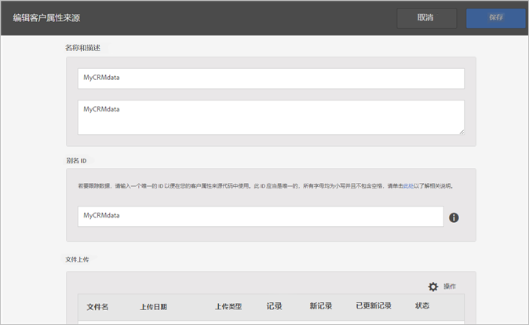

# 创建客户属性源并上传数据文件

创建客户属性源（CSV 和 FIN 文件）并上传数据。您可以在做好准备时激活数据源。在数据源激活后，可将属性数据共享到 Analytics 和 Target。

## 客户属性工作流程 {#concept_BF0AF88E9EF841219ED4D10754CD7154}


1. [创建数据文件](t-crs-usecase.md#task_B5FB8C0649374C7A94C45DCF2878EA1A)
1. [创建属性源并上传数据文件](t-crs-usecase.md#task_09DAC0F2B76141E491721C1E679AABC8)
1. [验证架构](t-crs-usecase.md#task_09DAC0F2B76141E491721C1E679AABC8)
1. [配置订阅并激活属性源](t-crs-usecase.md#task_1ACA21198F0E46A897A320C244DFF6EA)

在数据源处于活动状态后，您可以：

* [在 Adobe Analytics 中使用客户属性](t-crs-usecase.md#task_7EB0680540CE4B65911B2C779210915D)
* [在 Adobe Target 中使用客户属性](t-crs-usecase.md#task_FC5F9D9059114027B62DB9B1C7D9E257)

>[!IMPORTANT]
>
>要访问此功能，必须将用户分配到“客户属性”产品配置文件（客户属性 - 默认访问）。导航到&#x200B;**[!UICONTROL 管理]** > **[!UICONTROL Admin Console]** > **[!UICONTROL 产品]**。如果“客户属性”**&#x200B;显示为其中一个[!UICONTROL 产品配置文件]，则表示您已经可以开始。添加到客户属性组的用户将在 Experience Cloud 界面的左侧看到[!UICONTROL 客户属性]菜单。
>
>要使用“客户属性”功能，用户还必须属于应用程序级别的群组（Analytics 或[!DNL Target]）。

请参阅[管理 Experience Cloud 用户和产品](admin-getting-started.md#task_3295A85536BF48899A1AB40D207E77E9)。

## 创建数据文件 {#task_B5FB8C0649374C7A94C45DCF2878EA1A}

此数据是 CRM 中的企业客户数据。数据可能包含产品的订阅者数据，包括成员 ID、授权产品、最常启动产品等。

1. 创建一个 `.csv`。

   >[!NOTE]
   >
   >在此过程的后续步骤中，您可以通过拖放 `.csv` 文件来进行上传。然而，如果您[通过 FTP 上传](t-upload-attributes-ftp.md#task_591C3B6733424718A62453D2F8ADF73B)，则还需要一个与 `.csv` 文件同名的 `.fin` 文件。

   示例企业客户数据文件：

   

1. 在继续操作之前，请先查看[数据文件要求](crs-data-file.md#concept_DE908F362DF24172BFEF48E1797DAF19)中的重要信息，然后再上传文件。
1. [创建客户属性源并上传数据](t-crs-usecase.md#task_BCC327B2A0EF4A1BBB2934013AB92B78)，如下所述。

## 创建属性源并上传数据文件 {#task_09DAC0F2B76141E491721C1E679AABC8}

在 Experience Cloud 的“新建客户属性源”页面中执行这些步骤。

>[!IMPORTANT]
>
>创建、修改或删除客户属性源时，大约会有将近一小时的延迟。在此之后，ID 才开始与新的数据源进行同步。您在 Audience Manager 中必须具有管理权限才能创建或修改客户属性源。联系 Audience Manager 客户关怀团队或咨询人员以获取管理权限。

1. 在 [!DNL Experience Cloud] 中，选择菜单  图标。
1. 在 **[!DNL Experience Platform]** 下，选择&#x200B;**[!UICONTROL 人员]** > **[!UICONTROL 客户属性]**。

   在“[!UICONTROL 客户属性]”页面中，您可以管理和编辑现有的属性数据源。

   
1. 选择&#x200B;**[!UICONTROL 新建]**。

   
1. 在“[!UICONTROL 编辑客户属性来源]”页面中，配置以下字段：

   * **[!UICONTROL 名称：]**&#x200B;数据属性来源的易记名称。对于 [!DNL Adobe Target]，属性名称不能包含空格。如果传递包含空格的属性，[!DNL Target] 会将其忽略。其他不受支持的字符包括：`< , >, ', "`。

   * **[!UICONTROL 描述：]**（可选）数据属性来源的描述。

   * **[!UICONTROL 别名 ID：]**&#x200B;表示客户属性数据的来源，如特定的 CRM 系统。[!UICONTROL 别名 ID] 是在您的客户属性源代码中使用的唯一 ID。此 ID 应当是唯一的，使用小写字母并且没有空格。在 Experience Cloud 中的客户属性源的[!UICONTROL 别名 ID] 字段中输入的值，应与从实施中传入的值（无论是通过数据收集 (Launch)、动态标记管理还是 Mobile SDK 的 JavaScript 传入）匹配。

      别名 ID 对应于您在其中设置其他客户 ID 值的某些区域。例如：

      * **Dynamic Tag Management：**&#x200B;别名 ID 对应于 [Experience Cloud ID 服务](https://experienceleague.adobe.com/docs/experience-platform/tags/home.html?lang=zh-Hans)工具中[!UICONTROL 客户设置]下的&#x200B;*集成代码*&#x200B;值。

      * **访客 API：**&#x200B;别名 ID 对应于您可以与每个访客关联的其他[客户 ID](https://experienceleague.adobe.com/docs/id-service/using/reference/authenticated-state.html?lang=zh-Hans)。

         例如，下面的&#x200B;*“crm_id”*：

         ```
         "crm_id":"67312378756723456"
         ```

      * **iOS：**&#x200B;别名 ID 对应于 [visitorSyncIdentifiers:identifiers](https://experienceleague.adobe.com/docs/mobile-services/ios/overview.html?lang=zh-Hans) 中的 *&quot;idType&quot;*。

         例如：

         `[ADBMobile visitorSyncIdentifiers:@{@<`**`"idType"`**`:@"idValue"}];`

      * **Android™：** 别名 ID 对应于 [syncIdentifiers](https://experienceleague.adobe.com/docs/mobile-services/android/overview.html?lang=zh-Hans) 中的 *&quot;idType&quot;*。

         例如：

         `identifiers.put(`**`"idType"`**`, "idValue");`

         请参阅[利用多个数据源](crs-data-file.md#section_76DEB6001C614F4DB8BCC3E5D05088CB)，以了解有关别名 ID 字段和客户 ID 的数据处理的其他信息。
   * **[!UICONTROL 文件上传：]**&#x200B;您可以拖放 `.csv` 数据文件，或通过 FTP 上传数据。（使用 FTP 还需要 `.fin` 文件。）请参阅[通过 FTP 上传数据](t-upload-attributes-ftp.md#task_591C3B6733424718A62453D2F8ADF73B)。

      >[!IMPORTANT]
      >
      >存在特定的数据文件要求。请参阅[数据文件要求](crs-data-file.md#concept_DE908F362DF24172BFEF48E1797DAF19)，以了解更多信息。


      上传文件后，表数据将显示在此页面上的[!UICONTROL 文件上传]标题下。您可以验证架构，配置订阅或设置 FTP。

      **文件上传图**

      

   * **[!UICONTROL 唯一客户 ID：]**&#x200B;显示您向此属性来源上传了多少个唯一 ID。

   * **[!UICONTROL 别名为 Experience Cloud 访客 ID 的客户提供 ID：]**&#x200B;显示别名为 Experience Cloud 访客 ID 的 ID 数量。

   * **[!UICONTROL 具有高别名计数的客户提供 ID：]**&#x200B;显示具有 500 个或更多 Experience Cloud 访客 ID 别名的客户提供 ID 的计数。这些客户提供的 ID 很可能不代表个人，而是表示某种共享登录。系统会将与这些 ID 关联的属性分发到 500 个最新的 Experience Cloud 访客 ID 别名，直到别名计数达到 10000 个为止。到那时，系统会使客户提供的 ID 无效，且不再分发关联的属性。


## 验证架构 {#task_404AAC411B0D4E129AB3AC8B7BE85859}

验证过程允许您将显示名称和描述映射到已上传的属性（字符串、整数、数字等等）。您还可以通过更新架构来删除属性。

请参阅[验证架构](validate-schema.md#concept_B3A01A15D04E4F998118E09B3A9B5043)。

要删除属性，请参阅[（可选）更新架构（删除属性）](t-crs-usecase.md#task_6568898BB7C44A42ABFB86532B89063C)。

## （可选）更新架构（删除属性） {#task_6568898BB7C44A42ABFB86532B89063C}

如何删除和替换架构中的属性。

1. 在[!UICONTROL 编辑客户属性来源]页面上，删除 **[!UICONTROL Target]** 或 **[!UICONTROL Analytics]** 订阅（位于[!UICONTROL 配置订阅]下）。
1. [上传具有更新字段的新数据文件](t-crs-usecase.md#task_09DAC0F2B76141E491721C1E679AABC8)。

## 配置订阅和激活属性源 {#task_1ACA21198F0E46A897A320C244DFF6EA}

配置订阅可以设置 Experience Cloud 和应用程序之间的数据流。激活属性来源后，数据便可流向订阅的应用程序。您上传的客户记录与来自您网站或应用程序的传入 ID 信号相匹配。

请参阅[配置订阅](subscription.md#concept_ECA3C44FA6D540C89CC04BA3C49E63BF)。

**激活属性来源的方法**

在[!UICONTROL 新建[或编辑]客户属性来源]页面上，选择[!UICONTROL 激活]标题，然后选择&#x200B;**[!UICONTROL 活动]**。


## 在 Adobe Analytics 中使用客户属性 {#task_7EB0680540CE4B65911B2C779210915D}

利用 Adobe Analytics 等应用程序中现在提供的数据，您可以报告数据、分析数据并在营销活动中采取适当措施。

以下示例显示了一个基于上传属性的 [!DNL Analytics] 区段。此区段显示最常启动产品为 Photoshop 的 [!DNL Photoshop Lightroom] 订阅者。


在将区段发布到 Experience Cloud 后，它将在 Experience Cloud 受众和 Audience Manager 中变得可用。

## 在 Adobe Target 中使用客户属性 {#task_FC5F9D9059114027B62DB9B1C7D9E257}

在 [!DNL Target] 中，您可以在创建受众时从[!UICONTROL 访客配置文件]区域选择一个客户属性。列表中的所有客户属性都有前缀 `crs.`。可根据需要，将这些属性与其他数据属性结合使用以构建受众。


请参阅 [!DNL Target] 帮助中的[创建新受众](https://experienceleague.adobe.com/docs/target/using/audiences/create-audiences/audiences.html?lang=zh-Hans)。
