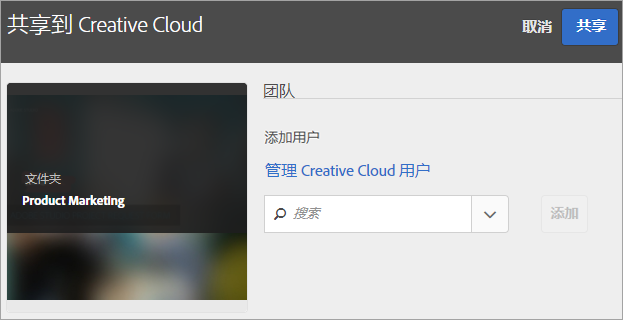
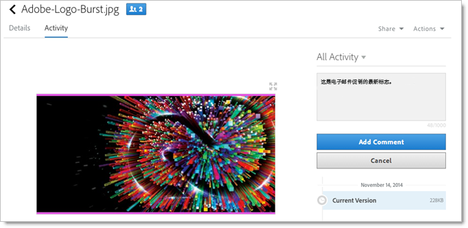
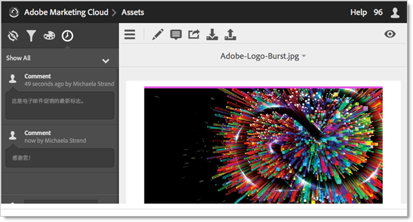
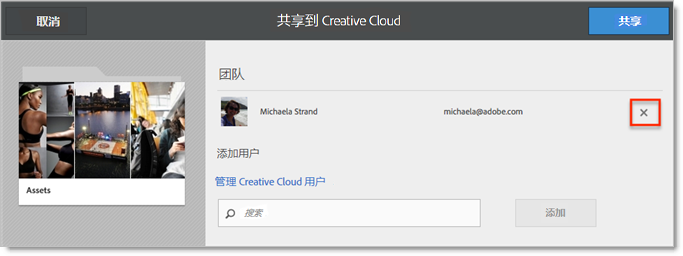

# 共享 Experience Cloud 资源文件夹

与 Creative Cloud 用户共享 Experience Cloud 资源文件夹。

1. 在 Asset 文件夹中，选择&#x200B;**[!UICONTROL 共享到 Creative Cloud]**。

   
1. 在“共享到 Creative Cloud”页面上，搜索用户，然后选择&#x200B;**[!UICONTROL 添加]**。

   

1. 选择&#x200B;**[!UICONTROL 共享]**。
1. 启动 [!DNL Creative Cloud] 桌面版（或在浏览器中导航到 [!UICONTROL Creative Cloud Files] 页面），并查找请求通知。

   
1. 打开请求，然后选择&#x200B;**[!UICONTROL 接受]**。

   
1. 要访问文件夹内容，请选择&#x200B;**[!UICONTROL 打开文件夹]**（或&#x200B;**[!UICONTROL 在 Web 上查看]**）。

   
1. 在共享资源中添加评论以继续：

   在 Creative Cloud 中，您可以选择进入图像，然后选择&#x200B;**[!UICONTROL 活动]**&#x200B;以在图像上添加评论。评论会在 [!DNL Creative Cloud] 和 [!DNL Experience Cloud] 的资源中同步。

   

   在 Experience Cloud 中，选择一个图像，然后选择时间线图标以在图像上添加评论。评论会在 Creative Cloud 和 Experience Cloud 的资源中同步。

   

1. 要取消共享文件夹，请选择&#x200B;**[!UICONTROL 使用 Creative Cloud 共享]**（与[步骤 3](t-share-creative-cloud.md#step_BA17CFA185284641A9B878BA29551996) 类似），再选择 X 以删除用户，然后选择&#x200B;**[!UICONTROL 共享]**。

一旦删除完所有的 Creative Cloud 用户，文件夹即被取消共享，且 Creative Cloud 用户不再具有访问权限。

使用共享资源的其他方式包括：

* 在 [!UICONTROL  中将]资源选择器[!DNL Adobe Social]中的资源用于社交帖子。
* 在 [!DNL Adobe Target] 中加载或交换[选件库](https://experienceleague.adobe.com/docs/target/using/experiences/offers/manage-content.html?lang=zh-Hans)中的资源以用于活动中的图像。

在将文件夹共享到 Creative Cloud 之后，您将在文件夹上看到 Creative Cloud 徽标。

。

相关帮助：

* [Creative Cloud 帮助 - 管理和同步文件](https://helpx.adobe.com/cn/creative-cloud/help/sync-creative-cloud-files.html)
* [Creative Cloud 帮助 - 与他人协作](https://helpx.adobe.com/cn/creative-cloud/help/collaboration.html)
* [Creative Cloud 帮助 - 协作常见问题解答](https://helpx.adobe.com/cn/creative-cloud/help/collaboration-faq.html)
